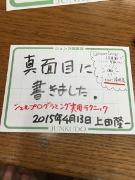

# シェルプログラミング実用テクニック
<ul>
 <li><a href="#purchase">購入はこちらから</a></li>
 <li><a href="#practice">練習道具</a></li>
 <li><a href="#supplement">補遺</a></li>
 <li><a href="/?page=06295" target="_blank">正誤表</a></li>

</ul>

<h2 id="practice">練習道具</h2>

<ul>
 <li>サンプルデータ・シェルスクリプトの置き場所
 <ul>
 <li><a href="https://github.com/ryuichiueda/GihyoShellBookSamples">https://github.com/ryuichiueda/GihyoShellBookSamples</a></li>
 </ul>
 </li>

</ul>

<h2 id="purchase">購入はこちらから</h2>

<h3>ジュンク堂書店様</h3>

[ネットストアはこちら。](http://www.junkudo.co.jp/mj/products/list.php?zssearch_genre=&search_2=1&search_1=0&search_text=%E4%B8%8A%E7%94%B0%E9%9A%86%E4%B8%80")

<a href="http://www.junkudo.co.jp/mj/store/store_detail.php?store_id=1" target="_blank">池袋店</a>にお邪魔して素人popを書いてきましたので、お店で探してみていただけたら幸いです。

字がアレなのは小学生時分から悩みなので傷に塩を塗らないでください。

<h3>Amazon様</h3>

[amazonjs asin="4774173444" locale="JP" title="シェルプログラミング実用テクニック (Software Design plus)"]

<h2>電子版</h2>

<a href="/?post=06276">/?p=6276</a>

<h2 id="#suppriment">補遺</h2>

bashのpipefailについて本書で触れられなかったので補足: <a href="/?post=05953" title="bashのpipefailで確実にスクリプトを止める">bashのpipefailでスクリプトを止める</a>
