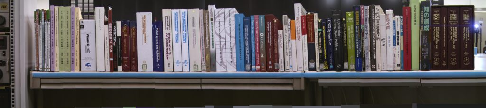

# 研究関係動画
<h2>某未発表アルゴリズムのデモ</h2>
<ul>
 	<li><a href="/?page=10021">こちら</a></li>
</ul>

<h2>別の某未発表アルゴリズムのデモ</h2>
<ul>
 	<li><a href="/?page=10034">こちら</a></li>
</ul>

<h2>ロボットの簡単な学習</h2>
<a href="http://link.springer.com/chapter/10.1007/978-3-319-48036-7_54">IAS-14</a>の発表内容。「左右に交互に行くと褒められる」という規則を学習。

<iframe src="https://www.youtube.com/embed/eBMIjjwNElM" width="560" height="315" frameborder="0" allowfullscreen="allowfullscreen"></iframe>
<h2>価値反復で無理やり計算した協調動作</h2>
8変数、6億状態に対する価値反復を10日間で計算。2台のロボットをどこに置いても適切に協調しだす方策が得られました（ただし実機実装までには至らず。）。
<ul>
 	<li>出典: <a href="http://ieeexplore.ieee.org/document/4209061/">ICRA2007</a></li>
</ul>
<iframe src="https://www.youtube.com/embed/SH5P2zMml84" width="560" height="315" frameborder="0" allowfullscreen="allowfullscreen"></iframe>
<h2>ネットワークカメラの位置推定</h2>
<ul>
 	<li><a href="https://link.springer.com/chapter/10.1007%2F978-3-642-00644-9_7">この研究</a>の実験。複数のネットワークカメラで動くルンバを見てネットワークカメラの姿勢を推定する研究。</li>
</ul>
<iframe src="https://www.youtube.com/embed/CnIfL4bvWF4" width="560" height="315" frameborder="0" allowfullscreen="allowfullscreen"></iframe>
<h2>動的計画法（価値反復）による経路生成</h2>
2005年頃の研究室紹介用ビデオ。

<iframe src="https://www.youtube.com/embed/gISo3HAom6k" width="560" height="315" frameborder="0" allowfullscreen="allowfullscreen"></iframe>
<h2>自己位置推定の誤りからの回復</h2>
IROS2004等の内容。センサリセットと膨張リセットの組み合わせ。

<iframe src="https://www.youtube.com/embed/LyrDmNnxM7A" width="560" height="315" frameborder="0" allowfullscreen="allowfullscreen"></iframe>
<h2>修論のアルゴリズムをRoboCupに投入したもの</h2>
2003年4月（D1になりたて）のイベント\@パシフィコ横浜

<iframe src="https://www.youtube.com/embed/fsQicKXE5AU" width="560" height="315" frameborder="0" allowfullscreen="allowfullscreen"></iframe>
<h2>自己位置推定アルゴリズムの評価</h2>
照明を暗くしてもカメラ画像からの自己位置推定が破綻しないことを証明する実験中の一コマ。

出典: <a href="http://ieeexplore.ieee.org/document/1250674/">IROS2003</a>

<iframe src="https://www.youtube.com/embed/UTR8zGxaeCk" width="560" height="315" frameborder="0" allowfullscreen="allowfullscreen"></iframe>
<h2>video mosaic + super resolution</h2>
図書館の本棚を撮影してOCRにかけるという想定で、ロボットが撮影した480x640の画像を重ね合わせて解像度を5倍に上げるということをしていました。要はGoogle Earthの垂直版です。イスラエルの軍事関係の論文を漁って実装。
<ul>
 	<li>論文: <a href="http://proceedings.spiedigitallibrary.org/proceeding.aspx?articleid=837333">http://proceedings.spiedigitallibrary.org/proceeding.aspx?articleid=837333</a></li>
 	<li>新聞の1面にも掲載されました: 広域の高精細画像 移動ロボで自動撮影 日立が新技術,
日刊工業新聞, 2003年9月23日1面.</li>
</ul>
<iframe src="https://www.youtube.com/embed/tgsHEucQWMQ" width="560" height="315" frameborder="0" allowfullscreen="allowfullscreen"></iframe>
<h3>重ね合せる画像</h3>

<h3>貼り合わせて解像度をあげた画像</h3>
photoshopの本の文字を上の画像と比較すると解像度が上がっていることが分かります。

<h3>おまけ</h3>
D1の時の上田

<iframe src="https://www.youtube.com/embed/anVjHDXTHn8" width="560" height="315" frameborder="0" allowfullscreen="allowfullscreen"></iframe>
<h2>色判別テーブルの自動作成（の試み）</h2>
2002年頃。テンプレートマッチングから抽出領域内のYUV値をラベル付けしている模様。詳細は忘れた。OpenCVのない時代なので当然ハフ変換等を使って自前で実装。

<iframe src="https://www.youtube.com/embed/okyyJME61oY" width="560" height="315" frameborder="0" allowfullscreen="allowfullscreen"></iframe>
<h2>自己位置推定の実験</h2>
2001年撮影。<a href="http://ieeexplore.ieee.org/abstract/document/1014731/">ICRA2002</a>用の実験。自己位置推定の手がかりが不完全な（ゴール板が取り外されて、ランドマークの一部が隠されている）状態でゴールキーパーがゴールに帰還できるかを検証。画像の解像度は88x72[pixel]。

<iframe src="https://www.youtube.com/embed/t6_aPFdvMYA" width="560" height="315" frameborder="0" allowfullscreen="allowfullscreen"></iframe>
<h2>衝突回避プログラムの検証</h2>
卒論の実験。2001年2月撮影。

<iframe src="https://www.youtube.com/embed/O6nEA3AMTGw" width="560" height="315" frameborder="0" allowfullscreen="allowfullscreen"></iframe>
