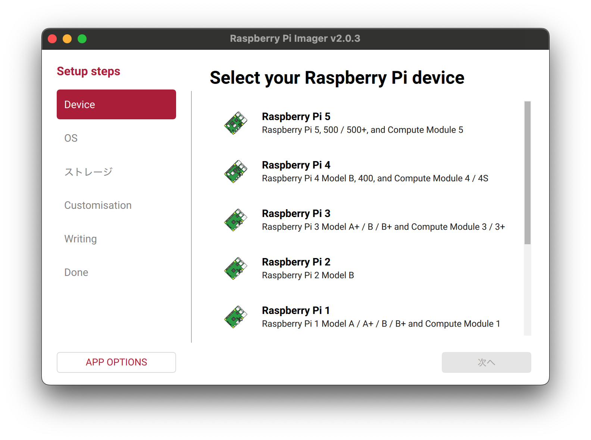
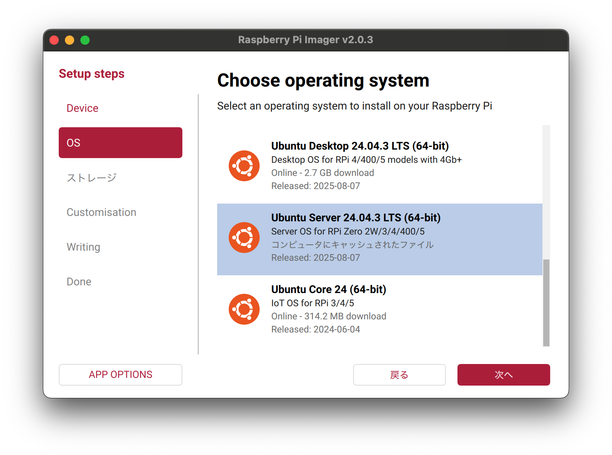
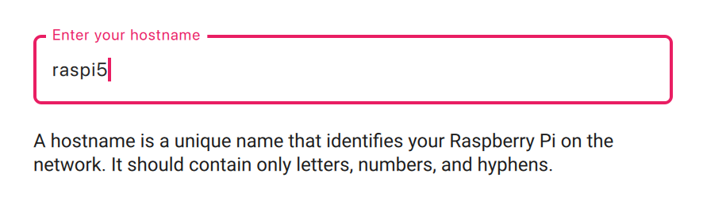
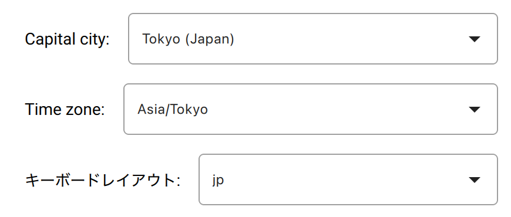
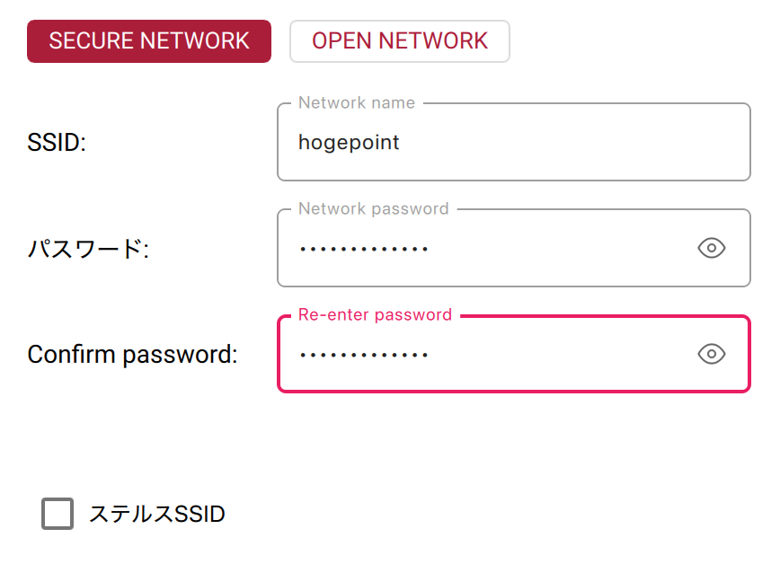

# Ubuntu Server 24.04 LTSをラズパイ5にインストールする方法

　書籍のための情報です。基本、ラズパイ財団のツールを使うだけです。ユーザー情報やWiFiの設定、キーボードの指定もツールでできて便利です。

## 用意するもの

* microSDカード
    * （私はよくわかってないのですが）高速なもの
    * 容量は16GB以上
* 普段使っているPC（次に説明するRaspberry Pi Imagerをインストールします）
    * microSDカードが読み書きできるようにカードリーダーも用意しましょう
* Raspberry Pi（このページではRaspberry Pi 5を想定）
    * キーボードやケーブル類、モニタ（テレビ）も

## Raspberry Pi Imagerのインストール

　[Raspberry Pi 財団のページ](https://www.raspberrypi.com/software/)から、「Raspberry Pi Imager」をインストールします。macOS用、Windows用、Linux用がありますが、以下ではmacOS用をもとに説明します。Windows版もほとんど同じものと思われます。

## Raspberry Pi Imagerの立ち上げ+ラズパイの選択

　通常のアプリの立ち上げ方でRaspberry Pi Imagerを立ち上げると、次のような画面が出るので、セットアップ対象のRaspberry Piのバージョンを選択します。

## OSの選択

　右側の画面をスクロールして「Other general-purpose OS」を選び、さらに「Ubuntu」を選びます。そして、「Ubuntu Server 24.04.x LTS（64-bit）」を選びます。xの数字は変わるかもしれません。執筆時点では24.04.3が選べました。下の図は、当該のバージョンを選択しているところです。「コンピュータにキャッシュ」とありますが、初回は「Online xx GB download」となっているはずです。

## ストレージの選択

　microSDを選びます。ただ、「microSD」とは表示されないので注意が必要です。表示される容量などを見てmicroSDか否かを見極めて選択してください。右下の「Exclude system drives」は特別な事情がない限りは外さないようにしましょう。何も出てこない場合は、microSDとPC本体の間にある機器の接続を確認しましょう。

## ホスト名

　ラズパイに名前をつけます。好きな名前をどうぞ。書籍では「raspi5」です。（上級や向け）もちろん、フルドメイン名で書いてもいいと思います。

## Localisation（Localization）

　自身の住んでいる都市と時間帯を選び、ラズパイに使うキーボードのレイアウトを選びます。細かく選べませんので、キーにひらがなが書いてあればjpでいいと思います。英語キーボードならusです。

## Choose username

　ログインに使う名前を選択します。特にこだわりがなければ姓名のどちらかで。長いと疲れます。厨二病っぽいとあとで後悔します。パスワードも設定しましょう。「Confierm password」は上で入力したパスワードを確認するための欄です。

## Choose Wi-Fi

　SSID（アクセスポイントの名前）とパスワードを入力しましょう。必要に応じてステルスSSIDなどにチェックを入れないといけませんが、よく分からないなら、おそらくチェックは不要です。あと、上のSECURE/OPEN NETWORKの選択ですが、OPEN NETWORKはたぶん危険なので、ご家庭のSECURE NETWORKを選択してください。

## SSH authentication

　SSHを有効化します。初心者はパスワード認証で十分です。ただし、ご家庭のネットワーク以外には接続しないようにしましょう。

## Write image

これまで設定した内容を確認してWRITEボタンを押しましょう。microSDの中身を消していいかという確認の画面が出ますが、大丈夫ならI UNDERSTAND, ERASE AND WRITEを押します。macOSの場合、macOSでログインに使っているパスワードの入力を促されます。

