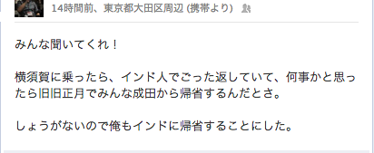
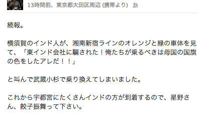
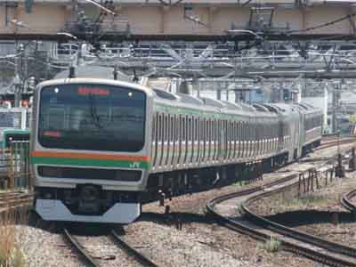

# エイプリルフールのアホ臭い気づき
本日は朝から嘘つきまくりでした。

[caption id="attachment_425" align="aligncenter" width="412"] 通勤のついでの酷い嘘１[/caption]

[caption id="attachment_426" align="aligncenter" width="408"] 通勤のついでの酷い嘘２[/caption]

インドの人、ごめんなさい。他意はないです。

しかし、自分で言って気づきましたが、湘南新宿ラインは、見れば見るほどインド国旗です。

[caption id="attachment_417" align="aligncenter" width="300"] こちらが湘南新宿ライン（出典：http://ja.wikipedia.org/wiki/%E3%83%95%E3%82%A1%E3%82%A4%E3%83%AB:Img878c1e12zik0zj.jpg）[/caption]

[caption id="attachment_416" align="aligncenter" width="300"] こちらがインド国旗（出典：http://ja.wikipedia.org/wiki/%E3%83%95%E3%82%A1%E3%82%A4%E3%83%AB:Flag_of_India.svg）[/caption]

うーむ。国旗の真ん中の丸は、車輪なのか？

車輪なのか？
