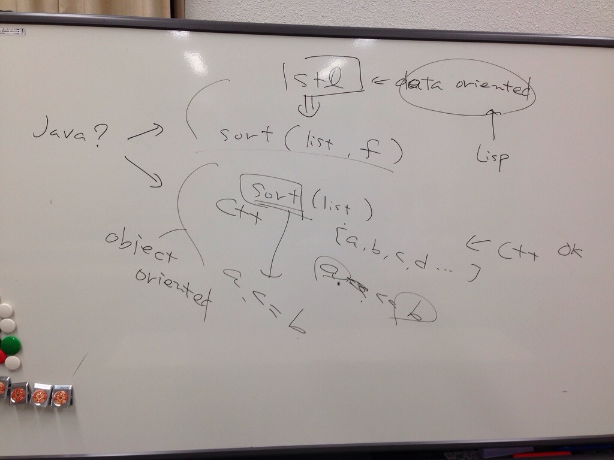

# <!--:ja-->Structure and Interpretation of Computer Programs読書会5回目メモ書き<!--:-->
今週はだーおかさんがいたので引き締まったヴェンキョウカイになりました。\\相変わらず本編よりも雑談が楽しいのですが、高階関数のところで、言語によってソートに大小比較の関数を渡すときと、比較演算子をオーバーライドするときがあるが、関数渡してる言語はオブジェクト指向なのかデータオリエンテッドなのかはっきりしねえぞ云々という議論になり、戦死者が続出したので、Javaでクラスに一個大小比較のメソッドを定義してソートに渡すのは論外だと私が珍しく（？）disって全員を処刑しました。その時のデスノートを掲載しときます。\\  \\その他、要点になっていない要点を示します。Facebookでのリモート参戦者も現れて不毛なダジャレ合戦になりました。\\<ul>\	<li>最適制御の世界には汎関数という高階関数があってだな（クドクド）</li>\	<li>ラムダ式を書くのに、lambdaとかくのはばかばかしい。なんとかならんか？</li>\	<li>ラムダとランバダは違う。</li>\	<li>毒電波(λ)を受け、イヤらしい腰付きでランバタ振動(周期運動)を起こすと、時空間を超える。</li>\	<li>ラムダ式とねじ式も違う。</li>\	<li>λという漢字は人と人が支えあう形になってる。</li>\\	<li>上田家のシェーバーはラムダッシュ</li>\\</ul>\\\来週は改めて1.3.2のラムダから。10/2水曜日。\\\アディオスアディダス。
