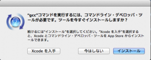

# OS X 10.9 で Command Line Tools をインストールする方法
↓こちらにありますが、もっと簡単な方法を発見（と言っても1カ所違うだけですが。）。うーん。Xcodeは滅多に使わないのでうれしい。 
 
<a href="http://www.computersnyou.com/2025/" target="_blank">http://www.computersnyou.com/2025/</a> 
 
ということでXcodeアンインストール！アプリケーションからXcodeのアイコンをゴミ箱にぽぽいぽい（でいいらしい・・・）。（ドキュメントとかアンインストールされるんかい？誰かおしえてください。） 
 
端末からgccを打つと・・・ 
 
[bash] 
uedamac:~ ueda$ gcc 
xcode-select: note: no developer tools were found at '/Applications/Xcode.app',  
requesting install. Choose an option in the dialog to download the command line  
developer tools. 
[/bash] 
 
なんかダイアログ出た！迷わずインストール。 
 
 
 
[bash] 
uedamac:~ ueda$ gcc 
clang: error: no input files 
[/bash] 
 
大丈夫です。 
 
 
・・・さて、今書いているものを書き直さなければ・・・とほほ・・・。
