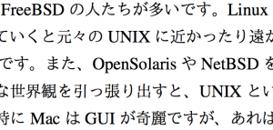
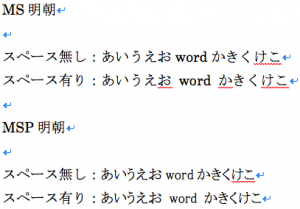

# 出版社に送る原稿には日本語と英単語の間にスペースを入れない方が良いらしいので贖罪のためにシェル芸やります。
<!--:ja-->本日はFaceBook上で、「<strong>執筆者から受け付けてこれからDTPに流し込む原稿においては、</strong>日本語と英単語の間にスペースを入れられると面倒だ！」と編集を生業とするベテランかつ重鎮の方々からシュプレヒコールが上がりましたので、ここにつらつらぐだぐだとそのことについて書きます。

ここに書く事はそこでの議論の本筋とは関係ありません。自分の興味でつらつら書きます。ただそこでの会話をまとめたものになっているので、ここに書くのはちょっと申し訳ない気もします。ただ、面白かったので・・・。

<h2>なぜ面倒か？</h2>

まず、日本語と英単語の間にスペースが入るとなにが嫌なのかというと、DTPソフトに流し込むときにはこれを一つ一つとらなければならないそうです。なるほど。これは執筆者は知っておくべきです。もしかしたら出版社からいただく諸注意に書いてあるかもしれません。（←ちゃんと読みましょう for 自分）

LaTeXを使う人は普段は明示的にスペースを入れないと思います。次のように自動的にちょうど良い隙間ができます。

<a href="スクリーンショット-2013-10-28-22.14.55.png"></a>

Wordもちゃんとスペースを入れてくれます。むしろスペースを入れるとあまり見栄えがよくありません。

<a href="スクリーンショット-2013-10-28-22.34.12.png"></a>

<h2>スペース派の起源？</h2>

一方で、私は研究室で、英単語と日本語の間にはスペースを入れるように指導されました。たぶん、他の理系の人もそういう人、いるんじゃないでしょうか？私は、なにか昔の慣習が残っている（例えばタイプライター時代の名残）のではないかと考えました。

んで、議論の中で、<span style="color:red">「理科系の作文技術」がルーツではないか</span>と教えていただきました。さすがプロ。

もちろん、この本は理系の人間のバイブルなので自宅にも有りましたが、p.168に、

```bash
ローマ字綴りのことばは、そのことばの前後に1/2角ずつあけて、・・・
```

とありました。

この本が書かれたのは1981年です。私の出身研究室の本棚にあった、その頃の卒業・修士・博士論文はタイプライター打ちか、あまり機能の豊富でないワープロ打ちでした。そのちょっと前は手書きです。したがって「原稿」を誰かに出したり、プログラムにかけたりしないので自分でスペースを空けていたものと思われます。

議論には挙りませんでしたが、もう一つ、日本語版のmanも、スペースを空けています。これも下書きではありません。人が読む上ではスペースがあったほうがよいですね。

```bash
GREP(1) GREP(1)

名称
 grep, egrep, fgrep, zgrep - パターンにマッチする行を表示する

書式
 grep [options] PATTERN [FILE...]
 grep [options] [-e PATTERN | -f FILE] [FILE...]

解説
 grep は、 FILE で名前を指定された入力ファイル (ファイルが指定されてない
 か、 file の部分に - が指定された場合は標準入力) を読み込み、与えられた
 PATTERN にマッチする部分を含む行を探します。デフォルト動作では、 grep
 はマッチした行を表示します。
```

だいたいここら辺が自分でパブリッシュする原稿の習慣に引きずられて、編集者に送る原稿にもスペースを入れるようになったルーツと思われます。

一方、これは考え過ぎで「<span style="color:red">何も考えずにスペースを空ける人</span>」もいるかと思います。と言いますか、わたし、reSTで書くときはたまにあけちゃうことがあります。懺悔っす。

<h2>お詫びに</h2>

こういうときは、コマンドで解決！ということで、スペースを取っ払うワンライナーを書いておきます。UTF-8で使えます。ただ、ソースコードとか埋め込まれた原稿だとうかつに変換できないんですよね・・・

```bash
uedamac:MEMO ueda$ echo "わたしは aho です。4 さいです。" |
 sed 's/\\([^a-zA-Z0-9]\\) \\([a-zA-Z0-9]\\)/\\1\\2/g' |
 sed 's/\\([a-zA-Z0-9]\\) \\([^a-zA-Z0-9]\\)/\\1\\2/g'
わたしはahoです。4さいです。
```

<h2>終わりに</h2>

ネタにしてしまったお詫びに、訴えておきます。

<blockquote>publishers&nbsp;&nbsp;&nbsp;に送る&nbsp;&nbsp;manuscripts&nbsp;&nbsp;&nbsp;には、Japanese&nbsp;&nbsp;&nbsp;と&nbsp;&nbsp;&nbsp;English words&nbsp;&nbsp;&nbsp;の間に&nbsp;&nbsp;&nbsp;absolutely&nbsp;&nbsp;&nbsp;スペースい　れ　な　い　で　く　　だ　　　さ　　　　い。</blockquote>


寝る。


<h3>追伸</h3>

これだけ人が来ていると間違えて踏む人いないかと、なんとなくアフィリエイトつけてみた。

<iframe src="http://rcm-fe.amazon-adsystem.com/e/cm?lt1=_blank&bc1=000000&IS2=1&bg1=FFFFFF&fc1=000000&lc1=0000FF&t=ryuichiueda-22&o=9&p=8&l=as4&m=amazon&f=ifr&ref=ss_til&asins=4121006240" style="width:120px;height:240px;" scrolling="no" marginwidth="0" marginheight="0" frameborder="0"></iframe>

