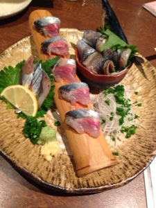

---
Keywords:USP友の会,寝る,シェル芸,シェル芸勉強会
Copyright: (C) 2017 Ryuichi Ueda
---

# 第7回シェル芸勉強会無事終了
今回も一人の死者も出さず、無事にシェル芸を和了できました。\\ご来場の皆様、ありがとうございました。\\会場をお貸しいただいた<a target="blank" href="http://www.kddi-webcommunications.co.jp/">KDDIウェブコミュニケーションズ</a>の小原さん宮川さん、今回もリア充環境ありがとうございました。\\\@bsdhackさん、\@natsu_nananaさ、\@tcshさん、\@hi_saitoさん、お手伝いありがとうございました。今回は想定外のことが幾つか重なっていろいろ気を遣わせてしまいました。すんません。\\> （ぬ）\\毎々お世話になります。\\今日も大変な日になってしまい、かねてからのこともあって心労はまだまだ絶えぬこととお察し致します。\\また落ち着いたら、今度は講師をお願いしたく。\\---以上---\\> （い）\\毎々お世話になります。\\会場でマジックを炸裂させてほしかったですが、勉強会の日を間違えるなんて、なんてことでしょう。なんてことでしょう。\\次回幹事、お願いしたく。ネタにして申し訳なく。\\---以上---\\解答をブログに掲載された方のリンク集と各問題についてのコメントは友の会のブログにそのうち書きます。\\12月もやることになりそうなので、また少しづつお力をお貸しいただけたら幸いです。\\ところで、全然関係ないけど風邪がしんどくて現在、布団で干からびたカエル状の物体に変態しております。そして、全然関係ないけど勉強会の様子を全く写真に撮らなかったので二次会で食べた秋刀魚の刺身の写真を掲載しときます。\\  \\副会長と近いうちに暴れることができることを祈るばかり。\\\寝る。
