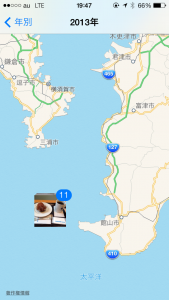

# 「奥さん、その写真、どこで撮ったかバレてますよ」的な問題に対するシェル芸的な対策
バイト時代はマダムキラーと呼ばれていました。上田です。ホストではありませんドーナツ売りです。

さて、本日はCLIで画像のGPS情報を抜き取る話です。私の周辺では常識であり、ちょっとネタがキャッチーすぎて気が引けますが。

iPhoneで写真を見ていると、地図に写真が張り付いているのを見た事があるかもしれません。私のiPhoneはこんな感じになって写真が見られます。

<!--more-->

[caption id="attachment_1570" align="aligncenter" width="169"] なんだか海上に写真がマッピングされていますが、気のせいです。気のせいということにして本題へ。[/caption]

こいつの情報源はExif（Exchangeable image file format）情報といいまして、困ったことに画像に埋め込まれています。自分自身のプライバシーには私はかなり無頓着なのですが、ちょっとどうなんでしょう？UNIX的な解釈だと、画像は画像、付加情報は付加情報で別々のファイルにすべきです。が、便利さに勝てなかった文明は人類を危険へと追いやっております。うかつに写真を投稿すると場所がばれてしまい、うかうか浮気もできません。いや、それは冗談ですが、一枚写真をアップしただけで、自宅の位置とか丸分かりになってしまうのはどうなんでしょうというところです。（知ってるなら機能を切れよという話でもありますが。）

んで、この情報はImageMagickをインストールすると読めます。別にGUIで読めるけどCLIで読みたいんです私は。Macでbrewだとこんな感じ。

[bash]
uedamac:~ ueda$ brew install imagemagick
[/bash]

ImageMagickのidentifyというコマンドを使うと読めます。私のiPhoneで撮った写真から・・・。緯度経度が丸わかりです。

[bash]
uedamac:~ ueda$ identify -verbose ~/Pictures/iPhone/IMG_0005.JPG | head
Image: /Users/ueda/Pictures/iPhone/IMG_0005.JPG
 Format: JPEG (Joint Photographic Experts Group JFIF format)
 Mime type: image/jpeg
 Class: DirectClass
 Geometry: 2592x1936+0+0
 Resolution: 72x72
 Print size: 36x26.8889
 Units: PixelsPerInch
 Type: TrueColor
 Endianess: Undefined
uedamac:~ ueda$ identify -verbose ~/Pictures/iPhone/IMG_0005.JPG | grep GPS
 exif:GPSInfo: 568
 exif:GPSLatitude: 35/1, 3989/100, 0/1
 exif:GPSLatitudeRef: N
 exif:GPSLongitude: 139/1, 4540/100, 0/1
 exif:GPSLongitudeRef: E
 exif:GPSTimeStamp: 21/1, 0/1, 5899/100
[/bash]

緯度がGPSLatitudeとGPSLatitudeRefで北緯35度39.89分0秒、経度がGPSLongitudeとGPSLongitudeRefで東経139度45.4分0度と分かります。これ、思いっきり新橋の緯度経度です。写真は新橋で飲んで酔っ払っている写真なので掲載不可。

これだと単にコマンドの紹介になっちまいますので、シェル芸で写真の名前と緯度経度を並べてお茶を濁します。うーん。新橋に行って、その後鎌倉に行ったことが丸わかりです（数字見ただけでは分からんが）。

[bash]
uedamac:~ ueda$ for f in ~/Pictures/iPhone/IMG_* ; do echo $f ; identify -verbose $f | grep -E ':GPS(Latitude|Longitude):' ; done | awk '/\\/Users/{print &quot;&quot;;printf $0}/^ /{printf $0}' 

/Users/ueda/Pictures/iPhone/IMG_0002.JPG exif:GPSLatitude: 35/1, 3989/100, 0/1 exif:GPSLongitude: 139/1, 4540/100, 0/1
/Users/ueda/Pictures/iPhone/IMG_0005.JPG exif:GPSLatitude: 35/1, 3989/100, 0/1 exif:GPSLongitude: 139/1, 4540/100, 0/1
/Users/ueda/Pictures/iPhone/IMG_0007.JPG exif:GPSLatitude: 35/1, 1873/100, 0/1 exif:GPSLongitude: 139/1, 3214/100, 0/1
/Users/ueda/Pictures/iPhone/IMG_0008.JPG exif:GPSLatitude: 35/1, 1873/100, 0/1 exif:GPSLongitude: 139/1, 3213/100, 0/1
/Users/ueda/Pictures/iPhone/IMG_0009.JPG exif:GPSLatitude: 35/1, 1873/100, 0/1 exif:GPSLongitude: 139/1, 3211/100, 0/1
/Users/ueda/Pictures/iPhone/IMG_0010.JPG exif:GPSLatitude: 35/1, 1874/100, 0/1 exif:GPSLongitude: 139/1, 3212/100, 0/1
[/bash]

この情報を除去するにはImageMagickのconvertコマンドを使い、-stripオプションを指定します。

[bash]
uedamac:~ ueda$ cp ~/Pictures/iPhone/IMG_0005.JPG ~/hoge.jpg
uedamac:~ ueda$ identify -verbose hoge.jpg | grep GPS
 exif:GPSInfo: 568
 exif:GPSLatitude: 35/1, 3989/100, 0/1
 exif:GPSLatitudeRef: N
 exif:GPSLongitude: 139/1, 4540/100, 0/1
 exif:GPSLongitudeRef: E
 exif:GPSTimeStamp: 21/1, 0/1, 5899/100
uedamac:~ ueda$ convert -strip hoge.jpg foo.jpg &lt;- Exif情報を抜いたfoo.jpgを作る
uedamac:~ ueda$ identify -verbose foo.jpg | grep GPS
uedamac:~ ueda$ &lt;- 何も表示されない
[/bash]

面倒な人はどこかにディレクトリを掘って、次のようにワンライナーで全部stripしちゃえという感じです。ストリップしちゃいなよ。

[bash]
uedamac:safe ueda$ for f in ~/Pictures/iPhone/*.JPG ; do convert -strip $f ./safe/$(basename $f) ; done
[/bash]

さいなら。
