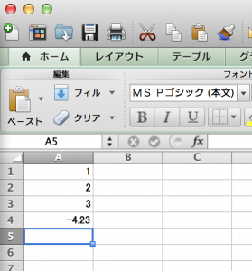

# Excelファイルをシェル芸でほじくる。ただしエクセル方眼紙は後日ということで。
追記：<a href="http://blog.ueda.asia/?p=2417" title="Excelファイルをシェル芸でほじくる。（hxselect編）" target="_blank">続編書きました</a> 
 
だっこした子供が寝てしまってキーボードを叩くしかやることがない上田ですこんばんわ。 
 
最近エクセル方眼紙がブームです。シェル芸人としては便乗するしかありません。ちょっとエクセルのファイルに悪戯してみます。皆さんも手を動かしてみてください。 
 
 
 
 
まず上に挙げたエクセルファイルを用意して、book.xlsxと名前とつけます。セルにはとりあえず数字だけ書きましょう。文字列がある場合はまた後日。 
 
こんな風に適当なディレクトリに置いてください。 
 
[bash] 
uedambp:tmp ueda$ pwd 
/Users/ueda/tmp 
uedambp:tmp ueda$ ls  
book.xlsx 
[/bash] 
 
次にやるのは「解凍」です。実は.xlsxはzipファイルです。 
 
<!--more--> 
 
[bash] 
uedambp:tmp ueda$ unzip book.xlsx  
Archive: book.xlsx 
 inflating: [Content_Types].xml  
 inflating: _rels/.rels  
 inflating: xl/_rels/workbook.xml.rels  
 inflating: xl/workbook.xml  
 extracting: docProps/thumbnail.jpeg  
 inflating: xl/theme/theme1.xml  
 inflating: xl/styles.xml  
 inflating: xl/worksheets/sheet1.xml  
 inflating: docProps/core.xml  
 inflating: docProps/app.xml  
[/bash] 
 
解凍するとこんなディレクトリツリーが出現します。エロいですね。（何が？） 
 
[bash] 
uedambp:tmp ueda$ tree 
. 
├── [Content_Types].xml 
├── _rels 
├── book.xlsx 
├── docProps 
│   ├── app.xml 
│   ├── core.xml 
│   └── thumbnail.jpeg 
└── xl 
 ├── _rels 
 │   └── workbook.xml.rels 
 ├── styles.xml 
 ├── theme 
 │   └── theme1.xml 
 ├── workbook.xml 
 └── worksheets 
 └── sheet1.xml 
 
6 directories, 10 files 
[/bash] 
 
sheet1.xmlを見てみましょう。 
 
[bash] 
uedambp:tmp ueda$ cat xl/worksheets/sheet1.xml  
&lt;?xml version=&quot;1.0&quot; encoding=&quot;UTF-8&quot; standalone=&quot;yes&quot;?&gt; 
&lt;worksheet  
xmlns=&quot;http://schemas.openxmlformats.org/spreadsheetml/2006/main&quot;  
xmlns:r=&quot;http://schemas.openxmlformats.org/officeDocument/2006/relations 
hips&quot; xmlns:mc=&quot;http://schemas.openxmlformats.org/markup- 
compatibility/2006&quot; mc:Ignorable=&quot;x14ac&quot;  
xmlns:x14ac=&quot;http://schemas.microsoft.com/office/spreadsheetml/2009/9/ac&quot; 
&gt;&lt;dimension ref=&quot;A1:A4&quot;/&gt;&lt;sheetViews&gt;&lt;sheetView tabSelected=&quot;1&quot;  
workbookViewId=&quot;0&quot;&gt;&lt;selection activeCell=&quot;A5&quot; sqref=&quot;A5&quot;/&gt;&lt;/sheetView&gt; 
&lt;/sheetViews&gt;&lt;sheetFormatPr baseColWidth=&quot;12&quot; defaultRowHeight=&quot;18&quot;  
x14ac:dyDescent=&quot;0&quot;/&gt;&lt;sheetData&gt;&lt;row r=&quot;1&quot; spans=&quot;1:1&quot;&gt;&lt;c r=&quot;A1&quot;&gt; 
&lt;v&gt;1&lt;/v&gt;&lt;/c&gt;&lt;/row&gt;&lt;row r=&quot;2&quot; spans=&quot;1:1&quot;&gt;&lt;c r=&quot;A2&quot;&gt;&lt;v&gt;2&lt;/v&gt;&lt;/c&gt;&lt;/row&gt; 
&lt;row r=&quot;3&quot; spans=&quot;1:1&quot;&gt;&lt;c r=&quot;A3&quot;&gt;&lt;v&gt;3&lt;/v&gt;&lt;/c&gt;&lt;/row&gt;&lt;row r=&quot;4&quot;  
spans=&quot;1:1&quot;&gt;&lt;c r=&quot;A4&quot;&gt;&lt;v&gt;-4.2300000000000004&lt;/v&gt;&lt;/c&gt;&lt;/row&gt;&lt;/sheetData&gt; 
&lt;phoneticPr fontId=&quot;1&quot;/&gt;&lt;pageMargins left=&quot;0.7&quot; right=&quot;0.7&quot; top=&quot;0.75&quot;  
bottom=&quot;0.75&quot; header=&quot;0.3&quot; footer=&quot;0.3&quot;/&gt;&lt;extLst&gt;&lt;ext uri=&quot;{64002731-A6B0- 
56B0-2670-7721B7C09600}&quot;  
xmlns:mx=&quot;http://schemas.microsoft.com/office/mac/excel/2008/main&quot;&gt; 
&lt;mx:PLV Mode=&quot;0&quot; OnePage=&quot;0&quot; WScale=&quot;0&quot;/&gt;&lt;/ext&gt;&lt;/extLst&gt; 
&lt;/worksheet&gt;uedambp:tmp ueda$  
[/bash] 
 
<del>嫌がらせ</del>容量の抑制のために改行ナッシングです。 
 
[ad#articleheader] 
 
数字はcという名前の要素に入っています。抽出してみましょう。POSIXにうるさい方々には叱られそうですが・・・。 
 
[bash] 
uedambp:tmp ueda$ cat xl/worksheets/sheet1.xml | 
 grep -o '&lt;c [^&lt;]*&gt;&lt;v&gt;[^&lt;]*&lt;/v&gt;&lt;/c&gt;' 
&lt;c r=&quot;A1&quot;&gt;&lt;v&gt;1&lt;/v&gt;&lt;/c&gt; 
&lt;c r=&quot;A2&quot;&gt;&lt;v&gt;2&lt;/v&gt;&lt;/c&gt; 
&lt;c r=&quot;A3&quot;&gt;&lt;v&gt;3&lt;/v&gt;&lt;/c&gt; 
&lt;c r=&quot;A4&quot;&gt;&lt;v&gt;-4.2300000000000004&lt;/v&gt;&lt;/c&gt; 
[/bash] 
 
あとは余計な記号を除去してセルの番号と数字を取り出します。 
 
[bash] 
uedambp:tmp ueda$ cat xl/worksheets/sheet1.xml | 
 grep -o '&lt;c [^&lt;]*&gt;&lt;v&gt;[^&lt;]*&lt;/v&gt;&lt;/c&gt;' | tr '&gt;&lt;&quot;' ' ' | awk '{print $3,$5}' 
A1 1 
A2 2 
A3 3 
A4 -4.2300000000000004 
[/bash] 
 
ぜひやってみてください。案外使える技かもしれません。 
 
文字列や数式が入っている場合についてはまた後日。 
 
 
寝る。
