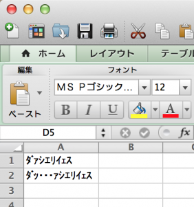
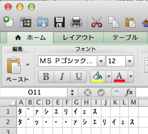

# エクセル方眼紙の無駄をエクシェル芸で遠回しに指摘する。
上田です。<a href="http://kernel.doorkeeper.jp/events/9547" target="_blank">カーネル読書会</a>に潜入中です。

ここ2日、連続でExcelファイルをシェル芸でほじる記事を書きましたが、副会長から、<span style="color:red">エクシェル芸</span>という名称をいただきました。使わせていただきます。有り難うございます。

<blockquote class="twitter-tweet" lang="ja"><p>シェル芸拡張 エクシェル芸が誕生した瞬間 <a href="https://twitter.com/search?q=%23%E3%82%B7%E3%82%A7%E3%83%AB%E8%8A%B8&amp;src=hash">#シェル芸</a> <a href="https://twitter.com/search?q=%23usptomo&amp;src=hash">#usptomo</a> <a href="http://t.co/llzq8qTM5w">http://t.co/llzq8qTM5w</a></p>&mdash; (っ´A｀)っ ゃー (\@nullpopopo) <a href="https://twitter.com/nullpopopo/statuses/448832135101968384">2014, 3月 26</a></blockquote>
<script async src="//platform.twitter.com/widgets.js" charset="utf-8"></script>


Excelと言えば、最近、<a href="http://itpro.nikkeibp.co.jp/article/Watcher/20140321/545102/" target="_blank">これ</a>とか<a href="http://wol.nikkeibp.co.jp/article/column/20130523/153361/" target="_blank">これ</a>とか、エクセル方眼紙が話題になっています。

<!--more-->

なぜエクセル方眼紙がいけないのか。データとレイアウトと操作が一緒くたになっているとか、別のアプリからデータが使えず再利用性に問題とか、貴重な労働時間が削減されるとか、いろいろありますが、そういう話は他の人に任せて、ここ二日で紹介した<a href="http://blog.ueda.asia/?p=2398" title="Excelファイルをシェル芸でほじくる。ただしエクセル方眼紙は後日ということで。" target="_blank">Excelをunzipして中のXMLファイルをほじくる手法</a>でエクセル方眼紙を観察してみます。<span style="color:red">非常に遠回しですが、やはり「エクセル方眼紙は無駄だ！！」という結論が得られております。</span>

まず、方眼紙でないファイルを用意しました。下の図のようなものです。少々ネタが古いです。

<a href="スクリーンショット-2014-03-28-19.29.45.png"></a>

さて、解凍してみます。文字列はxl/sharedStrings.xmlに入っています。

```bash
ueda\@remote:~/tmp$ unzip *
ueda\@remote:~/tmp$ cat xl/sharedStrings.xml | hxselect si | sed 's;</si>;&\\n;g'
<si><t>ﾀﾞｧｼｴﾘｲｪｽ</t><phoneticPr fontId="1"/></si>
<si><t>ﾀﾞｯ・・・ｧｼｴﾘｲｪｽ</t><phoneticPr fontId="1"/></si>
```

このファイルのsi要素に、上から0,1番と番号を振り、それをsheet1.xmlで参照しています。

```bash
ueda\@remote:~/tmp$ cat xl/worksheets/sheet1.xml | hxselect c | sed 's;</c>;&\\n;g'
<c r="A1" t="s"><v>0</v></c>
<c r="A2" t="s"><v>1</v></c>
```

<a href="http://blog.ueda.asia/?p=2398" title="Excelファイルをシェル芸でほじくる。ただしエクセル方眼紙は後日ということで。" target="_blank">数字のときはv要素の中に数字が入っていましたが</a>、文字列のセルの場合はc要素にt="s"という目印を付けた上でv要素の中にポインタが入っています。

<span style="color:red">しかし、sharedStrings.xml、si要素にidを付けずに順序で番号をつけるとは・・・。</span>そんなにファイルを小さくしたいか？

さて、この文字列を表現するのにどれだけデータがあるか数えてみましょう。

```bash
ueda\@remote:~/tmp$ cat xl/sharedStrings.xml | hxselect si | wc 
c-146
ueda\@remote:~/tmp$ cat xl/worksheets/sheet1.xml | hxselect c | wc 
c-56
```

合計202バイトです。テキストだと改行コードを入れて68バイトなので、3倍くらい容量があります。まあ、便利さと引き換えにするとそんなべらぼうでもありません。ただ、Excelファイル全体では26232バイトもあるわけですが、まあ今時そんなに目くじらを立てるほどのものでもありません。XMLだしシェル芸で読めるのでそんなに怒る必要もないかと。


んで次に、方眼紙バージョンです。

<a href="スクリーンショット-2014-03-28-19.23.56.png"></a>

あ、発狂しないでください発狂しないでください。<span style="color:red">発狂するのはまだ早いわ！</span>

sharedStrings.xmlとsheet1.xmlから文字の部分を引っ張りだしてみましょう。

```bash
ueda\@remote:~/tmp$ unzip *
ueda\@remote:~/tmp$ cat xl/sharedStrings.xml | hxselect si | sed 's;</si>;&\\n;g'
<si><t>ﾀ</t><phoneticPr fontId="1"/></si>
<si><t>ﾞ</t><phoneticPr fontId="1"/></si>
<si><t>ｧ</t><phoneticPr fontId="1"/></si>
<si><t>ｼ</t><phoneticPr fontId="1"/></si>
<si><t>ｴ</t><phoneticPr fontId="1"/></si>
<si><t>ﾘ</t><phoneticPr fontId="1"/></si>
<si><t>ｲ</t><phoneticPr fontId="1"/></si>
<si><t>ｪ</t><phoneticPr fontId="1"/></si>
<si><t>ｽ</t></si>
<si><t>ｯ</t><phoneticPr fontId="1"/></si>
<si><t>・</t><phoneticPr fontId="1"/></si>
ueda\@remote:~/tmp$ cat xl/worksheets/sheet1.xml | hxselect c | sed 's;</c>;&\\n;g'
<c r="A1" t="s"><v>0</v></c>
<c r="B1" t="s"><v>1</v></c>
<c r="C1" t="s"><v>2</v></c>
<c r="D1" t="s"><v>3</v></c>
<c r="E1" t="s"><v>4</v></c>
<c r="F1" t="s"><v>5</v></c>
<c r="G1" t="s"><v>6</v></c>
<c r="H1" t="s"><v>7</v></c>
<c r="I1" t="s"><v>8</v></c>
<c r="A2" t="s"><v>0</v></c>
<c r="B2" t="s"><v>1</v></c>
<c r="C2" t="s"><v>9</v></c>
<c r="D2" t="s"><v>10</v></c>
<c r="E2" t="s"><v>10</v></c>
<c r="F2" t="s"><v>10</v></c>
<c r="G2" t="s"><v>2</v></c>
<c r="H2" t="s"><v>3</v></c>
<c r="I2" t="s"><v>4</v></c>
<c r="J2" t="s"><v>5</v></c>
<c r="K2" t="s"><v>6</v></c>
<c r="L2" t="s"><v>7</v></c>
<c r="M2" t="s"><v>8</v></c>
```

<span style="color:red;font-size:40px">うわああああああああああああ！！！！</span>と興奮することもないですが、結構前立腺肥大しています。サイズは、と・・・

```bash
ueda\@remote:~/tmp$ cat xl/sharedStrings.xml | hxselect si | wc 
c-449
ueda\@remote:~/tmp$ cat xl/worksheets/sheet1.xml | hxselect c | wc 
c-619
```

1kB超えてますね。たかがﾀﾞｧｼｴﾘｲｪｯｽに1kB超です。

しかし、サイズについてはいいんです。1kBくらいどうってことありません。<span style="color:red">しかし何が悲しいかというと、エクセルがsheet1.xmlに文字列を埋め込まずに別にXMLを準備して文字列を格納し、それをsheet1.xmlからポインタで参照する構造にしているのに、そのポインタが巨大化してかえって全体として肥大化しているということです。</span>

```bash
#マイクロソフトのもくろみではこの構造の方が節約できる
<c r="A1" t="s"><v>0</v></c>
<c r="A2" t="s"><v>0</v></c>
<si><t>ﾀ</t><phoneticPr fontId="1"/></si>
#でもこうした方が小さいという・・・
<c r="A1"><v>ﾀ</v></c>
<c r="A2"><v>ﾀ</v></c>
```
ポインタの方がでかいという・・・。

M社のデータ構造の想定の遥かに上を行くExcel方眼紙こわいということで、この話はおしまいにします。・・・あなたのPCにも、こんなXMLが・・・


おしまい。
<!--:-->
