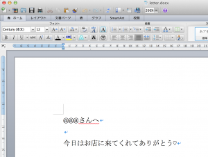
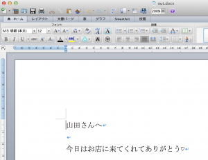

# Word（docx）用sedを作ってしもうた。
<a href="http://blog.ueda.asia/?p=2957" title="Word（docx）用sedを改良してしもうた。">続編アリ（2014/4/23）</a>

クリエイチビチーが止まりません。上田です。

お昼ごはんの蕎麦を食いながら昼休みの間に「ワードファイルの文字列を改ざんするコマンド」を作りましたので公開をば。本の一部にするので遊んでいるわけではない、遊んでいるわけではないと、自分に言い聞かせながら・・・。

<!--more-->

10分くらいで作ったのでそんなに手遊びというわけではありませんが・・・仕事が・・・。ブログ書くのも10分かかるし・・・。

<a href="https://github.com/ryuichiueda/ShellOfficeTools" target="_blank">https://github.com/ryuichiueda/ShellOfficeTools</a>

この中にシェルスクリプトの「wordsed」というのがあるので、これを使います。動作はMacで確認しています。せっかくなのでコードも晒しておきましょう。標準出力にcdやらzipやらが字を吐くので抑えるのが大変でした・・・。

```bash
#!/bin/bash 

# wordsed: a string replacement tool for docx

# written by Ryuichi UEDA, Apr. 22, 2014 

# usage: wordsed <from str&gt; <to str&gt; original.docx &gt; newfile.docx

tmp=./tmp-exshell-$$
mkdir &quot;$tmp&quot; || exit 1

cd &quot;$tmp&quot; &amp;&amp;
unzip &quot;$3&quot; &gt;&amp;2 || exit 1

FROM=$(echo &quot;$1&quot; | sed 's;/;\\/;g')
TO=$(echo &quot;$2&quot; | sed 's;/;\\/;g')

sed &quot;s/$FROM/$TO/g&quot; word/document.xml &gt; tmp &amp;&amp;
mv tmp word/document.xml

zip -r tmp.docx * &gt;&amp;2 &amp;&amp; cat tmp.docx

cd - &gt;&amp;2 &amp;&amp; rm -Rf &quot;$tmp&quot;

#The MIT License
#
#Copyright (C) Ryuichi UEDA
#
#Permission is hereby granted, free of charge, to any person obtaining a copy
#of this software and associated documentation files (the &quot;Software&quot;), to deal
#in the Software without restriction, including without limitation the rights
#to use, copy, modify, merge, publish, distribute, sublicense, and/or sell
#copies of the Software, and to permit persons to whom the Software is
#furnished to do so, subject to the following conditions:
#
#The above copyright notice and this permission notice shall be included in
#all copies or substantial portions of the Software.
#
#THE SOFTWARE IS PROVIDED &quot;AS IS&quot;, WITHOUT WARRANTY OF ANY KIND, EXPRESS OR
#IMPLIED, INCLUDING BUT NOT LIMITED TO THE WARRANTIES OF MERCHANTABILITY,
#FITNESS FOR A PARTICULAR PURPOSE AND NONINFRINGEMENT. IN NO EVENT SHALL THE
#AUTHORS OR COPYRIGHT HOLDERS BE LIABLE FOR ANY CLAIM, DAMAGES OR OTHER
#LIABILITY, WHETHER IN AN ACTION OF CONTRACT, TORT OR OTHERWISE, ARISING FROM,
#OUT OF OR IN CONNECTION WITH THE SOFTWARE OR THE USE OR OTHER DEALINGS IN
#THE SOFTWARE.
```

使ってみます。下のワードファイルの\@\@\@を名前に変換します。

<a href="スクリーンショット-2014-04-22-12.51.40.png"></a>

コマンド実行！！！

```bash
uedambp:ShellOfficeTools ueda$ ./wordsed \@\@\@ 山田 ~/letter.docx &gt; out.docx
```

out.docxを開いてみます。

<a href="スクリーンショット-2014-04-22-12.54.50.png"></a>


OK！！！


仕事に戻らねば・・・。
