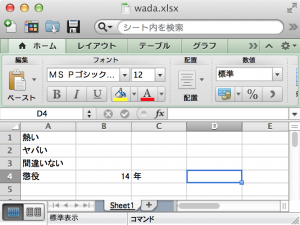

# Excel読み取りコマンドができた。ただしOpen usp Tukubai依存
小児科の待合室からこんにちは。

エクシェル芸の修行の一環である<a href="https://github.com/usp-engineers-community/Open-usp-Tukubai">オフィス用コマンド</a>をこの前から作ってますが、とりあえずシートの数字の文字列を読み込んで標準出力にゴモゴモと出すコマンドが完成しました。

<!--more-->


ワークシートにある文字列のポインタと文字列シートの文字列を結合するためにjoin1を使ってしまったのでOpen usp Tukubaiが必要ですが、他はMacでもLinuxでも動くかと。

では、次のワークシートを読み取ってみましょう。

[caption id="attachment_2992" align="aligncenter" width="300"]<a href="スクリーンショット-2014-04-25-17.59.24.png"></a> 特定の個人、団体とは一切関係がありません。[/caption]

はいできました。

```bash
uedambp:ShellOfficeTools ueda$ ./exread sheet1 ~/Desktop/wada.xlsx 
A 1 熱い
A 2 ヤバい
A 3 間違いない
A 4 懲役
C 4 年
B 4 14
###整形したけりゃこんな感じ###
uedambp:ShellOfficeTools ueda$ ./exread sheet1 ~/Desktop/wada.xlsx |
 self 2 1 3 | map num=1 | keta
* A B C
1 熱い 0 0
2 ヤバい 0 0
3 間違いない 0 0
4 懲役 14 年
```

<span style="color:red">今週末はLet's エクシェル芸!!</span>（なんかかっこ悪い）


診察まだかな。

（注: 小児科で下書きして家で仕上げてアップロードしました。）
