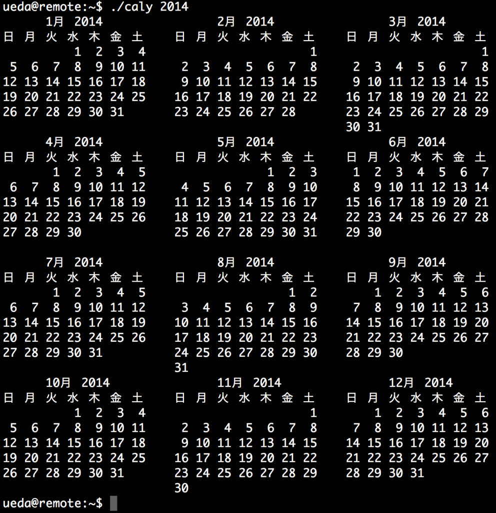

# 一年分のカレンダーを表示するシェルスクリプト
なんとなく作ってしまった・・・

<span style="color:red">（追記：cal 2014でいいじゃないか！！！！知らなかったじゃないか！！！！ということでpaste芸＆ <( )芸をお楽しみください。）</span>

```bash
ueda\@remote:~$ cat caly 
#!/bin/bash

paste <(cal 1 &quot;$1&quot;) <(cal 2 &quot;$1&quot;) <(cal 3 &quot;$1&quot;)
paste <(cal 4 &quot;$1&quot;) <(cal 5 &quot;$1&quot;) <(cal 6 &quot;$1&quot;)
paste <(cal 7 &quot;$1&quot;) <(cal 8 &quot;$1&quot;) <(cal 9 &quot;$1&quot;)
paste <(cal 10 &quot;$1&quot;) <(cal 11 &quot;$1&quot;) <(cal 12 &quot;$1&quot;)
```

制御構文使えよってくらいのベタ書きであるが・・・

せっかくなので、スクリーンショットで。

<a href="スクリーンショット-2014-04-29-21.36.42.png"></a>

来年の正月が楽しみだ。


寝る。
