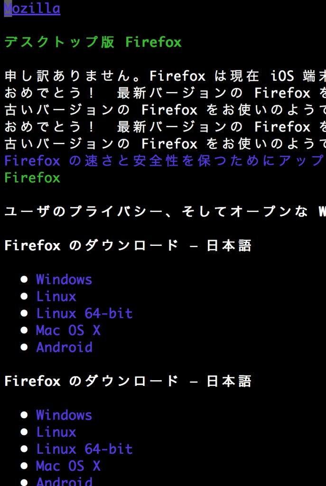

# 【この記事は何の役にも立ちません！】IEを使わずにFirefoxをダウンロードするヒント（当てずっぽう）
<blockquote class="twitter-tweet" lang="ja">
IEを使わずにChromeやFirefoxをインストールする方法をシェル芸でなんとかひとつ
&mdash; kentaro yanagida (\@yng13) <a href="https://twitter.com/yng13/statuses/461503780643540992">2014, 4月 30</a></blockquote> 
 
 
・・・とお題が出ましたが、手元にWindowsがありません。 
 
<!--more--> 
 
しかし、Cygwinにw3mがあればできるはずなので、その手順をば。もしWindowsでできなかったら申し訳ないです。 
 
（追記: おおおお！<a href="http://news.mynavi.jp/articles/2013/07/09/w3m/002.html">Windowsでw3mを動かす）</a> 
 
（追記2: じゃあどうやってCygwinインストールするんだと？） 
 
まず、Cygwinにw3mが存在している場合、こうすればFirefoxのサイトが見られるはずです。 
 
[bash] 
ueda\@remote:~$ w3m http://www.mozilla.org/ja/firefox/new/ 
[/bash] 
 
こんな画面が出ます。 
 
 
 
で、カーソルを 
[bash] 
Firefox のダウンロード — 日本語 
 • Windows 
[/bash] 
の所にあわせてEnterを押します。 
 
それで、ダウンロードが始まります。画面下に、 
[bash] 
(Download)Save file to: Firefox%20Setup%20Stub%2029.0.exe 
[/bash] 
と出るはずです。 
 
あとは、このファイルを検索で探し出してインストールすればよろしいかと。念のためもう一度言っておきますが、Windowsでは検証しておりません。 
 
 
寝る。 
 
<h2>追記: じゃあCygwinどうやってダウンロードするんだよ？（注意: これもダメ）</h2> 
 
[bash] 
$ wget http://cygwin.com/setup-x86_64.exe 
[/bash] 
 
でいいんですが・・・。wgetがないという・・・。みんな不便なもの使ってるな・・・
