# 京都の裏道を散歩した
おばんです。おばはんではありません。\\学会で喋った後、京都の裏路地を歩きました。駅前から四条まで。\\まず、こんな看板。リド飲食街とは何でしょう？後から調べたらいい感じの古い飲み屋がたくさんあったらしいのですが、今回は踏み込まず。\\<!--more-->\\  <a href="20140523-205712-75432861.jpg">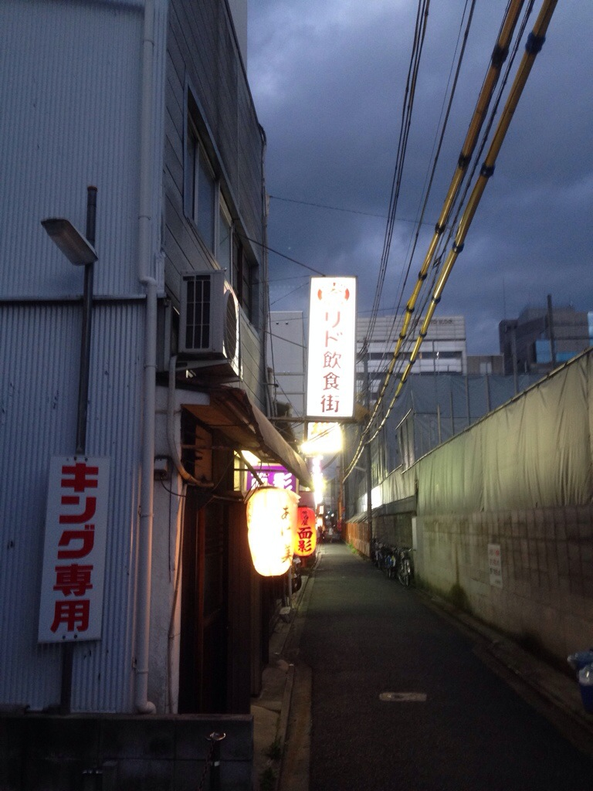</a>\\パチンコ屋の駐車場を通って（おい）七条に出て道を渡ると、こんなことに。\\  <a href="20140523-210249-75769663.jpg">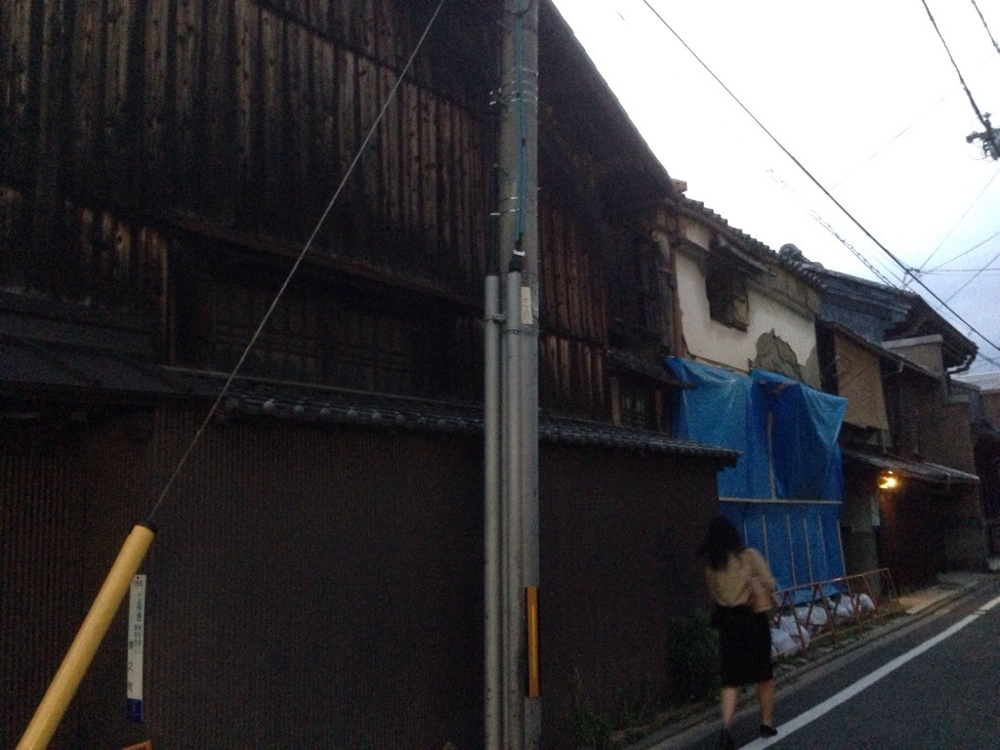</a>\\ちょっと写真を撮るのも掲載するのも憚られるのですが、自分が考えていたことは壁が崩れているなということではなく「土壁だ懐かしい」でした。\\確かにもう、普通の家には土壁使わんよなーと。\\路地を行くといい感じの町屋が続きます。そう言えば京都の町屋は有名ですが、これまでそんなこと気にもしませんでした。\\  <a href="20140523-211312-76392161.jpg">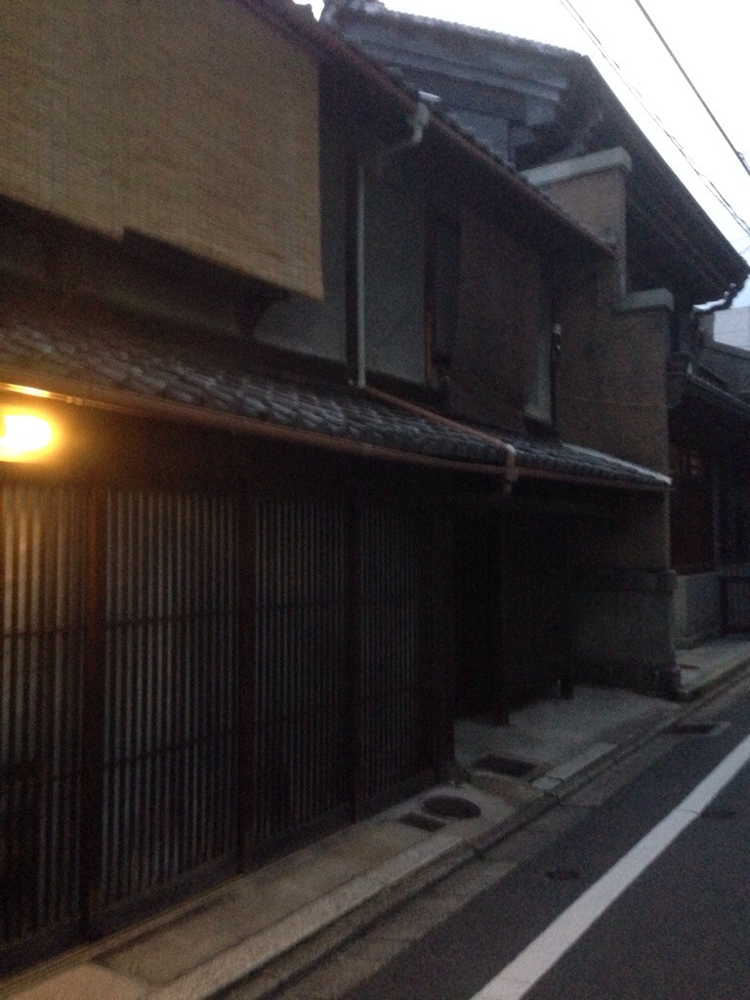</a>\\\何で気にしなかったか考えるとあっさり答えが出ました。北陸地方の町は基本的に京都を真似ており、町屋はそんなに珍しくないからです。今は木造のはほとんど残ってないでしょうが。\\私の場合、父親の実家が伏木の勝興寺の坂を少し下りた所という、町のド真ん中にある木造の町屋だったので、そういうところに普通に出入りしていたわけです。\\父親の実家（私にとってはおばあちゃんの古い家）は、私が五歳くらいの時に引き払ってしまったので、もう記憶も朧げですが、確かこんな町屋を少し狭めたような家だったと記憶しています。\\  <a href="20140523-212016-76816998.jpg">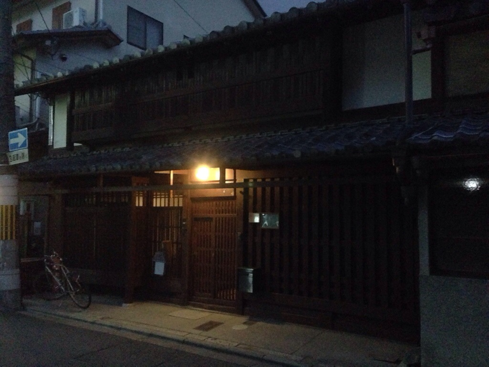</a>\\ちなみに、ばあちゃんの家は縦に長く引き伸ばしたコの字をしており、コの中に庭、縦棒のところに台所、一番奥に風呂があるという間取りでした。これは伏木の町屋では一般的らしく、調べると祖母の家と全く同じ間取りの家が売りに出されていて（560万円100平米超ですがいかがでしょう？）面白かったです。一方、京町屋は庭の部分が土間らしく、昔から地価が高かったのねと思ったのですが違いますかね？\\歩いて行くと、異様な袋小路がありました。東本願寺の石垣です。\\  <a href="20140523-213157-77517806.jpg">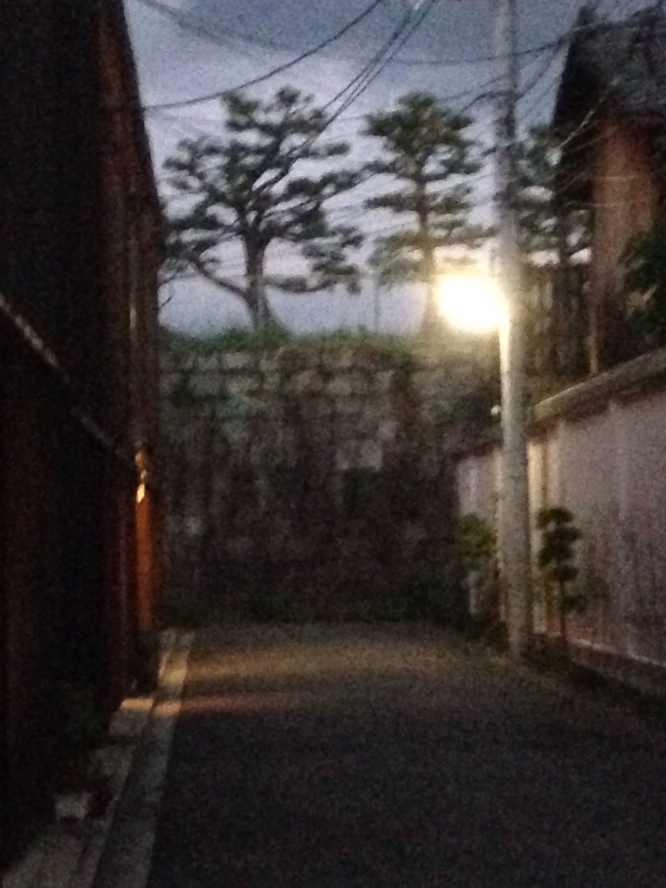</a>\\でかい建築物の裏を巡るツアーでも企画しようかと思いました。\\裏路地の写真はこんなもんですが、個人的には、もうお婆さんもあの家も無くなってしまった伏木の町を思い出しながらしんみりと散歩ができて、裏道選んで正解でした。涙が出そうになりました。\\その後、四条を鴨川方向に歩きました。関西の各地で繰り広げられる阪神と阪急のネオン対決が眩しかったです。\\\  <a href="20140523-213739-77859665.jpg">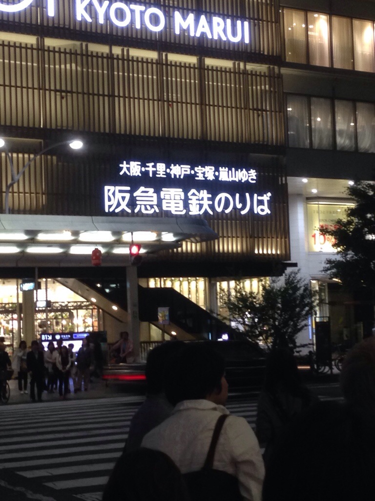</a>\\  <a href="20140523-213757-77877705.jpg">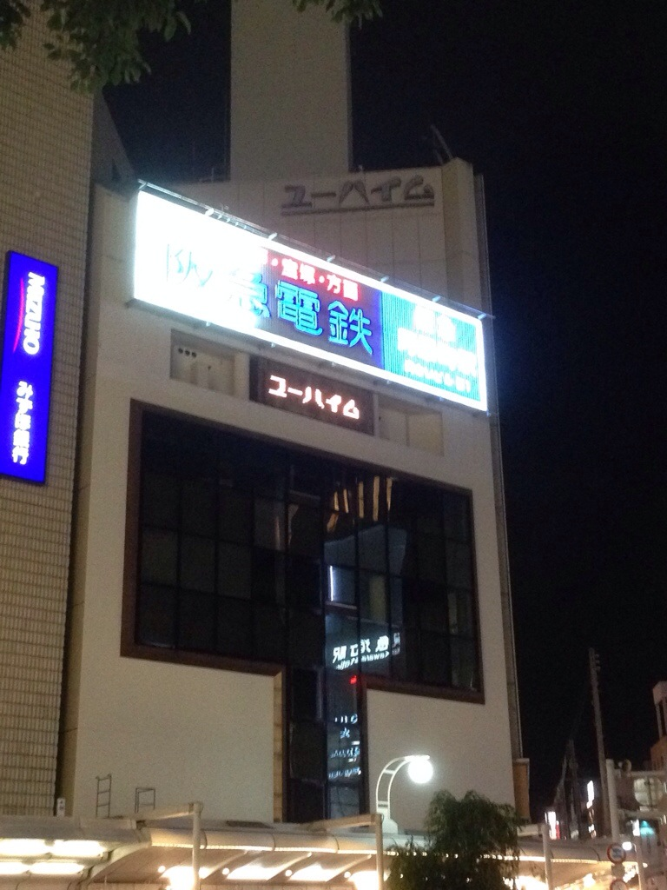</a>\\私的にはどう考えても味のある阪急の勝ちです。\\祇園四条まで歩きます。\\  <a href="20140523-214048-78048388.jpg">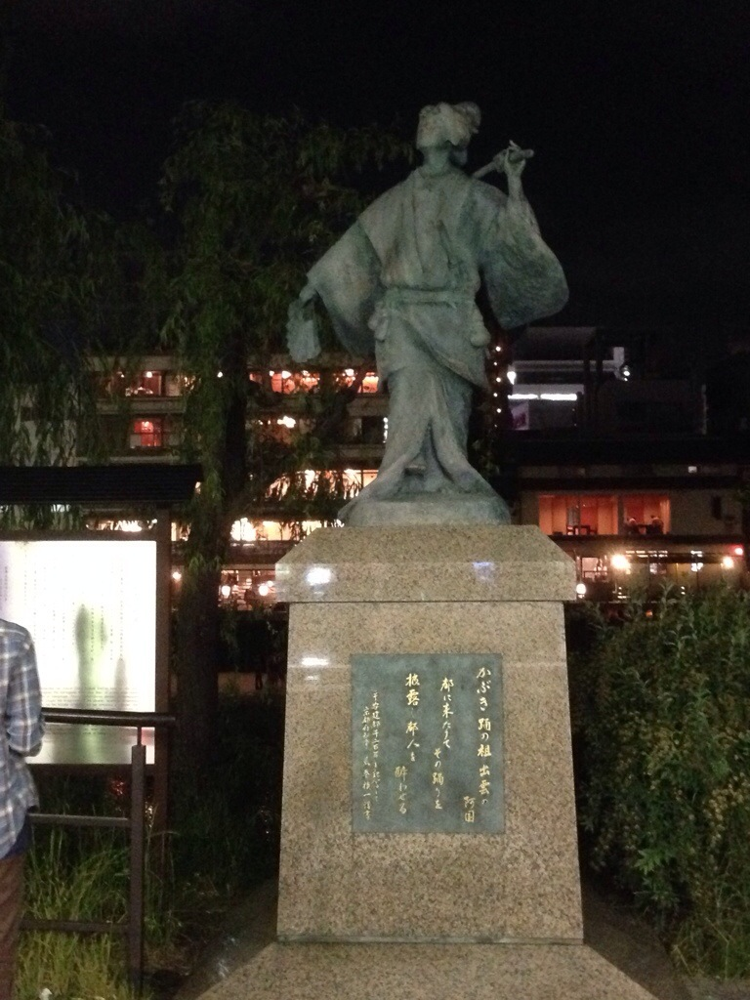</a>\\あこ・・・阿国！\\\鴨川に降ります。\\  \\歩きます。\\  <a href="20140523-214139-78099431.jpg">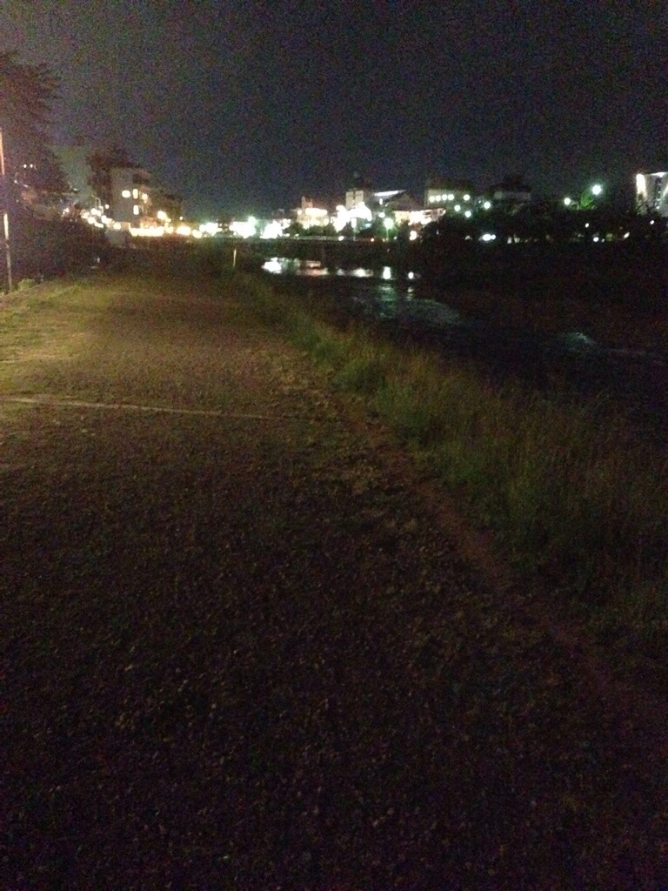</a>\\・・・\\  <a href="20140523-214200-78120919.jpg">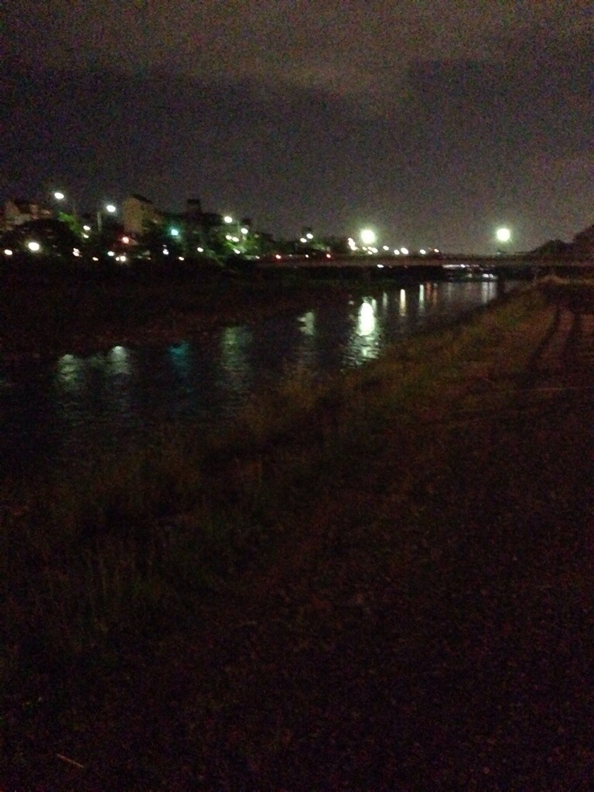</a>\\上に上がれねーじゃねーかよ！！\\ようやく怪しい橋がかかってる箇所を見つけて生還しました。\\\  <a href="20140523-214630-78390853.jpg">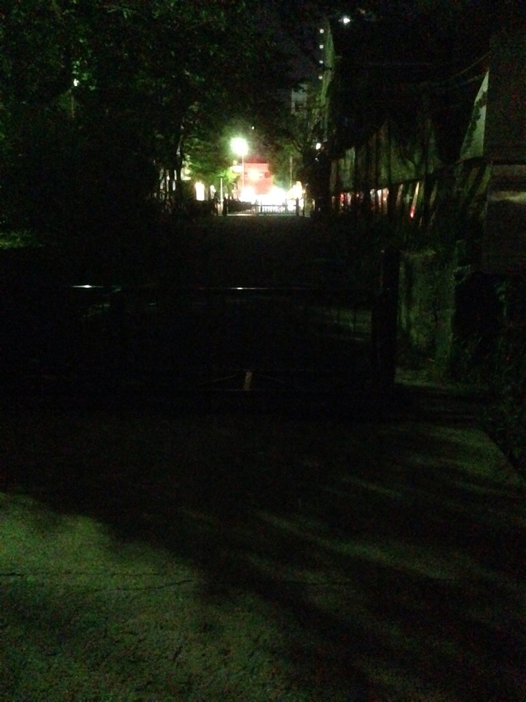</a>\\この後、逃げるようにバスに乗って駅前のホテルに戻るという、少々残念なフィナーレを迎えましたが、トータルではとてもよい散歩でした。\\ぜひ鴨川には、土手から上がる橋なり階段なりを増やしていただきたく。\\\おしまい。
