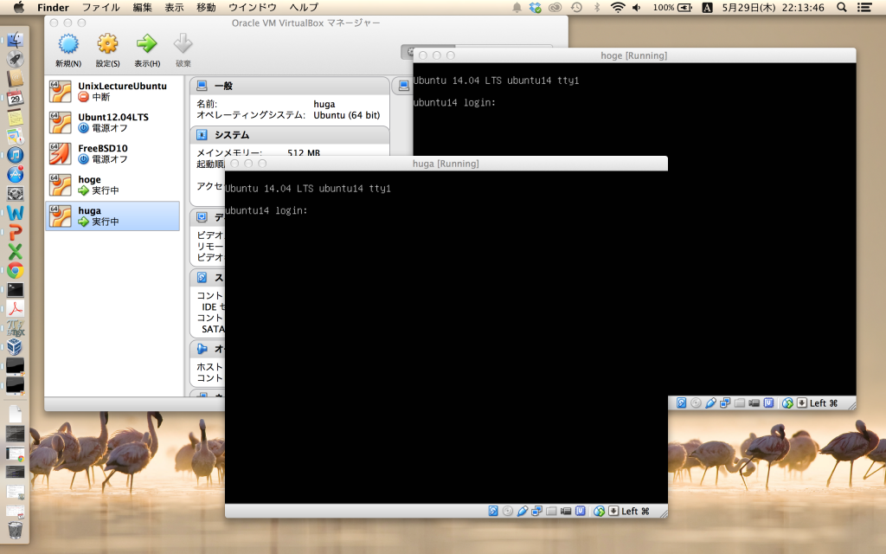

# 【徒労だったか？】VirtualBoxの仮想マシーンのクローン作りをシェルスクリプトでやっちまう
<h2>あとから追記</h2>

現在、この記事がきっかけでVirtualBox clonevmでクローン簡単に作れないかという話になってます。Facebookで。

・・・で、次のようにクローンが作れると分かりました。

[bash]
uedambp:VirtualBox VMs ueda$ VBoxManage clonevm コピー元 --mode machine --name コピー先 --register
[/bash]

とりあえずVMのクローンが作りたくてここを訪れた人はこれでお願いします。

ただ、tar.gzで固めてないとまっさらなOSかどうか分からないので、私は自分で書いたシェルスクリプト版を使います。

以上。

こんばんは。シェル芸勉強会でないシェル勉強会に興味シンシンの上田です。

<blockquote class="twitter-tweet" data-partner="tweetdeck">
シェル芸じゃないシェルの勉強会来たけどここ前にシェル芸勉強会やったとこだｗ <a href="https://twitter.com/search?q=%23nanapi_study&amp;src=hash">#nanapi_study</a>
&mdash; Kei Iwasaki (\@laugh_k) <a href="https://twitter.com/laugh_k/statuses/471959638506602496">May 29, 2014</a></blockquote>

ややこしい。

<h2>本題</h2>

さて本題。本とかの検証でまっさらな環境を何回も作らなければならん状況になっております。（つまりやっと出版されそうだということなんですが・・・）。

世の中にはVagrantなんて便利なものもありますし、VirtualBoxでマウスをクリクリすればクローンは作れますが、私といたしましてはシェルスクリプトで済ませるものはシェルスクリプトで済ませたいので、シェルスクリプトで済ませました。環境はMacです。

まず、まっさらな仮想OSをtar.gzしておきます。

<!--more-->

[bash]
uedambp:VirtualBox VMs ueda$ ls *Virgin.tar.gz
Ubuntu14.04DesktopVirgin.tar.gz Ubuntu14.04ServerVirgin.tar.gz
[/bash]

んで、次のようなシェルスクリプトでtar.gzファイルを展開することにしました。$1に展開したいtar.gzファイル、$2に新しい名前を指定します。単に解凍するだけだと二つ以上クローンしたときにUUIDがバッティングするので、UUIDを改ざんしています。エラー処理もショボく、力技なので解説するほどのものでもないですが、面白い所では、uuidgenコマンドでしょうか。あと、VirtualBox付属のVBoxManageコマンド。

[bash]
uedambp:VirtualBox VMs ueda$ cat vmcp 
#!/bin/bash -xv

ORG=$(echo &quot;$1&quot; | sed 's;^./;;' | sed 's;\\.tar\\.gz$;;' | tr -d '/')

tar zxvf &quot;$1&quot;

###ディレクトリ名の変更###
mv &quot;$ORG&quot; &quot;$2&quot; || exit 1
cd &quot;$2&quot; || exit 1

###ファイル名の変更###
ls &quot;$ORG&quot;* |
while read f; do
 newfile=$(echo $f | sed &quot;s;$ORG;$2;&quot;)
 mv &quot;$f&quot; &quot;$newfile&quot;
done
sed -i.bak1 &quot;s;$ORG;$2;g&quot; &quot;$2&quot;.vbox

###HDDのUUID変更###
OLDUUID=$(cat $2.vbox | grep &quot;HardDisk uuid&quot; | sed 's/^.*{//' | sed 's/}.*//')
NEWUUID=$(VBoxManage internalcommands sethduuid &quot;$2.vdi&quot; | awk '{print $NF}')
sed -i.bak2 &quot;s;$OLDUUID;$NEWUUID;g&quot; &quot;$2.vbox&quot;

###本体のUUID変更###
OLDUUID=$(cat $2.vbox | grep &quot;Machine uuid&quot; | sed 's/^.*{//' | sed 's/}.*//')
NEWUUID=$(uuidgen)
sed -i.bak3 &quot;s;$OLDUUID;$NEWUUID;g&quot; &quot;$2.vbox&quot;
[/bash]

理屈はいらねえ使ってみやがれということで、使います。

[bash]
uedambp:VirtualBox VMs ueda$ ./vmcp Ubuntu14.04ServerVirgin.tar.gz hoge
uedambp:VirtualBox VMs ueda$ ./vmcp Ubuntu14.04ServerVirgin.tar.gz huga
[/bash]

両方立ち上げてみましょう。

[bash]
###Macの場合、こうやって開く###
uedambp:VirtualBox VMs ueda$ open hoge/hoge.vbox
uedambp:VirtualBox VMs ueda$ open huga/huga.vbox
[/bash]

実行！

でけた。

たぶん、大量に仮想マシンを複製しなければいけないときは、この方法が有効でしょう。ネットワークカードのMACアドレスも変えた方が良いし、変えることもできそうですが、とりあえず私はこれで満足なのでこれでやめときます。

でけたので、寝る。

（後記：これ、VirtualBoxのコマンドで一発でできるんだったらかなり恥ずかしいな・・・）
