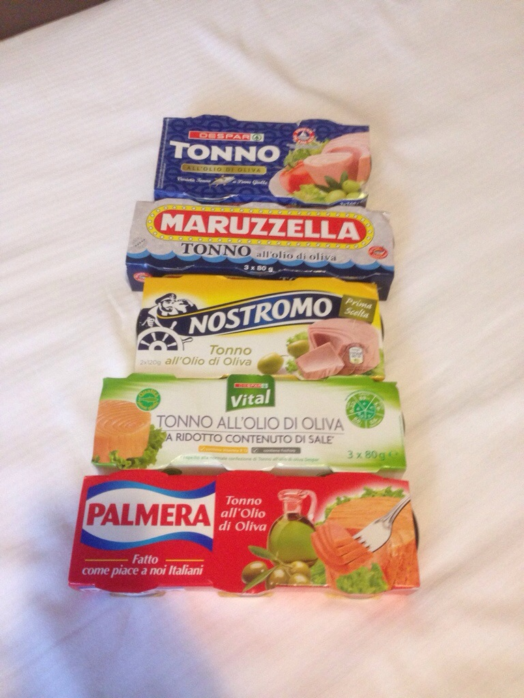

# イタリアのツナ缶をたくさん買ってきた
出張でイタリアのパドバというところに行って来ました。ベネチアの近くです。\\んで、イタリアのツナ缶。油がサラダ油でなくてオリーブオイルという点で気に入っております。街のスーパーが改装工事中で休業という不運を乗り越え、学会の終わった夕方に、わざわざ郊外のスーパーにチャリで行ってたくさん買ってきました。\\  \\\そのまま食べてもうまいのですが、サラダの上にドバッと出すとオリーブオイルがそのままドレッシングになります。サラダ油のツナ缶だとむしろ油は邪魔者になってしまうので、油を切ってサラダに乗っけたりしますが、これだと油に溶けた栄養かなにか（そんなものがあるのかどうかは定かではない）が無駄になったり、ツナがパッサパサになったりします。この差は大きすぎます。しかもオリーブオイルは体に良い。\\ネットで調べてもこの話をしている人があまりおらず、日本のスーパーで売っているのを見たこともありませんが、もしこれを日本で売ったらそこそこ人気が出るんじゃないかと思います。どなたかイタリアツナ缶を大量に輸入して一代で財をなしてみてはいかがでしょうか。\\食う時にまたブログに書きます。
