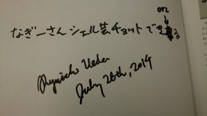

# がちスタック勉強会に突撃してきた
日曜に「<a href="https://atnd.org/events/53449" target="_blank">がちスタック勉強会</a>」という勉強会で拙著「<a href="http://www.amazon.co.jp/dp/4048660683" target="_blank">シェルスクリプト高速開発手法入門</a>」で勉強会が開かれるということで、大学で仕事の帰りに突撃してみました。\\この勉強会、普段は「フルスタック勉強会」あるいは「ゆるスタック勉強会」として活動しているそうです。ハッシュタグは<a href="https://twitter.com/hashtag/FuStWG?src=hash" target="_blank">#FuStWG</a>です。よろしければ。\\\写真を撮るなんて気の利いたことはしませんでしたので、Facebookとtwitterの抜粋で・・・。\\<h2>コッソリ向かっている途中にFacebookで依頼が</h2>\\

 \

<a href="https://www.facebook.com/permalink.php?story_fbid=256785407863397&amp;id=100005958185167">投稿</a> by <a href="https://www.facebook.com/profile.php?id=100005958185167">大喜多 利哉</a>.

\\\20分したらそこに乱入するんだよーん。\（道を間違えて30分かかった。）\\<h2>乱入</h2>\\<blockquote class="twitter-tweet" data-partner="tweetdeck">
おじゃまします <a href="https://twitter.com/hashtag/FuStWG?src=hash">#FuStWG</a>
&mdash; Ryuichi UEDA (@ryuichiueda) <a href="https://twitter.com/ryuichiueda/statuses/492916241430900736">July 26, 2014</a></blockquote>\\\<blockquote class="twitter-tweet" data-partner="tweetdeck">
シェルスクリプト高速開発手法入門の著者、上田さんが、まさかの登場！ <a href="https://twitter.com/hashtag/FuStWG?src=hash">#FuStWG</a>
&mdash; michael (@creaism) <a href="https://twitter.com/creaism/statuses/492915432739721216">July 26, 2014</a></blockquote>\\\<h2>厚かましくサイン</h2>\\<blockquote class="twitter-tweet" data-partner="tweetdeck">
人生初かもしれないサイン本GET！&#10;<a href="https://twitter.com/hashtag/FuStWG?src=hash">#FuStWG</a> <a href="https://twitter.com/hashtag/%E3%82%B7%E3%82%A7%E3%83%AB%E8%8A%B8?src=hash">#シェル芸</a> <a href="http://t.co/bdP9RMp813">http://t.co/bdP9RMp813</a>
&mdash; すのーん (@_snowlong) <a href="https://twitter.com/_snowlong/statuses/492943584509698048">July 26, 2014</a></blockquote>\\\<h2>そして厚かましくサインの字を間違える</h2>\\[caption id="attachment_3524" align="aligncenter" width="300"] 悲劇[/caption]\\<h2>厚かましく本の宣伝エントリー（釣り）を宣伝してもらう</h2>\\あくまで自発的に。\\<blockquote class="twitter-tweet" data-partner="tweetdeck">
ちょｗこれｗｗｗ <a href="https://twitter.com/hashtag/FuStWG?src=hash">#FuStWG</a> / “夏に読みたい技術書10選 | 上田ブログ” <a href="http://t.co/8qiFpEXmIO">http://t.co/8qiFpEXmIO</a>
&mdash; michael (@creaism) <a href="https://twitter.com/creaism/statuses/492923229695000576">July 26, 2014</a></blockquote>\\\この後バーみたいなところで飲んで、ラーメンで締めました。\\えー大変お騒がせ致しました・・・。\\ちなみにこの日は<a href="http://conoha.doorkeeper.jp/events/11848" target="_blank">てっくおやじ</a>の日でもありました。\\<blockquote class="twitter-tweet" data-partner="tweetdeck">
8/2にUSP友の会のイベントあり <a href="https://twitter.com/hashtag/TechOYAJI?src=hash">#TechOYAJI</a>
&mdash; NOKUBI Takatsugu野首貴嗣 (@knok) <a href="https://twitter.com/knok/statuses/492991621248450561">July 26, 2014</a></blockquote>\\\しれっと宣伝が。そう。<a href="http://usptomo.doorkeeper.jp/events/12763" target="_blank">8/2はシェル芸勉強会</a>です。まだ何にも準備してません！\\またタイミングが合ったら乱入をば・・・。でも、期待はしないでくださいませ。\\\では。
