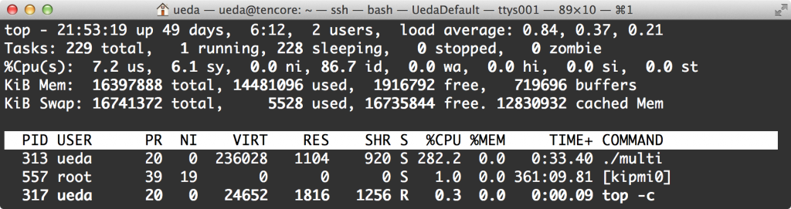

---
Keywords:auto,C++,C/C++,POSIXスレッド,pthread
Copyright: (C) 2017 Ryuichi Ueda
---

# 【お盆の勉強にどうぞ】C++11はもはやLL
研究のために<a href="https://github.com/ryuichiueda/DP_TOOL2/tree/master/bin" target="_blank">科学計算のコマンド</a>をC++で作ってます。去年もちょっと使いましたが、自分がC++ばっかり書いていた頃（1997年から10年くらい）から何年もたっているので、 
 
<iframe src="http://rcm-fe.amazon-adsystem.com/e/cm?lt1=_blank&bc1=000000&IS2=1&bg1=FFFFFF&fc1=000000&lc1=0000FF&t=ryuichiueda-22&o=9&p=8&l=as4&m=amazon&f=ifr&ref=ss_til&asins=B00DUW4BMS" style="width:120px;height:240px;" scrolling="no" marginwidth="0" marginheight="0" frameborder="0"></iframe> 
 
を読みながらリハビリ中です。 
 
 
<h2>autoを使う</h2> 
 
この本、1000ページ以上もあり、しかもKindle版で正直読みにくいのではなっから全部読むつもりはないのですが、私の知っているC++とあまりにも違って浦島太郎状態です。まず最初に、autoというものを見つけてひっくり返りました。昔のautoとは違います（昔のautoは使ったことないけど）。 
 
こんなふうに使います。 
 
[cpp] 
#そーす 
uedambp:tmp ueda$ cat hoge.cc  
#include &lt;iostream&gt; 
using namespace std; 
 
int main(int argc, char const* argv[]) 
{ 
	double v = 1.0; 
	int n = 5; 
 
	//doubleとintのかけ算 
	auto x = v*n; 
	cout &lt;&lt; &quot;型:&quot; &lt;&lt; typeid(x).name() &lt;&lt; &quot; 値:&quot; &lt;&lt; x &lt;&lt; endl; 
 
	return 0; 
} 
[/cpp] 
 
実行すると、xの型はdoubleになっていることが分かります。 
 
[cpp] 
#こんぴゃーるして実行 
uedambp:tmp ueda$ g++ -O3 -std=c++11 hoge.cc -o hoge 
uedambp:tmp ueda$ ./hoge  
型:d 値:5 
[/cpp] 
 
要はHaskellみたいに型推論してくれるということかと。 
 
んで、これだと型に慣れている人はあまり有り難がらないと思いますが、私が感動したのはこういう書き方ができるということです。 
 
[cpp] 
int main(int argc, char const* argv[]) 
{ 
	vector&lt;string&gt; str; 
	str.push_back(&quot;abc&quot;); 
	str.push_back(&quot;あいう&quot;); 
	str.push_back(&quot;!?*&quot;); 
 
	//こう書ける 
	for(auto i=str.begin();i&lt;str.end();i++) 
		cout &lt;&lt; *i &lt;&lt; endl; 
 
	//昔の書き方（STLの便利さが90%減） 
	for(vector&lt;string&gt;::iterator i=str.begin();i&lt;str.end();i++) 
		cout &lt;&lt; *i &lt;&lt; endl; 
} 
[/cpp] 
 
「vector&lt;string&gt;::iterator」を初心者に教える自信は全くなく、そして何年もブランクのある今、私もなにがなんだか分からないし、書き方を忘れていて調べてしまったのですが、autoはそんな人々を温かく出迎えてくれます。 
 
STLを使えばポインタやデストラクタでいろいろ悩むこともなく、C++を使える人の人口をぐっと増やせると私は思っているのですが、これでまた間口が広がったような気がします。 
 
<h2>スレッドを使う方法がバカバカしいくらいに簡単になっている</h2> 
 
んで、今私の書いている「価値反復」というアルゴリズムは、排他なしで並列処理ができます。できるということは並列化しないと笑われるので泣く泣くPOSIXスレッドの立て方を復習していたのですが、これもC++11だとすごく簡単ということが分かりました。threadというクラスのインスタンスを作るだけです。 
 
[cpp] 
ueda\@ubuntu:~$ cat multi.cc  
#include &lt;iostream&gt; 
#include &lt;thread&gt; 
using namespace std; 
 
void tfunc(string name) 
{ 
	int num = 0; 
	for(int i=0;i&lt;10000000;i++){//ひたすら足し算 
		fprintf(stdout,&quot;\\n%s: %d&quot;,name.c_str(),num++); 
	} 
} 
 
int main(int argc, char const* argv[]) 
{ 
	thread th1(tfunc,&quot;th1&quot;);//実行したい関数と、その関数に渡したい引数を指定 
	thread th2(tfunc,&quot;th2&quot;); 
	thread th3(tfunc,&quot;th3&quot;); 
 
	th1.join();//これで終わるのを待つ 
	th2.join(); 
	th3.join(); 
} 
[/cpp] 
 
実行して途中の出力を見てみます。th1,2,3入り乱れています。 
[cpp] 
ueda\@ubuntu:~$ g++ -O3 -std=c++11 -pthread multi.cc -o multi 
ueda\@ubuntu:~$ ./multi | head -n 10000 | tail  
th1: 5102 
th3: 2605 
th2: 2282 
th1: 5103 
th3: 2606 
th1: 5104 
th3: 2607 
th1: 5105 
th3: 2608 
th3: 2609 
[/cpp] 
 
実行中にtopで見ると、CPUの使用率が300%近くになってます。 
 
 
 
ちなみに時間はこんなもん。30000000回の足し算と標準出力への吐き出しですが、なんかもうちょっと速いような気もしないでもありません。もし何かヘマをしていたら教えていただきたく。CPUの周波数は2.5GHzです。 
 
[cpp] 
ueda\@ubuntu:~$ time ./multi &gt; /dev/null 
 
real	0m24.254s 
user	0m34.824s 
sys	0m32.161s 
[/cpp] 
 
Macでもちゃんと動作しますが、topの出力がいまいちよく分からなかったのでUbuntuで実験しました。 
 
もちろん、排他制御は自分でやらなければいけませんので、そこはちょっと敷居が高くなるかと思います。 
 
<h2>おわりに</h2> 
 
LLから入った人はC/C++にアレルギーがあるようなのですが、STLを落ち着いて勉強すればポインタを使ったり自分でメモリを解放したりということはほとんどしなくて良いので、あまり怖がる意味はないかと思います。SLTが満足に整備されていなかったときと比べると、格段に簡単になっています。生のCと比べるとLLと言っていいくらいです。 
 
自分で書いたプログラムが何の引っかかりも無く立ち上がって、すんごい速さで動く感覚を是非味わっていただきたく。と言いますかこれが普通の速さなのですが。 
 
ぜひC++でコマンドを書いてシェルスクリプトでシェル芸を。いや、これ書いておかないと自分がどこの会長か忘れてしまうので。 
 
 
よいお盆を。
