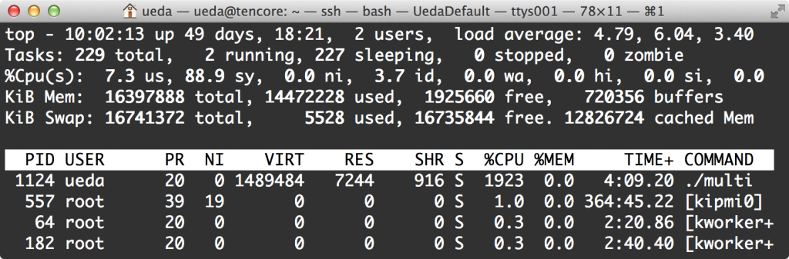
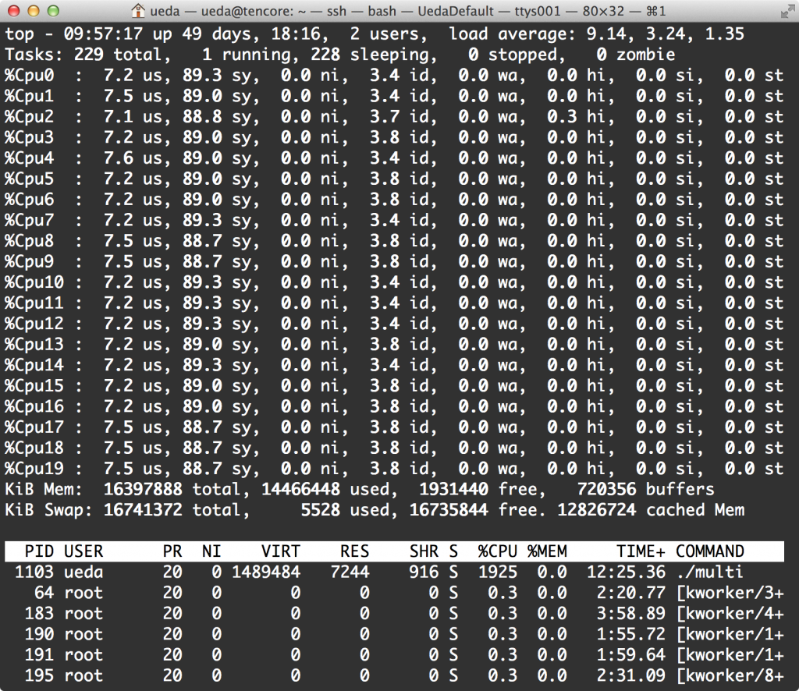

# 【CPU使用率2000%】なんだかよくわからない流れでマルチスレッドの追試験をするはめになった
昨日の「<a href="http://blog.ueda.asia/?p=3640" title="【お盆の勉強にどうぞ】C++11はもはやLL">【お盆の勉強にどうぞ】C++11はもはやLL</a>」のエントリーをみた「よ」のお方がもっとCPU使用率上がらないのかと迫ってきたので20スレッド立ち上げてtopで見てみました。 
 
20コア（物理10コア）あるので理論上2000%までいきますが・・・。 
 
 
 
1923%逝きました！逝きました！ 
 
コードは昨日のmulti.ccをコピペで20スレッドまで増やしたものですが、恥ずかしいので掲載しません。 
 
ちなみに面白いタイトルを考えようとして「2000%」で検索したら、なんか<a href="http://utapri.tv/" target="_blank">こんなサイト</a>がひっかかりました。すいません。ついていけません。それから、「2000パーセント」で検索したら電卓が出てきました。余計なお世話です。 
 
ちなみにLinuxのtopが立ち上がった画面で「1」と打つと、各CPUの使用率を見る事ができるのはご存知でしょうか。ということで見てみます。 
 
 
 
 
ちょーっとsysのCPUの食いかたが激しいのでオーバーヘッドが生じているかもしれません。また、ターボブーストとかハイパースレッディングとかいう仕組みのせいで、全部のCPUを使うのが一番効率がよいかというとそうでもないので、世の中複雑になったものだと溜め息が出るばかりです。ここら辺も調査したら面白いのですが、あまり深入りすると私の研究者人生のオーバーヘッドがでかくなりすぎるので、今日はここまでにしておきます。 
 
 
ちなみに「よ」さんには「消費電力測ってよ！！！」というリクエストもいただいておりますが、共同研究の書類はいつでも用意しておりますので、ぜひぜひご検討を！ 
 
 
 
研究と時間を切り売りする男より。
