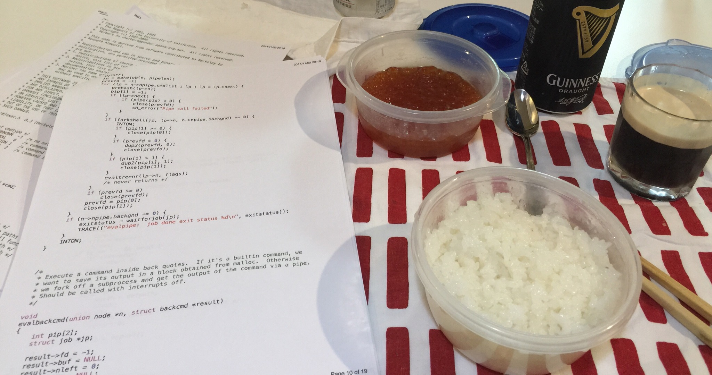

---
Keywords:プログラミング,C言語,dash,goto,shell,寝る,紙便利,グルー言語を作る
Copyright: (C) 2017 Ryuichi Ueda
---
# 【日記】dashのコードを紙にプリントアウトして読んでいる
本日はdashのコードの精読を開始しました。査読が３件、査読の割り振りが３件、自分の論文再提出が１件（全部英文だ馬鹿野郎）溜まってますが、シェルに比べたらそんなことは大したことではありません。「シェルは身を滅ぼす」なんて諺もありますし。\\<!--more-->\\dashのコードは、今布団の中なので正確には分かりませんが20くらいのヘッダファイルとソースファイルで構成されています。精読は、同名のヘッダとソースファイルの組を紙にプリントアウトし、ホッチキスで綴じたものを作り、main.cにincludeされている順に読むという方法でやってます。やっぱりモニタ見てるより捗ります。\\写真の左側に何セットかの紙の束がありますが、こいつらがソレです。右側は見ないでください。Facebookにアップしたら、お世話になってるMさんに「痛風デスクトップ」と、ありがたくない名前を頂戴しました。\\  \\\ここに何か解説でも書ければ良いのですが、とりあえずそれは全部読んでからにします。C言語だから仕方ありませんが関数や変数がどのファイルで定義されているのか分からんのでなかなか読むのが大変です。\\この前はbashの謎コードに全世界が泣かされましたが、dashもなかなか面白く、main.cに「なぜif文の中にgotoのラベルがあるのか、イミフ（意訳）」という、ダイイングメッセージが書かれています。あとは「notyet」という謎のマクロのキーワードが・・・。\\ところで、いちいちプリントアウトすると紙がもったいないのですが、紙はやっぱり便利です。読まなきゃいけない量が直観的に分かりますし、前に読んだところに戻るという操作が自然です。（操作というのも電子ブック的な言い方で、紙なら操作とも思えない簡単な作業。）\\そして何よりも、パソコンのモニタを見てると家族が不機嫌になるんですが紙だとあまりカドが立たないようです。パソコンだと遊んでるかもしれず、イライラの原因になりますが、紙だと読んでるのが明白ですからね。自分自身も遊ばないで読むのに集中できます。\\やっぱり、道具はときに「何ができるか」よりも「何ができないか」の方が重要だなと思ってしまいます。何でもかんでもペーパーレスというのはどうなんでしょ？本当に。目も疲れないし。\\ということで明日もコード読みます。論文は火曜になったら本気出す。\\\\寝る。
