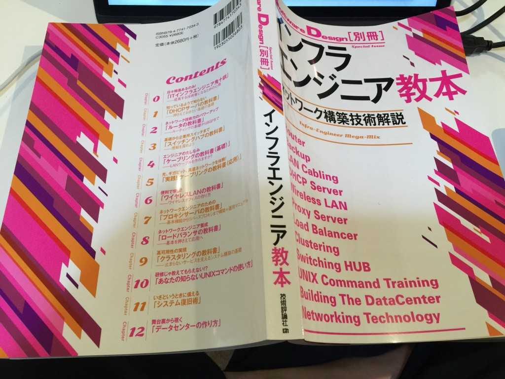

---
Keywords:SoftwareDesign,インフラエンジニア教本,書評
Copyright: (C) 2017 Ryuichi Ueda
---
# SoftwareDesign別冊「インフラエンジニア教本」がっ！
・・・分厚い。 
 
 
 
実は私の記事（初心者向け薄口記事）も再録されていますが、毎回どこか分からなくなるほど分厚いです。 
 
 
んで、表紙を見ていただければ分かるのですが、通信まわりとUNIXの使い方が一通り網羅されております。全部読めてませんが、パラパラ見てそんな感じです。LANケーブルの作り方や光ケーブルの切断と接続方法まで掲載されています。それから、ややこしいネットワーク構成図がたくさん出てきます。好きな人は見ただけで気持ち悪い奇声を発してしまうかもしれません。 
 
 
ところで分厚いと言ってもそれぞれ完結した記事の集合体なので、教科書と違ってつまみ食いもできます。私はひみつのLinux通信だけ先に読みました。それでいいのかという向きもありましょうが、これがまとめ読みできただけで私は成仏いたしました。 
 
 
ということで、完読してないのでうかつなことは書けないわけですが、こういう分厚くて楽しい物体があると紹介して、薄口感想文を終わります。 
 
<iframe src="http://rcm-fe.amazon-adsystem.com/e/cm?lt1=_blank&bc1=000000&IS2=1&bg1=FFFFFF&fc1=000000&lc1=0000FF&t=ryuichiueda-22&o=9&p=8&l=as4&m=amazon&f=ifr&ref=ss_til&asins=4774170348" style="width:120px;height:240px;" scrolling="no" marginwidth="0" marginheight="0" frameborder="0"></iframe> 
 
 
寝る。
