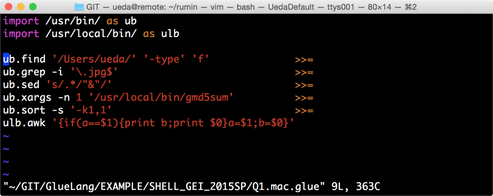

# 今日もruminを試し、作っていただいたGlueLangのシンタックスハイライトを試した
明日までにある予稿を書かなければならんのですが・・・。もう眠い・・・。ということで昨日のrumin再チャレンジと、GlueLangのシンタックスハイライトを作っていただいたので試してみます。

<!--more-->

<blockquote class="twitter-tweet" data-partner="tweetdeck"><p><a href="https://twitter.com/ryuichiueda">\@ryuichiueda</a> <a href="https://twitter.com/hashtag/rumin?src=hash">#rumin</a> コンピャールスクリプトを直してみました。よろしければcloneをし直して頂くかrake cleanを実行した上でお試しください。(´；ω；｀)&#10;相変わらずインストーラとか無いです。。。</p>&mdash; kazuhide (\@kzhd15med3t) <a href="https://twitter.com/kzhd15med3t/status/554656065938153472">January 12, 2015</a></blockquote>
<script async src="//platform.twitter.com/widgets.js" charset="utf-8"></script>

・・・ダメだったのでissue投げておきました。大変でしょうが・・・。とにかく何がきっかけでプロジェクトに勢いがつくか、あるいは勢いがつくきっかけを失うかは、こういうことにかかっていたりするので・・・。

自分も気をつけます。

<h1>そして昨夜に引き続きGlueLangが動く話をば・・・</h1>

そして、見落としてたのですがこんな嬉しいツイートがありました。

<blockquote class="twitter-tweet" data-partner="tweetdeck"><p>GlueLang syntax highlight &amp; indenting plugin for Vim&#10;GlueLangお試し中なので... とりあえず&#10;<a href="https://t.co/phWD6GN4u6">https://t.co/phWD6GN4u6</a> <a href="https://twitter.com/hashtag/gluelang?src=hash">#gluelang</a></p>&mdash; CORDEA (\@_Cordea) <a href="https://twitter.com/_Cordea/status/553081150906720256">January 8, 2015</a></blockquote>
<script async src="//platform.twitter.com/widgets.js" charset="utf-8"></script>

インストールは<a href="https://github.com/Shougo/neobundle.vim" target="_blank">NeoBundle</a>を使うようですが、ここではマニュアルでのインストール方法を。

まず、git cloneしてvim-glueディレクトリに入ります。

```bash
uedambp:GIT ueda$ git clone https://github.com/CORDEA/vim-glue.git
uedambp:GIT ueda$ cd vim-glue/
```

そして地味にrsync。ディレクトリの後ろのスラッシュを忘れないでください。

```bash
uedambp:vim-glue ueda$ rsync -av ftdetect/ ~/.vim/ftdetect/
uedambp:vim-glue ueda$ rsync -av indent/ ~/.vim/indent/
uedambp:vim-glue ueda$ rsync -av syntax/ ~/.vim/syntax/
```

・・・そしてglueのサンプルスクリプトを開くと

```bash
uedambp:GIT ueda$ vi ~/GIT/GlueLang/EXAMPLE/SHELL_GEI_2015SP/Q1.mac.glue 
```


<a href="スクリーンショット-2015-01-13-23.15.34.png"></a>

<span style="color:red;font-size:20pt">おおおおお!!!!感激。多謝。</span>

これで、「シンタックスハイライトがないので自分で言語を作っててもその便利さがいまいちよく分からない問題」が解決されました。「>>=」に色が付くだけでも相当見栄えがします。

文法はこれからも追加されるのでご迷惑をおかけしますが、何卒手助けをいただけると大変ありがたく・・・。


寝るます。
