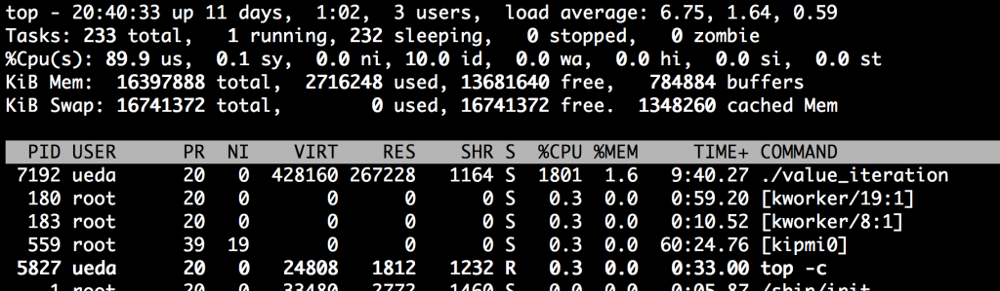

# 日記 ---ITエンジニアに読んでほしい！技術書・ビジネス書大賞2015、等
皆様ありがとうございました。あの「<a href="http://www.amazon.co.jp/gp/product/B00LBPGFJS/ref=as_li_ss_tl?ie=UTF8&camp=247&creative=7399&creativeASIN=B00LBPGFJS&linkCode=as2&tag=ryuichiueda-22">シェル芸本</a>（個人的にはbashcms本）」がITエンジニアに読んでほしい！技術書・ビジネス書大賞2015の「技術書部門ベスト10」に入りました。推薦していただいた方、投票していただいた方、投票を呼びかけていただいた方、重ね重ねありがとうございました。\\はてなブックマークで反応を見ているのですが、私の本が入っていることに対して意見がちらほらあって面白いです。予定調和的な無難な本ではない割には好意的なものが多くてありがたく。\\<iframe marginwidth="0" marginheight="0" src="http://b.hatena.ne.jp/entry.parts?url=http%3A%2F%2Fwww.shoeisha.co.jp%2Fcampaign%2Faward%2Fresult" scrolling="no" frameborder="0" height="230" width="500">
<a href="http://www.shoeisha.co.jp/campaign/award/result">ITエンジニアに読んでほしい！技術書・ビジネス書 大賞 2015</a><a href="http://b.hatena.ne.jp/entry/www.shoeisha.co.jp/campaign/award/result">はてなブックマーク - ITエンジニアに読んでほしい！技術書・ビジネス書 大賞 2015</a>
</iframe>\\ところで、私の本ではなく、ノミネートされた本全体に対して「わくわくしない」とか「これがベスト本なら、もう本じゃなくてネットで勉強するわ。」とかいうコメントがあり、パブリックなところでそんなこと書いている人ってどんな人なのだろうと思って気になったので、いろいろサーチして素性を調べてしまいました。\\それから今日は、論文を書くために、昔のVisual C++のコードをほじくり出してLinuxで動くように移植していました。さすがにGUIは動かすつもりはなく、ロジックだけ切り出してコマンドにしていました。ついでにPOSIXスレッドを使って高速化を図り、18並列で動かしてみました。科学計算っていうのは式を立てるのは難しいですが、そのあとは単純計算なので、並列処理が利きやすいという性質があります。マルチスレッドにした結果、次のようにCPU負荷がきれいに1800%になりました。\\\\timeの結果も、ほぼスレッドの数だけ倍速化されています。1日が1時間強に短縮されるのですから、論文もあと数時間で書けることでしょう書けません。ただし、CPUをフルに使うとターボブーストが効かなくなるので、userの値は逆に増えてしまっているかもしれません。\\[bash]\$ time ./value_iteration\real 74m48.798s\user 1308m34.196s\sys 1m32.359s\[/bash]\\\昨日夜遅かったので、もう寝る。
