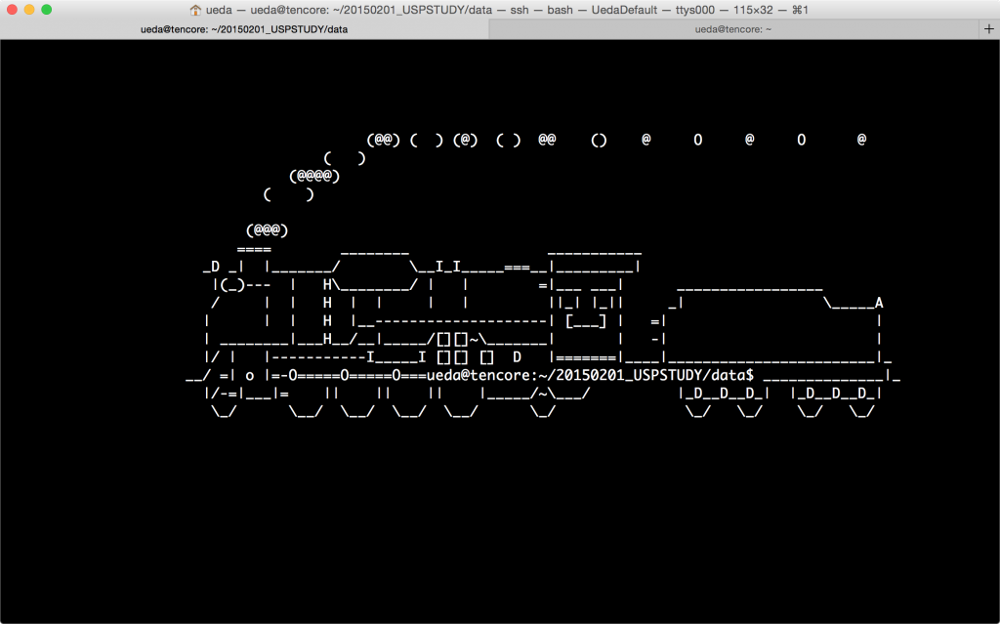

---
Keywords:どうでもいい,SL止まった,寝る,日記,本当にどうでもよい,頭の中だだ漏らし
Copyright: (C) 2017 Ryuichi Ueda
---
# 日記（SLを止める等）
* 以前、「SNS」（尻に、何か、刺された）事件があったが、翌日ニキビだと判明して一週間が経つ。本日、別の尻（左尻7合目北側斜面）にもう一つできた。青春である。 
 
* 昨日、<a href="http://blog.ueda.asia/?p=5124" title="日記（難しすぎるシェル芸の問題等）">slコマンドの出力を止めるという問題</a>を考えた。友の会のFacebookグループに投げたところ瞬殺であった。 
 
<!--more--> 
 
どんな方法かは、考えた人が公表すべきであるので公表しないが、特に公表してもクソの得にもならんので、数日待って週末シェル芸勉強会でやろうと思う。止まった画像を貼る。 
 
 
 
プロンプトがSLのエンブレムのようで美しい（主観）。ただし、この出力をファイルに生け捕るということには未だ成功していない。というか自分はやる気がない。 
 
* シェル芸の問題、今日は3問考えた。あと3問。今回の問題はかなり良問と言えそうである。 
 
* 今書いている予稿のサーベイ。今日はこれを読んだ。 
 
<a href="http://www.ncbi.nlm.nih.gov/pubmed/16003890" target="_blank">Barbieri R. et al.: An analysis of hippocampal spatio-temporal representations using a Bayesian algorithm for neural spike train decoding.</a> 
 
早く仕上げなければ。 
 
* SICP読書会は中止になった。とりさんとカレー屋で一杯。楽しかった。 
 
寝る。
