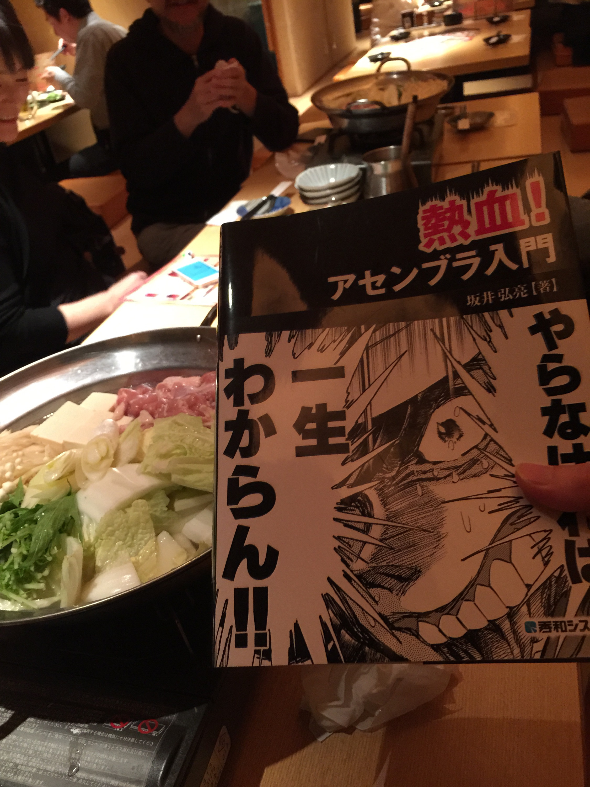

---
Keywords:アセンブラ,プログラミング,写真とった,寝る,書評,熱血
Copyright: (C) 2017 Ryuichi Ueda
---
# 熱血！アセンブラ入門。そして手書きPOPは拡散不可だそうで

昨日のことですが、熱血！アセンブラ入門を飲み会の前に購入し、そのまま飲み会の席で読んでました。どうせ一人でいたら自分の執筆や論文査読を優先するので、本を読むなら人がいる時です。また、別の飲み会に持参したいと思います（おい）。
 
 
 

 
 
<!--more--> 
 

 

飲み会でちょこちょこ話しかけられたのでまだ70ページくらいしか読んでませんが、分厚さは読者に理解してもらおうというサービス精神の結果で、しかもそれでいてしつこくない書きっぷりなのを確認したところです。こんなに丁寧に説明いただいているのだから、アセンブラやCPUの動きに興味があるなら必読だと思います。C言語が少し書けるくらいの予備知識は必要かなと思います。そして、相変わらず無意味でレビューになってない匿名レビューがAmazonについてますが、楽しく読むにはそれなりの素養が必要です。

 

ところで、本を購入したときに、本書の手書きPOPがあまりに面白かったのでネットにアップしていいかとレジの人に質問してみました。そしたら別の店員さんにレジの人が聞いて、聞かれた店員さんがどこかに電話をかけてしまい、さらには電話の向こうで審議になって、3, 4分くらい店員さんを拘束してしまいました。なんか申し訳ないことをしてしまいました。 

 

審議の結果はNGでした。残念。理由は深く聞かなかったのですが、店員さんの手書きのはNGとのことで、おそらくなんらかのクレームが入った時に店員さんを守るためなのでしょう。しかし、アップしたかったです。こんなこと聞くのはオッサンになった証拠でないこともないけど、やっぱりグレーなことは躊躇せずに聞いた方がいいですよね。

 

寝る。

 

 

 

 
 
 
 
<iframe src="http://rcm-fe.amazon-adsystem.com/e/cm?lt1=_blank&amp;bc1=000000&amp;IS2=1&amp;bg1=FFFFFF&amp;fc1=000000&amp;lc1=0000FF&amp;t=ryuichiueda-22&amp;o=9&amp;p=8&amp;l=as4&amp;m=amazon&amp;f=ifr&amp;ref=ss_til&amp;asins=4798041807" style="width:120px;height:240px;" scrolling="no" marginwidth="0" marginheight="0" frameborder="0"></iframe>
