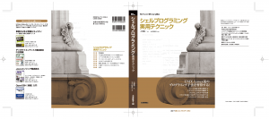

# 日記（シェルプログラミング実用テクニックの表紙、SoftwareDesign寄稿）
査読の割り振りが全く終わってないのに自分の書物の宣伝もしなければならず、結構小心者なので気疲れしている上田です。本日は２点。 
 
<h2>4/18発売のSoftwareDesignに記事を書きました</h2> 
 
奇しくも明日のシェル芸勉強会と同日になりました。虎の表紙でタイガースファンとしては感慨無量、灌漑農業です。 
 
<!--more--> 
 
内容は初心者向けのコマンド紹介です。が、ひねくれているのでSICPまで引っ張りだして初心者も置いてけぼりにせず、上級者に話のネタを提供する感じに仕上げました。つまりみんな買ってねということで、何卒よろしくお願い申し上げる次第。 
 
<iframe src="http://rcm-fe.amazon-adsystem.com/e/cm?lt1=_blank&bc1=000000&IS2=1&bg1=FFFFFF&fc1=000000&lc1=0000FF&t=ryuichiueda-22&o=9&p=8&l=as4&m=amazon&f=ifr&ref=ss_til&asins=B00TIVC4QA" style="width:120px;height:240px;" scrolling="no" marginwidth="0" marginheight="0" frameborder="0"></iframe> 
 
<h2>シェルプログラミング実用テクニックの表紙を公開しまっす</h2> 
 
実は表紙はもう公開して良いと言っていただいているのですが、一つ問題がありまして公開してませんでした。が、先日<a href="http://heartbeats.jp/" target="_blank">HEARTBEATS</a>さんの10周年記念のパーティーにお邪魔した際にSD誌の編集長様にその問題を相談し、OKをもらったので、公開します。 
 
 
 
 
 
・・・問題というのは、「トンボ付きのpdfしか持ってねえ」ということでした。いや、もらえばいいんですが。面白いのでそのままスクリーンショットを撮って掲載しました。 
 
表紙を見て分かりますように、真面目な本です。また、Tukubaiのコマンドが表紙にいますが、頻出しているわけではないのでLinux環境一般で通用する内容です。ですので、一家に一冊、一人で10冊、何卒よろしくお願い申し上げます。 
 
 
<iframe src="http://rcm-fe.amazon-adsystem.com/e/cm?lt1=_blank&bc1=000000&IS2=1&bg1=FFFFFF&fc1=000000&lc1=0000FF&t=ryuichiueda-22&o=9&p=8&l=as4&m=amazon&f=ifr&ref=ss_til&asins=4774173444" style="width:120px;height:240px;" scrolling="no" marginwidth="0" marginheight="0" frameborder="0"></iframe> 
 
今日はもう寝ようかなあ・・・あ、査読の割り振りします。ごめんなさいごめんなさい。 
 
あ、明日は<a href="http://blog.ueda.asia/?page_id=684" title="シェル芸勉強会スライド一覧">シェル芸勉強会</a>です。東京大阪福岡3会場＋Twitterでワンライナーが大爆発しますので、よろしくお願いいたします。 

