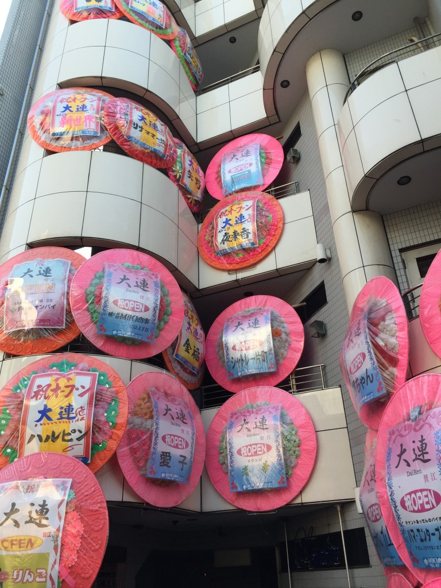
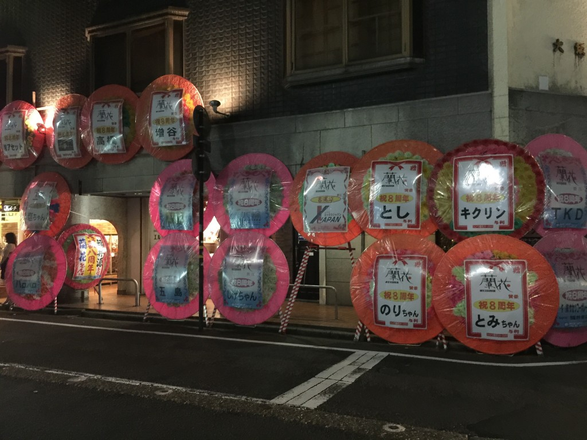

# 日記（花輪直付けスタイル）
本日も<a href="http://live.nicovideo.jp/watch/lv218597421">ロボカップ</a>。リンクは明日のニコ生のサイトです。私は今日ちょっとしゃべったのでお役御免です。考えてみればロボカップはツッコミを入れたりウンチクを語ったりと、ニコ生に最適なコンテンツのような気がしないでもありません。来年も期待。 
 
あ、<a href="http://www3.nhk.or.jp/lnews/fukui/3054421171.html">NHKにもバッチリ写りました</a>。 
 
まあしかし、主役は選手（学生）な訳ではありますが・・・。 
 
しかし、わたくしの興味は現在宿泊している福井市内の片町に行っております。この街は夜になると夜のお店の人が店の前に立ってたり、タクシーと運転代行で道がごった返していたり、無料案内所があったりと、なんとなく夜の宗右衛門町や夜の赤坂を彷彿とさせます。ちょっと新橋とは雰囲気が違います。新橋はみんな歩くので。 
 
<!--more--> 
 
夜の街なら上記のようにいろいろ似たところがあるのですが、 
 
 
 
 
 
 
なんですかこれ？ 
 
 
花輪が道に飾ってあるのは見たことがないこともないのですが、壁面に直貼りしているのは見たことがありません。 
 
 
見たことある人います？
