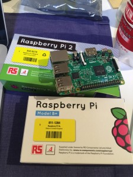

---
Keywords:Linux,Raspberry,執筆,ご報告,寝る,日経Linux,シェル芸,連載
Copyright: (C) 2017 Ryuichi Ueda
---

# 新連載の日経Linuxが明後日8日に発売されます
追記（5/6）: 最初「明日8日」って書いてたけど明日は7日じゃまいか！・・・大変申し訳なく・・・orz 
 
表題の通り、明後日5月8日に私の新連載第1回が掲載される日経Linux6月号が発売されます。 
 
<iframe src="http://rcm-fe.amazon-adsystem.com/e/cm?lt1=_blank&amp;bc1=000000&amp;IS2=1&amp;bg1=FFFFFF&amp;fc1=000000&amp;lc1=0000FF&amp;t=ryuichiueda-22&amp;o=9&amp;p=8&amp;l=as4&amp;m=amazon&amp;f=ifr&amp;ref=ss_til&amp;asins=B00UJXLDP4" style="width:120px;height:240px;" scrolling="no" marginwidth="0" marginheight="0" frameborder="0"></iframe> 
 
今回のテーマは私の元々の専門のロボットで、ロボットを組み立てていき、Raspberry Pi上でプログラミングして、部品や完成したロボットを動かすというテーマです。 
 
連載の特色は、「ハードをいじらないロボット屋」である私が、ロボットのキットを作る株式会社アールティさんにソフト屋の立場からワガママを言いまくって成り立っている点です。 
 
[caption id="attachment_6218" align="aligncenter" width="225"] どっちでも動かせるので、どっちでも検証しなければならないので辛い。[/caption] 
 
<!--more--> 
 
私がソフト寄りに偏っていることを逆手に取ることで、ソフトしかいじったことのない人でも、かなり直感的にロボットをいじれる内容にしていきます。 
 
 
私の立場だと、ロボットのセンサの値が簡単にプログラミング中で使えて、モータに簡単に指令が出せる、すなわちAPIが単純であることを良しとするのですが、ガチのロボット屋さんというのは、パフォーマンス重視で密結合なソフトを作りがちです。また、疎なのもありますが、これはこれでライブラリが大きすぎるものが多数です。 
 
 
前々職のときからそう思っていたのですが、10年越しで少しだけどそれを世に問えることになりそうです。 
 
 
んで、十分に抽象化されたAPIとして私がアールティさんに作ってと頼んだのが、連載第2回から登場するデバイスファイルです。ファイルに字を書いたり読み出したりするだけでロボットを動かします。簡単です。他になにも要りませんし、外から機械学習系のライブラリを持ってきてもすぐに連携させることができます。第1回はデバイスファイルでなくGPIOというものを使いますが、同様にファイル入出力だけでデバイス（第1回はLED）を操作します。 
 
抽象化と言いながら、デバイスファイルを使ってローレベルじゃねーかと言われそうですが、picでアセンブラとか、シリアルで9600bpsで接続して・・・とかいう世界と比較してのことです。またUNIX系の場合、それ以上ソフトウェアのレイヤを重ねても、あまり良いこともありません。なので、デバイスファイルにこだわりました。 
 
 
さて、ファイル入出力を使うとどんなプログラミングになるのかは、ぜひ連載を読んでご確認を。まあ、シェル芸なんですが・・・。 
 
 
連載第1回で使う部品は、↓から・・・。シャッチョサンも鼻息が荒ぶっております。あ、念のため大学には産学連携の相談をして諸条件はクリアしてコラボしております。 
 

<blockquote cite="https://www.facebook.com/yuki.nakagawa.75/posts/871897936214863">
&#x65e5;&#x7d4c;Linux&#x306e;5&#x6708;8&#x65e5;&#x767a;&#x58f2;&#x53f7;&#x306e;&#x30ad;&#x30c3;&#x30c8;&#x3092;&#x767a;&#x58f2;&#xff01;&#x65e5;&#x7d4c;Linux&#x306f;&#x307e;&#x3060;&#x5165;&#x3063;&#x3066;&#x304d;&#x3066;&#x306a;&#x3044;&#x306e;&#x3067;&#x3068;&#x308a;&#x3042;&#x3048;&#x305a;amazon&#x306e;&#x4e88;&#x7d04;&#x30b5;&#x30a4;&#x30c8;&#x3092;&#x3054;&#x7d39;&#x4ecb;&#x3057;&#x3066;&#x307e;&#x3059;&#x3002;http://www.rt-shop.jp/index.php?main_page=product_info&amp;cPath=1366&amp;products_id=3019
Posted by <a href="https://www.facebook.com/yuki.nakagawa.75">中川 友紀子</a> on <a href="https://www.facebook.com/yuki.nakagawa.75/posts/871897936214863">2015年5月5日</a></blockquote>

 
 
 
 
寝る。 

