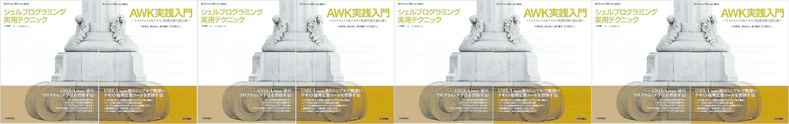

---
Keywords:AWK実践入門,勉強会,執筆,ジュンク堂,ご報告,シェルプログラミング実用テクニック,シェル芸
Copyright: (C) 2017 Ryuichi Ueda
---
# 6月18日の19:30からジュンク堂書店池袋本店で出版イベントを行います
6月18日の19:30からジュンク堂書店池袋本店にて「シェルプログラミング実用テクニック」と「AWK実践入門」の出版記念イベントを行います。 
 
 
<blockquote class="twitter-tweet" data-partner="tweetdeck">
イベント情報：2015/6/18(木)19:30〜『シェルプログラミング実用テクニック』『AWK実践入門』刊行記念イベント「AWK&amp;Shell テキスト処理ブーム再来について熱くなる夜。」上田隆一氏×中島雅弘氏×富永浩之氏 定員40名 お申込みは店頭かお電話で0359566111
&mdash; ジュンク堂書店池袋本店/PC書 (\@junkudo_ike_pc) <a href="https://twitter.com/junkudo_ike_pc/status/603060655927660547">May 26, 2015</a></blockquote> 
 
 
 
詳細はコチラ→<a href="talksession_AWKShell.pdf">talksession_AWKShell.pdf</a> 
 
 
 
前半はAWKについてトークで盛り上がるという前代未聞（？）の企画で、後半は4問だけシェル芸勉強会を行う予定です。 
 
予約はツイートのように電話と店頭だけですが、ぜひぜひ。 
 
 
ところで、告知だけだと申し訳ないので、柱を増量した画像を貼り付けておきます。くだらないですか？くだらないですね。 
 
 
 
飲んでから寝る。
