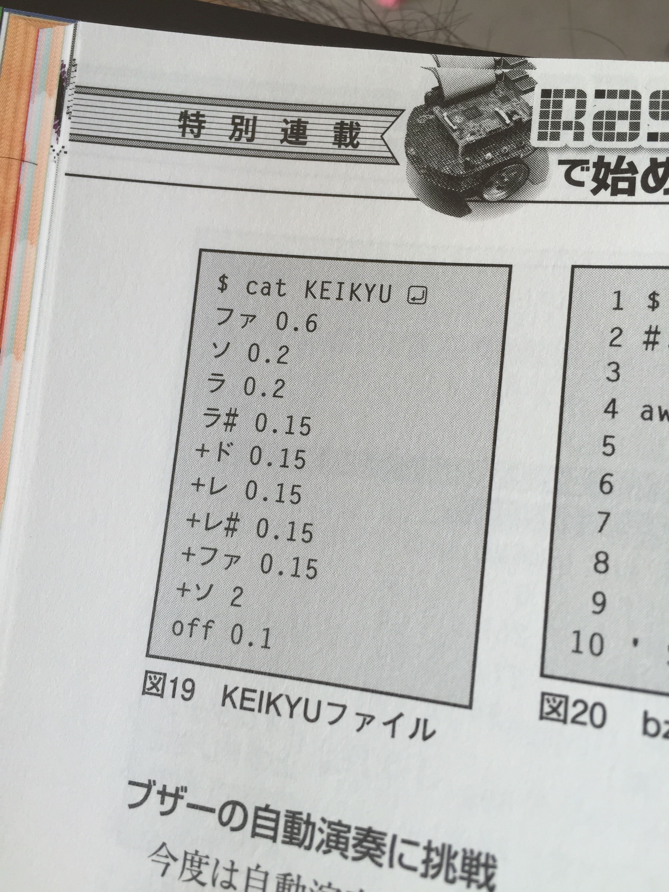

# KEIKYUサウンドがこだまする日経Linuxが明日発売なので連載のチラ見せ
日経Linuxがボチボチ発売です。わてくしの連載もなんとか掲載されております。この記事は宣伝です。ええ、宣伝ですとも。士族の商法じゃないんだから書いたら売らねばならんのです。 
 
<iframe src="http://rcm-fe.amazon-adsystem.com/e/cm?lt1=_blank&amp;bc1=000000&amp;IS2=1&amp;bg1=FFFFFF&amp;fc1=000000&amp;lc1=0000FF&amp;t=ryuichiueda-22&amp;o=9&amp;p=8&amp;l=as4&amp;m=amazon&amp;f=ifr&amp;ref=ss_til&amp;asins=B00XVHU3FQ" style="width:120px;height:240px;" scrolling="no" marginwidth="0" marginheight="0" frameborder="0"></iframe> 
 
今回の部品はこちらから購入できます。在庫アリです。 
 
<iframe src="http://rcm-fe.amazon-adsystem.com/e/cm?lt1=_blank&bc1=000000&IS2=1&bg1=FFFFFF&fc1=000000&lc1=0000FF&t=ryuichiueda-22&o=9&p=8&l=as4&m=amazon&f=ifr&ref=ss_til&asins=B00XTGX04U" style="width:120px;height:240px;" scrolling="no" marginwidth="0" marginheight="0" frameborder="0"></iframe> 
 
 
夜露死苦お願い致しやす。 
<h2>今月の内容</h2> 
今月の「Raspberry Piで始めるかんたんロボット製作」（まだタイトルが覚えられない）は、ブザーとモータを動かす内容です。まーだまだロボットを動かすところまで行かないのと、部品代が今回からそこそこ大きくなるのが少し申し訳ないのですが、楽しんでいただければと。 
 
今回の個人的な目玉は、ブザーandシェルスクリプトでKEIKYUです。何のことかわからん人はこれを聞いてください。PCの裏にロボットがいます。 
 
<iframe width="560" height="315" src="https://www.youtube.com/embed/A4sE3LMKlkk" frameborder="0" allowfullscreen=""></iframe> 
 
記事にも堂々とKEIKYUと掲載する偉業を果たしました。 
 
&nbsp;&nbsp; 
 
これでも神奈川県と鉄しか分からんと思いますが、要はブザーで演奏するというか、そういう内容です。ただ、それだと単なる趣味になるのでデバイスファイルに字を叩き込む方法についてつらつら書きました。甚だ簡略ながら<a href="http://ja.m.wikipedia.org/wiki/%E3%83%91%E3%83%AB%E3%82%B9%E5%B9%85%E5%A4%89%E8%AA%BF">PWM（pulse width modulation）</a>もデバイスファイルを使ってやってます。 
 
7月号は他にも役に立つ記事満載なので是非買ってちょんまげ頂きたく候。 
 
<a href="http://blog.ueda.asia/?p=6359">昨日こんな有様</a>だったので寝不足でテンション高い。 
 
ちなみに先月が連載第一回だったのでチェックしてなかった方は是非前回からどうぞ。 
<iframe src="http://rcm-fe.amazon-adsystem.com/e/cm?lt1=_blank&amp;bc1=000000&amp;IS2=1&amp;bg1=FFFFFF&amp;fc1=000000&amp;lc1=0000FF&amp;t=ryuichiueda-22&amp;o=9&amp;p=8&amp;l=as4&amp;m=amazon&amp;f=ifr&amp;ref=ss_til&amp;asins=B00UJXLDP4" style="width:120px;height:240px;" scrolling="no" marginwidth="0" marginheight="0" frameborder="0"></iframe> 
 
早いけど寝る。あ、やっぱりもうちょっと起きてます。
