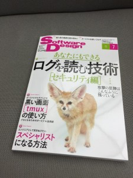

# SoftwareDesign2015年7月号の一行感想文
みなさんトークショーご参加有難うございました。もうちょっと笑いをとって腹筋崩壊から失禁に導きたいところでしたが、私の力は出し切ったかと思います。 
 

<blockquote cite="https://www.facebook.com/photo.php?fbid=10206083403911330&amp;set=a.2100520959818.2122891.1449262967&amp;type=1">
&#x3072;&#x30fc;&#x9593;&#x306b;&#x5408;&#x3063;&#x305f;
Posted by <a href="https://www.facebook.com/ryueda">上田 隆一</a> on <a href="https://www.facebook.com/photo.php?fbid=10206083403911330&amp;set=a.2100520959818.2122891.1449262967&amp;type=1">2015年6月18日</a></blockquote>

 
 
 
ソフ◯ップ的な衝立があったので、B級グラビアアイドルの真似をしてみたが、なんとなく不発。 
 
<blockquote class="twitter-tweet" lang="ja">
某ソフ○ップ <a href="https://twitter.com/hashtag/junkudo?src=hash">#junkudo</a> <a href="https://twitter.com/hashtag/%E3%82%B7%E3%82%A7%E3%83%AB%E8%8A%B8?src=hash">#シェル芸</a> <a href="http://t.co/pyje7aiWDF">pic.twitter.com/pyje7aiWDF</a>
&mdash; Mitzyuki - 転職先絶賛募集中 (\@bsdhack) <a href="https://twitter.com/bsdhack/status/611508630534270977">2015, 6月 18</a></blockquote> 
 
 
さて、トークショーの中でも池本さんから話がありましたSoftwareDesign7月号ですが、久々に薄口一行感想文をやってみたいと思います。単なる独り言です。1行です。自己満足です。期待しないでください。 
 
 
 
<h2>再発見の発想法</h2> 
 
私は万年アイドル状態です。なんとかならないでしょうか。 
 
<h2>おとなラズパイリレー</h2> 
 
私も<a href="http://blog.ueda.asia/?p=6198">日経Linuxでラズパイ関連を連載している</a>ので敵情視察という感じですが、最後の方に書いてある、私と誕生日が一ヶ月違いの田中社長が「怪我をされたら困ります！」と言われた逸話が心に沁みました。 
 
<h2>なんでもネットにつなげちまえ道場</h2> 
 
SDでアノードとかカソードとか聞くとは。日経Linuxと共に流れが電子工作に行っている感じ。 
 
<h2>かまぷの部屋</h2> 
 
おのれ出たなカマタ！ 
 
 
以上。 
 
<h2>第1特集 ログを読む技術</h2> 
 
コマンドの使い方もあって個人的には面白かったが、そろそろApacheのデフォルトのフォーマットがもうちょっと処理しやすい形式になっても良いと思う。各フィールドの書式が不統一すぎる。ログに現れない文字を区切り文字にするとか。 
 
他、いろいろ勉強になりました。Linux Auditの話とか、いろんな種類のDDoSの話とか。 
 
C&Cサーバって一瞬NECかと思った。 
 
<h2>第2特集 tmuxの使い方</h2> 
 
端末切り替え器は今は使っていないが、監視が業務に入ると便利であった。使ってたのscreenだけど。 
 
<h2>第3特集 6人の先駆者に訊くスペシャリストになる方法</h2> 
 
なるほど。 
 
<h2>Kotlin入門</h2> 
 
楽しそう。 
 
<h2>Erlangで学ぶ並行プログラミング</h2> 
 
力武さん・・・ムズイっす。ムズイけど、今、ロボットの研究の方がバーストしすぎて絶賛開発ストップ中の<a href="http://blog.ueda.asia/?tag=gluelang">GlueLang</a>の目指しているものを一部具現化しているような感じもします。 
 
ただ、Unixの概念をラッパーしたようになっているのが個人的にはどうなのかと思うところでして、普通にUnixの言葉を素直に実装できないのだろうかという印象を抱いています。 
 
<h2>Sphinxで始めるドキュメント作成術</h2> 
 
図番がサポートされましたか！ありがたやありがたや。それと、フィールドリスト知らなかったので今度使ってみます。 
 
 
<h2>るびきち流Emacs超入門</h2> 
 
v(ry 
 
<h2>Android Wearアプリ開発入門</h2> 
 
こういうプログラミングをすることがここ数年ほぼ無くなった。 
 
<h2>Mackerelではじめるサーバ管理</h2> 
 
シェ(ry 
 
<h2>書いて覚えるSwift入門</h2> 
 
こういうプログラミングをすることがここ数年ほぼ無くなった。（二回目） 
 
<h2>セキュリティ実践の基本定石</h2> 
 
フィッシングサイトはゲームオーバーゼウスというものが作っていると。なんと。気になった方は書店に走りましょう。 
 
船橋のザウスはとっくに取り壊されていると。（本文とは関係ありません。） 
 
<h2>ShowNetが示すネットワークの近未来</h2> 
 
もうちょい私のような素人にも分かるようにShowNetというものがざっくりどういうものなのかを教えてほしいと思いました。 
 
<h2>.SPECS</h2> 
 
dnf!dnf! 
 
<h2>チャーリー・ルートからの手紙</h2> 
 
Dスクリプト芸!! 
 
<h2>Debian Hot Topics</h2> 
 
なるほど。 
 
<h2>Ubuntu Monthly Report</h2> 
 
むむむむむ。 
 
<h2>Linuxカーネル観光ガイド</h2> 
 
毎度勉強になります。NIC一つ一つにCPUが付いていたらどうなるんだろうとか妄想しながら前半を読みました。後半、Raspberry Piのデバイスツリーが一体何者なのかやっと理解できました。 
 
<h2>ひみつのLinux通信</h2> 
 
昨日はサインありがとうございました！漫画に出てきたようにいろいろツール使う人、いますよね・・・ 
 
<h2>Monthly News from jus</h2> 
 
メールを介さないコミュニケーションは仕事の速度アップに大切ですね。<a href="http://www.jus.or.jp/archives/258">本文と関係ないけど総会は7/25で拝承。</a> 
 
<h2>Hack For Japan</h2> 
 
毎度頭が下がります。 
 
<h2>温故知新ITむかしばなし</h2> 
 
む。著者が・・・。 
 
GPS衛星が初めて打ち上げられたのは1978年2月ということで私の誕生月ということですか。道理で方向音痴なわけだ（関係ない）。 
 
<h2>プロジェクト管理ツール再入門</h2> 
 
最後らへんのツールに対する態度に共感を覚えました。 
 
 
 
以上。 
 
<iframe src="http://rcm-fe.amazon-adsystem.com/e/cm?lt1=_blank&bc1=000000&IS2=1&bg1=FFFFFF&fc1=000000&lc1=0000FF&t=ryuichiueda-22&o=9&p=8&l=as4&m=amazon&f=ifr&ref=ss_til&asins=B00XU0UEJY" style="width:120px;height:240px;" scrolling="no" marginwidth="0" marginheight="0" frameborder="0"></iframe> 

