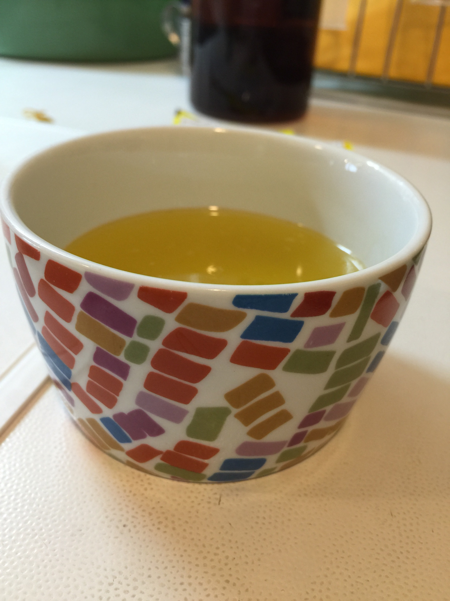

---
Keywords:Haskell,Raspberry,シェルプログラミング実用テクニック,寝る,日記,シェル芸,記念日は嫌い
Copyright: (C) 2017 Ryuichi Ueda
---
# 日記（ジュンク堂イベントのまとめ等）
本日はシェル芸ホロン部的なネット工作民でした。 
<blockquote class="twitter-tweet" lang="ja"> 

「<a href="https://twitter.com/gihyosd">\@gihyosd</a>さんの本の宣伝からトークイベント\@ジュンク堂さんを経て第17回シェル芸勉強会に至るまでの記録」をトゥギャりました。 <a href="http://t.co/v5YO9Iw8WD">http://t.co/v5YO9Iw8WD</a>
 
— Ryuichi Ueda (\@ryuichiueda) <a href="https://twitter.com/ryuichiueda/status/612504951739191297">2015, 6月 21</a></blockquote> 
 
 
 
 
 
 
 
 
 
 
 
 
 
 
 
 
 
 
 
 
 
 
 
 
 
 
 
 
 
 
 
 
 
 
 
<blockquote class="twitter-tweet" lang="ja"> 
 
会長\@友の会 :~$ echo USP友の会:6/18（木）トークイベントの中でシェル芸勉強会やりました ;curl <a href="https://t.co/5rmJRNXybS">https://t.co/5rmJRNXybS</a> <a href="https://twitter.com/usptomo">\@usptomo</a>さんから <a href="https://twitter.com/hashtag/usptomo?src=hash">#usptomo</a> 
 
— 【怒濤の】USP友の会【シェル芸】 (\@usptomo) <a href="https://twitter.com/usptomo/status/612497977324650496">2015, 6月 21</a> 
 
 
 
 
 
 
 
 
 
 
 
 
 
 
 
 
 
 
 
 
</blockquote> 
 
 
 
 
 
 
 
 
 
 
 
 
 
 
 
 
 
 
 
 
 
 
  
 
イベントを支えて下さった鎌田さん星さん長田さん今泉さん、そして毎度の事いじってしまった斉藤さんには改めて御礼申し上げます。 
<h2>ある雑誌のHaskellの記事</h2> 
最初の校正。あくまで普段使いしている素人の目で書いたけど、例の騒動についても言及。お前が言及すんのかという感じだが、大変残念に思っている一人であり、ああいう自己欺瞞みたいなものとは研究者は絶えず向かい合わなければならない事なので、やはり他人事ではない。 
<h2>依頼されて査読のようなもの</h2> 
読んで欲しいとの事で快諾して読んでそのままにしてたら「まだですか？」と催促があり。メール読み返したら確かにフィードバックしなければならなかったようで。内容は秘密だが別分野なのとパラグラフライティングされてなくて読みにくかった。 
<h2>父の日？</h2> 
知らんかった。長女と夕飯の買い物の時になにかの宣伝（父の日だから肉食え的な。余計なお世話。）を長女が見つけて「ごめんなにも準備してない」と言ってくれたので、「そんなもの無視して毎日をしっかり過ごしなさい」と返答。心底、そう思う。毎日が父の日であり、娘の日である。 
 
とか言いながら、結婚記念日だけは気にしているな俺と思った。結婚状態を継続することによる緊張感で、脳の当該部分が萎縮しておかしくなっている。 
<h2>挽肉の脂採取</h2> 
タコミートを作るために合挽き肉500gを調味料もいれず油もフライパンに敷かずに炒めた。余計な脂は捨てるのだが別の料理に使えるので採取。写真のように湯飲み茶碗に一杯分くらい採取できた。 
 
見かけが番茶っぽいが、一気飲みしたらたぶん死ねる。 
&nbsp;&nbsp; 
<h2>日経Linux9月号の記事</h2> 
本日書き出した。いよいよロボットが珍走、いや、暴走、いや、爆走する号。7月号読んでない方はこちらどうぞ。Kindle版。ところで、Kindleという名前は開発者の金銅烈（キムドンヨル）さんの名前からとったらしい。消防署の方から来た消火器売りのおじさんが言ってた。 
 
<iframe src="http://rcm-fe.amazon-adsystem.com/e/cm?lt1=_blank&amp;bc1=000000&amp;IS2=1&amp;bg1=FFFFFF&amp;fc1=000000&amp;lc1=0000FF&amp;t=ryuichiueda-22&amp;o=9&amp;p=8&amp;l=as4&amp;m=amazon&amp;f=ifr&amp;ref=ss_til&amp;asins=B00ZEL935S" style="width:120px;height:240px;" scrolling="no" marginwidth="0" marginheight="0" frameborder="0"></iframe> 
 
嘘である。くだらない。実にくだらない。 
寝る。
