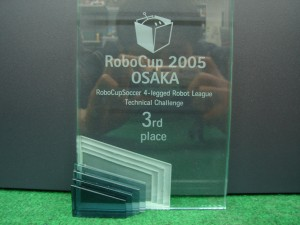

# 日記 ---RoboCupについてもう少し知って欲しいなあと少々暑苦しい記述
普段は人のチームの成績など嫉妬心があって宣伝しないし、「日本」っていう括りで何かを論じるのが嫌いなのですが、あまりに扱いが小さい。

<blockquote class="twitter-tweet" lang="ja">
Japan&#39;s humanoids scoop 1-0 win: A team from Japan wins the child-sized humanoid football final at the RoboCup... <a href="http://t.co/A9HrFqpl5h">http://t.co/A9HrFqpl5h</a>
&mdash; BBC Tech News - RSS (@BBC_Tech_News) <a href="https://twitter.com/BBC_Tech_News/status/623829092786286593">2015, 7月 22</a></blockquote>

というように中国でやってることをわざわざBBCが報じているように、<a href="https://en.wikipedia.org/wiki/RoboCup" target="_blank">RoboCup</a>はそこそこ大きいイベントです。私も東京の単なるエキシビジョンで、BBCの取材を受けたことが有ります。もともと日本発のイベントで、かつ15年前のことですが、その頃から注目を浴びていました。

んで、「日本チーム」というか（そういう呼び方は好きではないので）、「私の知り合いの偉大な先生方のチーム」が、今年の世界大会で結果を残しております。

<blockquote class="twitter-tweet" lang="ja">
BabyTigers -R got the 3rd of Logistics League.&#10;&#10;ようやくRoboCup の記録にBabyTigers-Rの名前を残すことができました。&#10;ひとえに皆様の色々なご協力のお陰様です。感謝です。 <a href="http://t.co/E629IHo6cj">pic.twitter.com/E629IHo6cj</a>
&mdash; Wataru Uemura (@wadaru) <a href="https://twitter.com/wadaru/status/623882086206697472">2015, 7月 22</a></blockquote>

<blockquote class="twitter-tweet" lang="ja">
優勝だぁぁぁぁ&#10;&#10;CITBrains世界一!!!!&#10;&#10;<a href="https://twitter.com/hashtag/robocup2015?src=hash">#robocup2015</a>
&mdash; RyuYamamoto (@ryu_software) <a href="https://twitter.com/ryu_software/status/623754729777041408">2015, 7月 22</a></blockquote>

<blockquote class="twitter-tweet" lang="ja">
福井工業大学&#10;ロボカップ世界大会でFUT-Kが準優勝!!&#10;<a href="http://t.co/1jZMcxgxLr">http://t.co/1jZMcxgxLr</a>
&mdash; 森山和道 (@kmoriyama) <a href="https://twitter.com/kmoriyama/status/624126568856616960">2015, 7月 23</a></blockquote>

チームを持つには人件費を除いて最低500万/年くらい用意して、実験用の大きなスペースがなければならないのですが、コスト削減に煩いこの国でチームを維持して結果を残すのは至難の業です。「サッカー」と名が付けばいくらでも予算が出る国や、「軍事に使えますよ」と言えば予算が出る国、あるいは土地が安い国、学生が徴兵免除のために死に物狂いで開発してくる国とわたりあってこれだけ成績を残すのは、基礎的な能力（プログラミング能力と機械を作る能力）がまだまだこの国は水準が高いからとしか思えません。内情を知ってるとバタバタしていてそんなたいしたもんでもないと思うかもしれませんが、私は一度外に出たので、やはりあれだけのことをやれるのは人と環境が整っているからということがよく分かります。「日本はITが弱い」とか言っているのは、何か違うような気がします。先程も「日本という括りが嫌い」と言ったように、そんなでかい括りはあんまり意味がありません。自分の周囲のお仲間を見てそれだけを「日本」と簡単に呼ぶのはどうかと思います。

もう一つ他国との比較を言うと、海外チームの多くは「コンピュータサイエンス学科」に所属しています。つまりロボットはコンピュータサイエンスなんですが、私の住んでいる川崎から半径1000km以内のコンピュータサイエンス屋さんがRoboCupにあんまり反応しないので寂しい限りです。IoTってなんでしょう？

私の場合、本戦ではあんまりでしたが<a href="https://en.wikipedia.org/wiki/RoboCup_Standard_Platform_League#Technical_Challenges_Results_.5B4.5D">かろうじてテクニカルチャレンジでWikipediaにチーム（ARAIBO）の成績を乗せた</a>ので、もうちょっと自慢していいのかもしれません。

[caption id="attachment_6596" align="aligncenter" width="300"] この前の年は2位だったが盾の写真が出てこない。写り込んでいる奴だれや。[/caption]

しかしもう10年前のことなので、近々チームを持ってもう一度参戦しようと画策しております。オッサンの墓場とも言える「日本がどうのこうの」という議論に入らず、世界と戦いたいなあと。成績を残す自信はありませんが、それでも世界を肌で感じるには、やっぱり戦うのが一番です。当時はそれができることの重大さがサッパリ全然全く分かってませんでしたが。

ところで再来年のロボカップは20年ぶりに名古屋開催となりました。

<blockquote class="twitter-tweet" lang="ja">
ロボカップ：２０１７年世界大会　名古屋開催決まる - 毎日新聞 <a href="http://t.co/OV7Tydmupf">http://t.co/OV7Tydmupf</a>
&mdash; Hiroyuki Okada (@okdhryki) <a href="https://twitter.com/okdhryki/status/622893124520689664">2015, 7月 19</a></blockquote>

チームを持つ持たざるにかかわらず手伝わないといけないっぽいので、来年はライプチヒに視察というか、旧知の人と再会して協力を仰がなければいけません・・・。胃が痛い。

何か力んだエントリーになってしまったので頭を冷やすために寝る・・・と見せかけてここにも熱い方がおられますので道連れにします。

<blockquote class="twitter-tweet" lang="ja">
もう一度。DARPAロボティクスチャレンジ『惨敗』で日本のロボット研究が駄目になったとお嘆きの皆様は、中国で開催中のRoboCup2015において千葉工大のチームが2年連続優勝の快挙を成し遂げた事をご存知ですか？ <a href="https://t.co/MfhUChbU3Z">https://t.co/MfhUChbU3Z</a>
&mdash; Shuuji Kajita (@s_kajita) <a href="https://twitter.com/s_kajita/status/624115120508022784">2015, 7月 23</a></blockquote>

<blockquote class="twitter-tweet" lang="ja">
ご主張に激しく賛成なのですが…RoboCupがどういう技術を必要とする大会で、そのKidSizeで２年連続優勝がどれほどの偉業か、の解説も併せて呟く必要があるのかも、と。マスメディア…ダメぽなので。orz QT <a href="https://twitter.com/s_kajita">@s_kajita</a> もう一度…
&mdash; ホセヲ ʞzsɾʎ (@yjszk) <a href="https://twitter.com/yjszk/status/624116650233585664">2015, 7月 23</a></blockquote>

そういえば私も、肝心の「ロボカップって何？」ということを一言も説明していない。

アカン。
