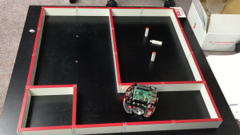

# 日記 ---自己位置推定の実機実装
必要に迫られ、およそ10年数ぶりに実機用のパーティクルフィルタのコードを書いています。売るものではないので公開してますが、ロボットの場合、ハードウェアが違うとコードがそのまま使えないのであまり反響はありません・・・が、ロボットは日経Linuxの連載で使っている<a href="/?page=05983" target="_blank">Raspberry Pi Mouse</a>で市販品なので、ちゃんとお化粧して教科書書いて<s>小銭を稼ぐ</s>使ってもらうのが目標です。

<blockquote class="twitter-tweet" data-partner="tweetdeck"><p lang="ja" dir="ltr">Raspberry Pi Mouseの自己位置推定コードをゴリッゴリに開発中。&#10;&#10;自己位置推定のコードをひと通り作ってログを使って動作確認済み。週明け実機でオンラインで実験。&#10;&#10;日経Linuxの連載もどうぞ。&#10;&#10;<a href="https://t.co/sRjfBYVfod">https://t.co/sRjfBYVfod</a></p>&mdash; Ryuichi Ueda (@ryuichiueda) <a href="https://twitter.com/ryuichiueda/status/630338662790660096">August 9, 2015</a></blockquote>
<script async src="//platform.twitter.com/widgets.js" charset="utf-8"></script>

リポジトリを見ても、「ああC++だなあ（逃げよう）」ということくらいしか分からんのでここに何やってるか書いておくと、次の写真のような環境で、ロボットに地図をもたせて、地図のどこにロボットがいるのか自分で把握させるコードを書いています。センサ情報はロボット前面の四つの赤外線センサから得られます。また、ロボットがどれだけ動いたかはモータへの指令から求めることができますが、壁に接触しながら動くと訳の分からん挙動を示すので大変です。

<a href="fa73bfa53dd26337607eb0df50fcd604.png"></a>

ロボットは次のような地図を持っています。ロードした地図をテキストで描画する確認用プログラムの出力を示します。シェル芸でしょうか。いいえ、C++です。

```bash
uedambp:map ueda$ ./main ./map | head -n 15
+---+---+---+---+
| | | 
+ + + + +
| | | 
+ + + + +
| | | 
+---+ +---+---+
| | | 
+---+---+---+---+
```

<span style="color:red">この出力をFacebookに貼りつけたら「Rogueみたい」というコメントを書き込むおじさまがたがたくさん釣れた</span>んですが、さあなんのことやら。

今日と明日はロボットのいる大学に行けないのでロボットへの行動指令とセンサの値のログを採取して開発中ですが、とりあえずそれっぽいものができましのでgifアニメをはりつけます。

<a href="animation3.gif"></a>

作っているコードはパーティクルフィルタというものです。地図の上にロボットの分身（ブツブツ）をばら撒いて、行動とセンサの履歴が説明できない分身を殺しまくって、説明できるやつを増やしてロボットの実際の位置に分身の位置を寄せていきます。

上の実行例は実際のロボットの位置を書き込んでないのですが、最終的にはロボットの最後の位置近くにブツブツが固まりました。


まだなんのことかサッパリ分からんと思いますが、続きは某所での講義で。分かってる人には「壁にぶつかったあとのパーティクルの挙動のモデル化が難しかったけど適当な方法でもうまくいった」とお伝えします。


寝る。
