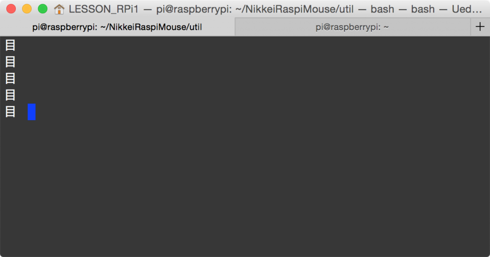

# プロンプトを目grep仕様にしたら仕事が捗った。
やっと新しい大学にも馴染んできました。

職場が変わってしばらくというのは、普段は何も考えずに受けている省力化・自動化の恩恵を感じるものです。無線LANも普段はパソコンを開いただけでつながるわけですが、9/1の赴任初日はまだ使えない状態だったのでパソコンを開くたびにテザリングの設定をやりなおし、数日たって部屋にアクセスポイントを立てても、アクセスポイント自体、パソコン、iPhone、支給されたiPadといちいち初期設定をする必要があり、正直、集中力がブチブチで仕事に支障が出ておりました。

自動化の恩恵というと、我々シェル芸人（←自分で言うのか）はコマンドによる仕事の自動化の効用を最大に享受しているわけです。grepのない仕事など考えられません。まだ環境が整ってないからgrepだけは目grepでお願いしますなどと言われたら、困るわけです。

そんな、クソにも役に立たない不特定多数への説教を考えていたところ、飛び込んで来たこのツイート。

<blockquote class="twitter-tweet" data-partner="tweetdeck"><p lang="ja" dir="ltr">目cat | 目grep</p>&mdash; 多糖類∠120° (\@pectin0x) <a href="https://twitter.com/pectin0x/status/641593686405574656">September 9, 2015</a></blockquote>
<script async src="//platform.twitter.com/widgets.js" charset="utf-8"></script>

たぶん、目でファイルを見て目で検索して疲れたという趣旨なんでしょうが、私には「目cat」の部分の「目」がプロンプトに見えたわけです。ならば仕方がない。今日は一日、プロンプトを「目」にしよう。仕方がない。

プロンプトの変え方ですが、Macでbashの場合はホームの.bash_profileに次のように1行足してPS1という変数をいじってやります。Linuxなら.bashrc。

```bash
$ tail -n 1 ~/.bash_profile 
export PS1=&quot;目 &quot;
```

端末立ち上げると、この通り。<s>不毛だ。</s>

<a href="5180e917e98bc6ffae29d0daf8a605a1.png"></a>

まずは目grep。いや、正確には目grepではないのだが・・・

```bash
目 grep &quot;Linux&quot; *.tex | head
contents.tex:		\\item Linuxのデバイスドライバ
contents.tex:\\frametitle{Linuxのデバイスドライバ}
contents.tex:Version: Linux version 4.1.6-v7+ (root\@raspberrypi) (gcc version 4.6.3
```


目make。メメイク。「目makeなんてup to dateね。」っていうワーニング出た（超妄想訳）。

```bash
目 make
make: `robosys_2015_10.pdf' is up to date.
```

目ギットプル。目レッドブルではない。

```bash
目 git pull
remote: Counting objects: 7, done.
remote: Compressing objects: 100% (6/6), done.
remote: Total 7 (delta 2), reused 5 (delta 1), pack-reused 0
Unpacking objects: 100% (7/7), done.
From https://github.com/ryuichiueda/NikkeiRaspiMouse
 f42960d..6defb52 master -&gt; origin/master
Updating f42960d..6defb52
Fast-forward
 util/{kernel_update_for_RPi2.bash =&gt; kernel_build_RPi2.bash} | 3 +++
 1 file changed, 3 insertions(+)
 rename util/{kernel_update_for_RPi2.bash =&gt; kernel_build_RPi2.bash} (80%)
```


はっきり言ってつまらないので、次は大技。Raspberry Piシャットダウン後に流れるように目プロンプトに帰還。通信が切れた後、おもむろに一言「<a href="https://ja.wikipedia.org/wiki/%E3%82%81%E7%B5%84%E3%81%AE%E3%81%B2%E3%81%A8">目</a>」と出てきます。まるでラッツアンドスターです。

```bash
pi\@raspberrypi ~/RPiM $ sudo shutdown -h now

Broadcast message from root\@raspberrypi (pts/0) (Sat Aug 22 17:25:19 2015):
The system is going down for system halt NOW!
pi\@raspberrypi ~/RPiM $ Connection to 192.168.2.100 closed by remote host.
Connection to 192.168.2.100 closed.
目 
```

次は目というファイルを作って操作してみました。英文法のSVO感が出ています。しかも主語と目的語が一緒。「目 rm 目」には「目には目を」というハンムラビ法典の一文を思わせる力強さがあります。

```bash
目 touch 目
目 ls 目
目 rm 目
目 ls 目
gls: cannot access 目: No such file or directory
```

「准教授にもなって何やってんですか？」というツッコミはいけませんいけません。人間、立場で行動を変えてはいけません。大学ではさっそく学生と間違われて事務方を大混乱に陥れておりますが、今後も夜露死苦ちゃんという感じです。

<span style="color:red">ちなみに実際の使用感ですが、ごく当然のように使いにくいです。</span>本当に今日（実のところ昨夜から）一日これで過ごしましたが、本日は非常に仕事が捗ったのでサムシンググレート的な何かかもしれません。


では。おうち帰る。
