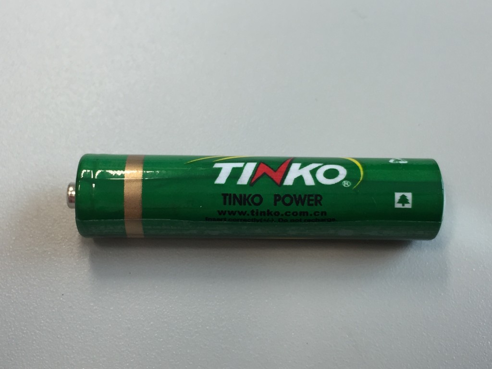
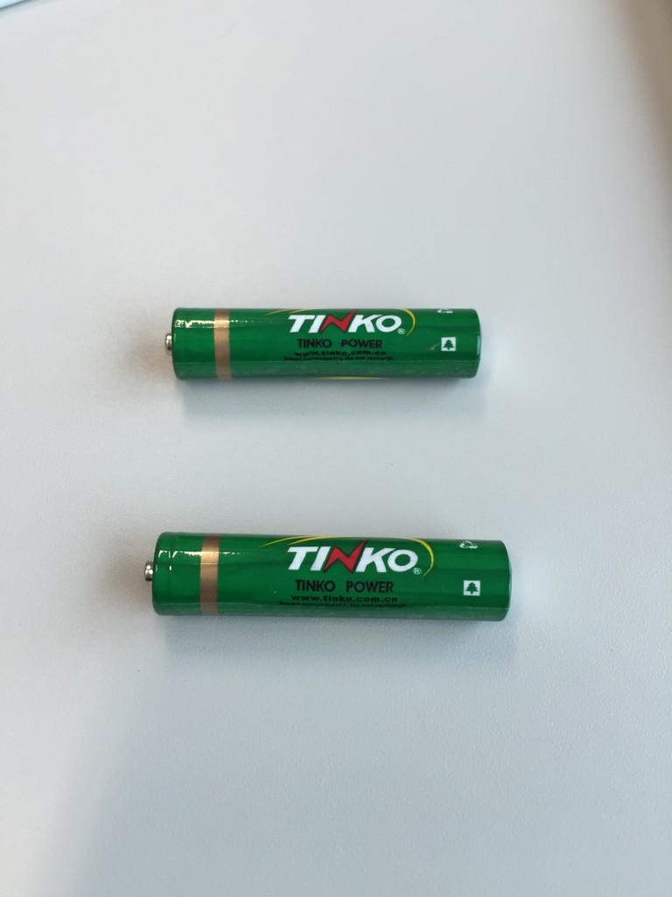

# 日記: Yes. TINKO POWER
電池の名前が、そういう名前だっただけです。秋月電子で買ったテスターに同封されていました。

この電池、たまにネットにさざ波を立てるようです。<a href="http://ameblo.jp/yorotiku123/entry-11577046627.html" target="_blank">こちら</a>にもエントリーがあります。名前の下にもっと面白いことが書いてあるのですが、それはこの方に譲ります。同封されていた単4電池だと字が小さくて写真では写せませんでした。

他に書くこともないので、2つ並べた写真をもう一枚貼って終わります。複数形になってDOUBLE TINKO POWERSですね。そうですね。

今日はこれから代官山で飲みます。代官山のシャレオツを自認する方々（本物はだいたい5%）にこれ見せてやりたいけど、ある意味、露出狂になるのでやめときます。

帰る。
