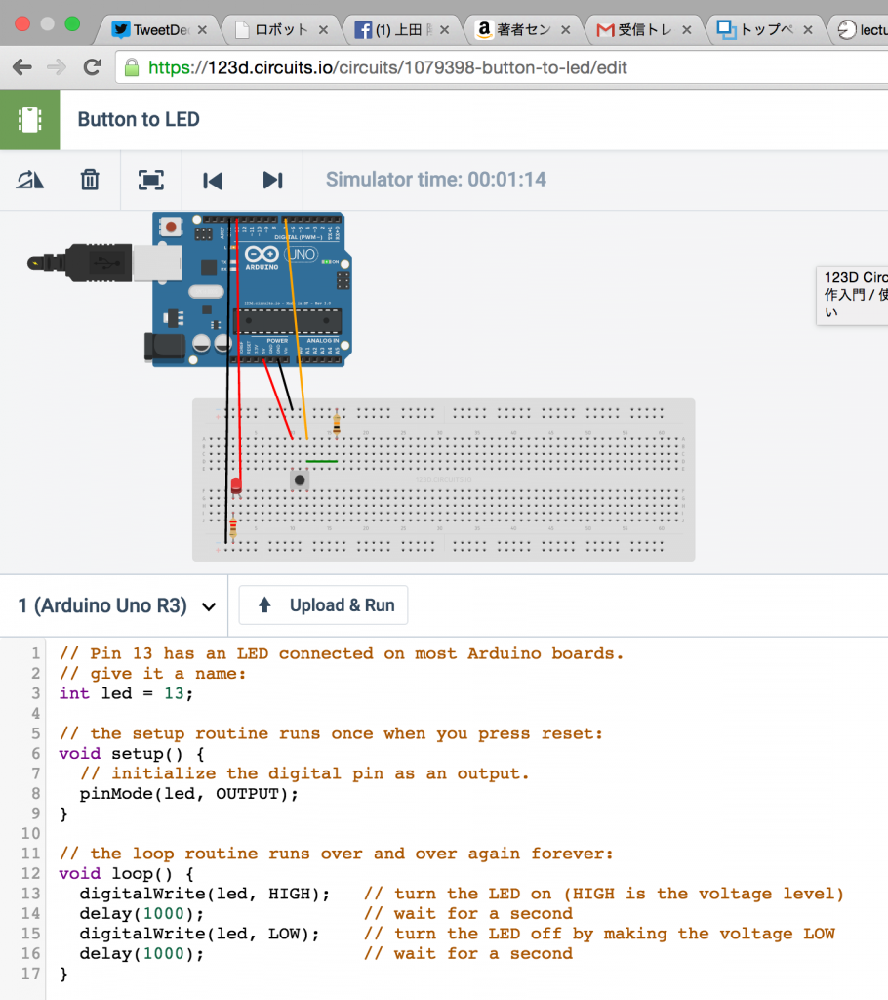
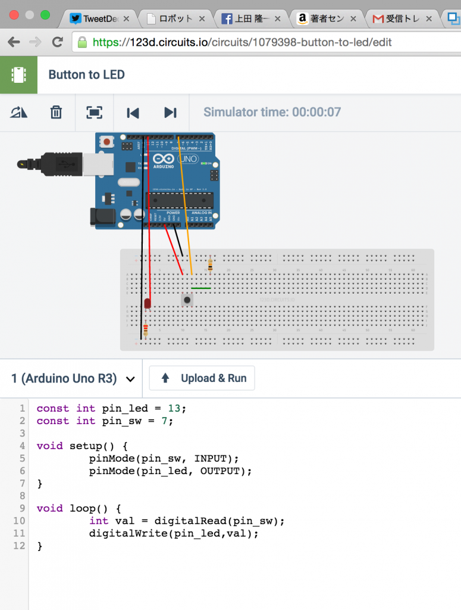

# 回路+Arduinoシミュレータ「123D Circuits」のメモ（本当にメモ程度）
講義のために調査。公開を前提に無料でArduinoを使った回路を組んでシミュレーションできるサービスだそうです。あ、タイトルに反映してませんでしたが、ウェブ上のサービスです。 
 
<h2>サイト</h2> 
 
<a href="https://123d.circuits.io/" target="_blank">https://123d.circuits.io/</a> 
 
です。 
 
<h2>サインアップ</h2> 
 
右上の「Sign up」から。私はFacebookのアカウントがあるので（学生は持ってない人もいる）、Facebookのアカウントで作成。ない人はメールアドレス等を入れるらしい。しかし、案内が日本語ですね・・・。 
 
サインアップ後はいくつかメニューが出てきますが、「Open Electronics Lab Hub」を使えばいいんじゃないかとなんとなく分かったのでこれをクリック。使うかビデオを見るか案内が出ますが、初めてなので「Watch introduction video」を選択。 
 
 
その後、Open Electronics Lab Hubを押したらいきなりでかいブレッドボードが出てきてしばし困惑。 
 
 
<h2>で、使ってみた</h2> 
 
しばし悩んだ後、「Edit」というボタンを発見しました。これを押すといろいろ部品が追加できるようになりました。あとは部品を配置してコードを書いて動かすということになります。LEDを置いたら勝手にコードが生成されていました。 
 
 
 
これを自分で書いたのに置き換えて、「Upload & Run」を押すとシミュレータが走ります。止めるときは右上の「Stop Simulation」を押します。この回路は<a href="http://www.oreilly.co.jp/books/9784873115375/" target="_blank">オライリーのArduinoの本</a>に書いてあった回路を改良したもので、タクトスイッチを押すとLEDが光るものです。 
 
 
 
タクトスイッチ、マウスで押すと光りました。よくできてます。途中、ちょっと重たかったです。 
 
プロジェクトの名前を買えるときは左上の名前をクリックしますが、説明書きやらライセンスの選択やらを迫られますので、英語に弱い人はとりあえず使いこなした後に名前を変えた方がいいかもしれません。 
 
ところで、プロジェクト一覧の画面で、「Arduinoのセット買え」みたいなのが出てきてこれは課金システムかと一瞬思ったのですが、そんなことはありません。シミュレータ上の部品はタダです。高級オーディオ用の高級な部品とか純金製のワイヤーとかの10連ガチャとか、そんなものは決してありません。 
 
 
以上。簡単なのであんまり書くこともないけど、この記事がキッカケになれば幸い。 

