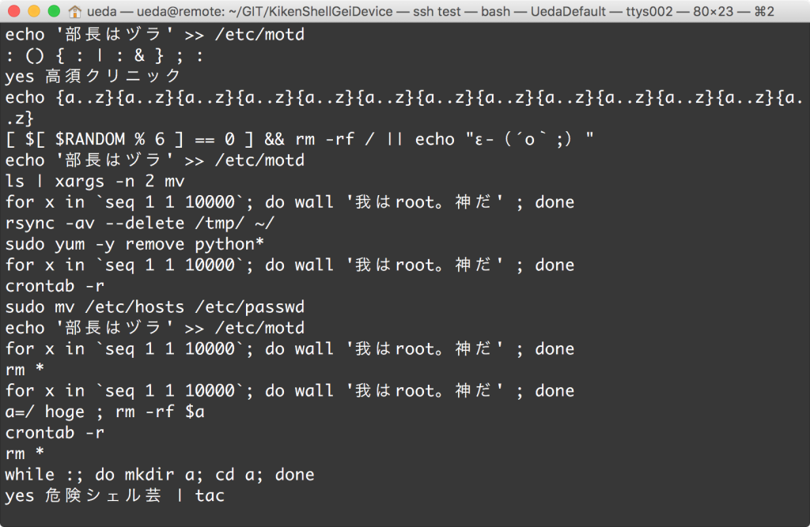

# 30億のデバイスで走るとやばい危険シェル芸デバイス作った
年が明けました。昨年は 
 
<blockquote class="twitter-tweet" data-partner="tweetdeck">
よんでくだしあ&#10;<a href="https://twitter.com/hashtag/%E3%82%B7%E3%82%A7%E3%83%AB%E8%8A%B8?src=hash">#シェル芸</a>&#10;<a href="https://t.co/jtOdNXyMrd">https://t.co/jtOdNXyMrd</a>
&mdash; ぐれさん (\@grethlen) <a href="https://twitter.com/grethlen/status/680614497028059136">December 26, 2015</a></blockquote> 
 
 
という騒ぎがありましたが、今年はシェル芸ポリスとして、荒ぶるシェル芸人を取り締まるふりをする所存です。出動！ミニスカポリス。 
 
<blockquote class="twitter-tweet" data-partner="tweetdeck">
シェル芸家って危険人物多いのかな(?)
&mdash; Gunzi\@Java勉強中 (\@hebereke2920083) <a href="https://twitter.com/hebereke2920083/status/682868864888094721">January 1, 2016</a></blockquote> 
 
 
違います。 
 
<h2>本題</h2> 
 
今日は年明けの講義のためにデバイスドライバの例を書いておりました。ただ、今日は元日です。酒を飲みながら書いていたので、なんでこうなったかよくわからんのですが、気がついたら<a href="https://github.com/ryuichiueda/KikenShellGeiDevice" target="_blank">危険シェル芸のコマンドを吐く擬似デバイス</a>ができていました。 
 
<a href="https://github.com/ryuichiueda/KikenShellGeiDevice/blob/master/README.md" target="_blank">README</a>を読んでも良く分からないと思いますので、解説を。 
 
 
<h2>擬似デバイスとは</h2> 
 
/dev/nullとか/dev/urandomとか、裏側に機械がくっついてないのに機械とのインタフェースの役割をするもののことです。/dev/nullとかのことは「デバイスファイル」と呼びます。「擬似デバイス」というのは「デバイスファイルを入出力口にして働く仮想の機械」というニュアンスの言葉です。 
 
UNIX屋さんなら何か調査するときに、デバイスファイルを次のように使ったりします。 
 
[bash] 
###コマンドの性能を測る（画面に文字を出して遅くならないように/dev/nullを使う）### 
$ time grep -r hoge ~/ &gt; /dev/null 
###128バイトの大きさのファイルを作る### 
uedamb:~ ueda$ head -c 128 /dev/urandom &gt; a 
uedamb:~ ueda$ ls -l a 
-rw-r--r-- 1 ueda staff 128 1 1 22:32 a 
[/bash] 
 
要はデータを吸い込んだり、生成したりする特別なファイルということになります。なぜコマンドやデーモンによるサービスの体裁を取らないかというと、ファイルの方がcatやリダイレクトで簡単に使えるからです。データハンドリングはファイルシステムで、というのはUNIXがUNIXであるための大前提のようなものです。<a href="https://blog.ueda.asia/?page_id=5983" target="_blank">日経Linuxの去年の連載</a>では、「ロボットでも基本はファイル入出力で」というテーマで執筆したのですが、それもこういうUNIXの考え方を意識したものでした。 
 
 
<h2>どうやって作るのか</h2> 
 
デバイスファイルの裏側にはデバイスドライバがいます。デバイスドライバをしかるべき方法でコーディングすれば、擬似デバイスを作ることができます。字を受けたときにどんな反応をするかをデバイスドライバ内に書けば、機械の代わりにそのコードが仕事をしてくれるわけです。本物の機械のためのデバイスドライバを書くときは（と言っても私は経験がほとんどありませんが）、デバイスドライバ内で機械のレジスタをいじることになります。 
 
デバイスドライバはカーネルの一部として動くので、デバイスドライバのコードはカーネルを書くように書かねばなりません。printfとかmallocが使えなかったり、いろいろ面倒なので、その分敷居は少し高くなります。 
 
あんまり詳しくは書けないのですが、<a href="https://github.com/ryuichiueda/KikenShellGeiDevice/blob/master/kiken.c" target="_blank">コード</a>をざっと見ていただければと。 
 
<h2>使い方</h2> 
 
 
今のところ、Ubuntu Linux 14.04でしか動作確認してません。今日作り始めたので当たり前ですが・・・。ということで、以下の操作をUnbuntuか、もし試していただけるなら別のLinux環境で行います。apt-getでgitとかmakeとかをインストールする必要があります。また、Linuxのヘッダファイルがないとコンパイルできないので、もしかしたらそれもapt-getする必要があるかもしれません。私はサーバ版でコンパイルしましたが、ヘッダはすでにあったのでapt-getする必要はありませんでした。 
 
[bash] 
$ git clone https://github.com/ryuichiueda/KikenShellGeiDevice.git 
$ cd KikenShellGeiDevice/ 
$ make 
[/bash] 
 
次のように「kiken.ko」というファイルができていたらOK。 
 
[bash] 
$ ls kiken.ko 
kiken.ko 
[/bash] 
 
デバイスドライバは、insmodというコマンドでカーネルに組み込みます。 
 
[bash] 
$ sudo insmod kiken.ko 
###カーネルから外したかったら以下のように### 
$ sudo rmmod kiken  
[/bash] 
 
次のように、「/dev/kiken0」というファイルができているはずです。 
 
[bash] 
$ ls -l /dev/kiken0  
crw------- 1 root root 249, 0 1月 1 23:03 /dev/kiken0 
###読み込みできるようにしておきましょう### 
$ sudo chmod +r /dev/kiken0  
[/bash] 
 
<h2>使う（危険）</h2> 
 
なんだか薄くて真面目な解説になっちまってましたがここからが本番です。headで打ち切ってますが、アレなワンライナーがランダムに出続けます。ネタは<a href="http://togetter.com/li/709172" target="_blank">ココ</a>から。 
 
[bash] 
$ cat /dev/kiken0 | head 
sudo yum -y remove python* 
sudo yum -y remove python* 
echo '部長はヅラ' &gt;&gt; /etc/motd 
echo ログ集計乙wwwww&gt;&gt; /var/log/httpd/access_log 
rsync -av --delete /tmp/ ~/ 
yes | xargs -P 0 yes 
for x in `seq 1 1 10000`; do wall '我はroot。神だ' ; done 
crontab -r 
echo {a..z}{a..z}{a..z}{a..z}{a..z}{a..z}{a..z}{a..z}{a..z}{a..z}{a..z}{a..z}{a..z} 
rsync -av --delete /tmp/ ~/ 
[/bash] 
 
危険極まりない。本当に何を考えているんだ。 
 
<h3>パイプと相性抜群</h3> 
 
とりあえず、自分のマシンを壊していいのなら、次のような使い方が標準になると思います。何の標準か知らんけど。 
 
[bash] 
$ cat /dev/kiken0 | sudo bash 
[/bash] 
 
試さない方が良いです。何の責任も取れないことはGPLのライセンスの中に書いてあリ・・・。 
 
<h3>安全に試す方法</h3> 
 
かと言って何も試さないのも面白くないので、次のワンライナーを提示しておきます。grepにつけた-aは、grepがバイナリとして危険シェル芸を扱ってしまうので、文字列として扱ってくれと明示的に指示するためのオプションです。 
 
[bash] 
$ cat /dev/kiken0 | grep -a 高須 | bash  
[/bash] 
 
<h2>今後</h2> 
 
オプションを充実させたり、標準入力から読み込んだ文字を関数の名前にしてfork爆弾を返す機能を実装する・・・っていうか講義の準備します。 
 
 
本当に冗談です。 
 
 
寝る。 
 
 
20160102追記: テスト用VPSサーバにインストール。いい感じだ。 
 
 
 
 
20160102追記: Raspberry Pi 2用のMakefileを追加。 
 
[amazonjs asin="4873112532" locale="JP" title="Linuxデバイスドライバ 第3版"]
