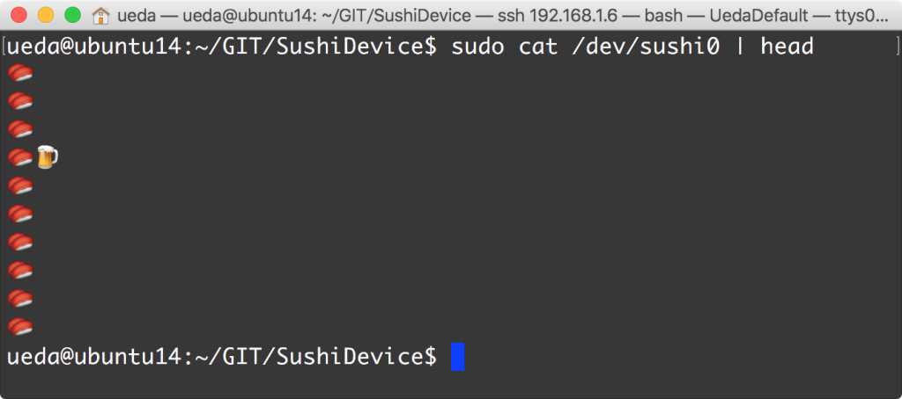
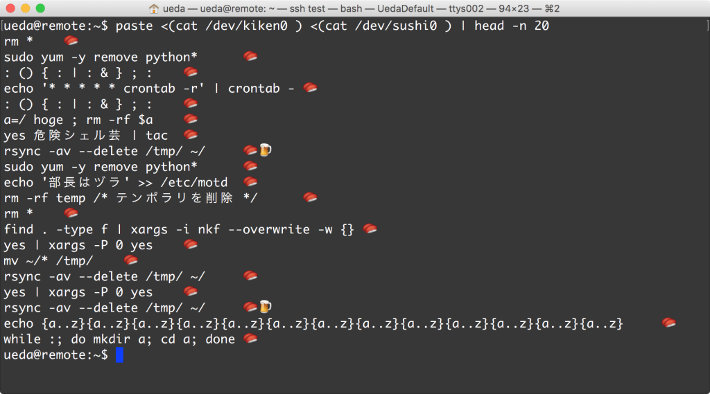

# 寿司デバイス
昨日の<a href="https://blog.ueda.asia/?p=7395">コレ</a>が、講義で使うにはあまりにもアレだったので、ちょっとマイルドな「寿司デバイス」も作りました。

リポジトリは<a href="https://github.com/ryuichiueda/SushiDevice" target="_blank">ココ</a>。

昨日の<a href="https://blog.ueda.asia/?p=7395">コレ</a>と組み合わせると、危険なワンライナーと寿司とビールが飛び交う世界がお楽しみいただけます。

Enjoy 寿司.
