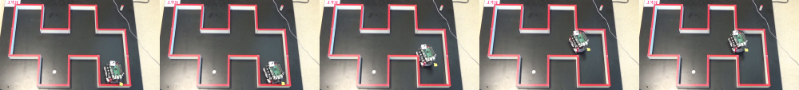
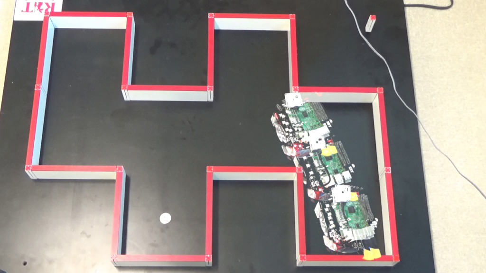

# 【メモ】ImageMagick（convertコマンド）で3枚以上の画像を合成する
単なるメモですが日本語で手っ取り早いエントリーがなかったので。以下のドキュメントを読んでやってみました。

<a href="http://www.imagemagick.org/script/command-line-options.php?#evaluate-sequence" target="_blank">http://www.imagemagick.org/script/command-line-options.php?#evaluate-sequence</a>

バージョンはこれです。Macでやってます。

[bash]
$ convert --version
Version: ImageMagick 6.9.2-3 Q16 x86_64 2015-10-06 http://www.imagemagick.org
Copyright: Copyright (C) 1999-2015 ImageMagick Studio LLC
License: http://www.imagemagick.org/script/license.php
Features: Cipher DPC Modules 
Delegates (built-in): bzlib freetype jng jpeg ltdl lzma png tiff xml zlib
[/bash]

この5枚を合成します。これもImageMagickで連結しました。（$ convert +append *.png ../a.png）

実行。maxのほかにmeanとかminとかあります。

[bash]
uedamb:tmp ueda$ convert *.png -evaluate-sequence max ../a.png
[/bash]

できたのがこれ。

時間を食ってしまったけどこれで論文が完成する・・・。

