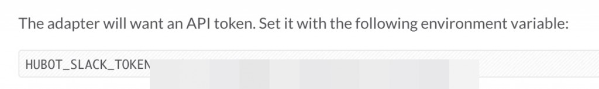
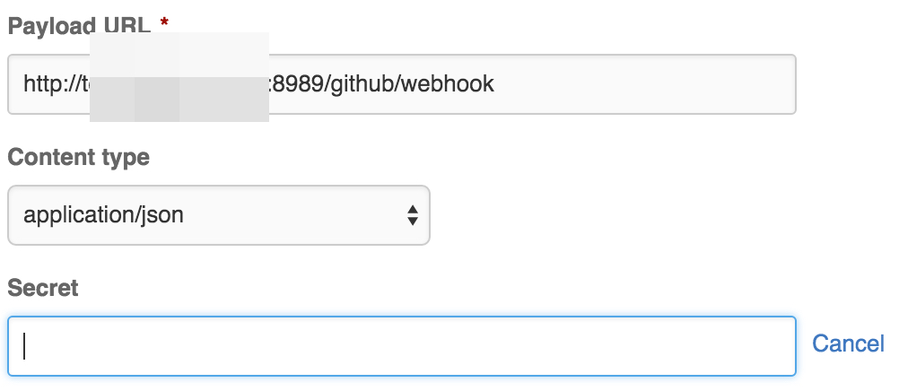
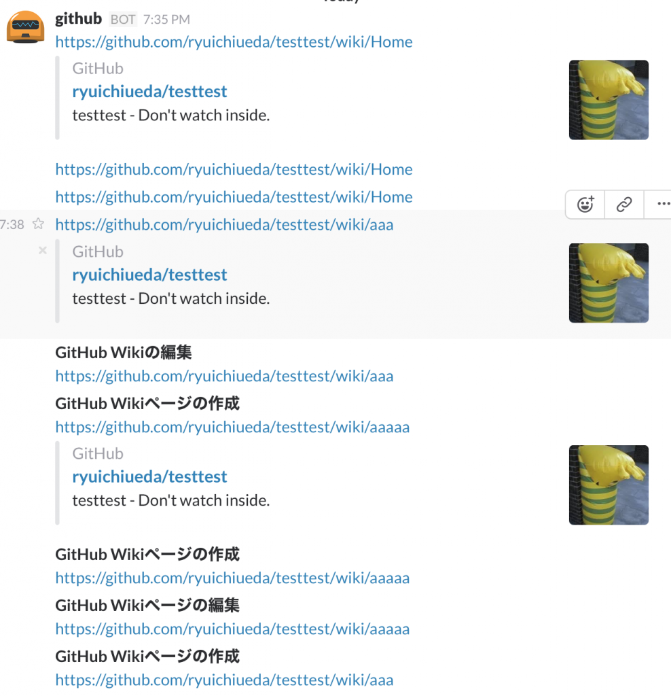

# GitHubのWikiの変更をHubot経由でSlackに通知
<a href="https://blog.ueda.asia/?p=7608">シェル芸勉強会</a>の次の日でかなり疲れているのですが、「GitHubのWikiを複数人で編集し、その変更をSlackに飛ばしたい」というニッチな需要ができたので工作活動してました。Slackの標準の機能には、GitHubのWikiの更新を受け取る手段が2016年2月14日現在、無いようです。<span style="color:red">（あったらすぐ教えてください！30分くらい探してSlack側に受け口が見つからなくてキレてやっちまいました。）</span>issueやpullリクエストの通知機能はあるんですが・・・。


ということで、HubotにGitHubからJSONを飛ばして、Hubotで解釈してSlackに飛ばすことにしました。Hubotについては、次のサイトを参考にインストールを行いました。環境はVPSのUbuntu 14.04上です。


<span class="hatena-bookmark-title"><a href="//www.atmarkit.co.jp/ait/articles/1408/20/news035.html">チャットボットでチーム開発効率化入門（1）：GitHub製フレームワークHubotの概要とインストール、チャットアプリと連携する基本的な使い方 (1/2) - ＠IT</a></span> <span class="hatena-bookmark-users"><a href="//b.hatena.ne.jp/entry/www.atmarkit.co.jp/ait/articles/1408/20/news035.html"></a></span>
<span class="hatena-bookmark-title"><a href="//qiita.com/GENM/items/0248433575580c9263b5">CentOSにHubotを導入してSlackと連携させる - Qiita</a></span> <span class="hatena-bookmark-users"><a href="//b.hatena.ne.jp/entry/qiita.com/GENM/items/0248433575580c9263b5"></a></span>

また、CoffeeScriptを書いた時は<a href="http://blog.spacemarket.com/code/hubot-github-webhook-1/" target="_blank">Hubot経由でGitHubのイベントを通知する | SPACEMARKET BLOG</a>を参考にさせていただきました。掲載されているコード（GitHubのissue等をTwitterに飛ばすもの）を、GitHubのwikiをslackに飛ばすように改造しました。

以下はちょっと端折ってますが手順です。

<h2>Hubotを召喚する</h2>

必要なものを上のサイトを参考にインストール後、適当なディレクトリ（自分の場合は~/HUBOT/GITHUB）を作り、その下で次のコマンドを打ちます。

```bash
yo hubot
```

すると、こんな感じで根掘り葉掘り聞かれます。<del>AAがアホっぽいです。</del>いや、なんでもありません。

```bash
$ yo hubot
 _____________________________ 
 / \\ 
 //\\ | Extracting input for |
 ////\\ _____ | self-replication process |
 //////\\ /_____\\ \\ / 
 ======= |[^_/\\_]| /---------------------------- 
 | | _|___\@\@__|__ 
 +===+/ /// \\_\\ 
 | |_\\ /// HUBOT/\\\\ 
 |___/\\// / \\\\ 
 \\ / +---+ 
 \\____/ | | 
 | //| +===+ 
 \\// |xx| 

? Owner Ryuichi UEDA <aho\@gmail.com>
? Bot name github
? Description A simple notifier for GitHub wiki
? Bot adapter (campfire) slack
```

間違えてはいけないのは
```bash
? Bot adapter (campfire) slack
```
の一箇所です。


<h2>hubotの起動スクリプトを作る</h2>

ディレクトリの下のbin/hubotがHubotの起動シェルスクリプトです。これを次のように書き換えます。PORTは、HubotがGitHubからデータを受け取るときに使うポート番号です。

<script src="https://gist.github.com/ryuichiueda/5faff08a5d3303891f46.js"></script>

このスクリプトは最後のforeverでサーバに常駐化します。常駐化するとデバッグで止めたり動かしたりするのが面倒なので、
デバッグの時はコメントアウトしている#exec...を使うと良いでしょう。こっちを使うとCtrl+cで止まります。

<h2>各種設定</h2>

上のスクリプトで次のようになっているところは、自分の環境に合わせて書き換える必要があります。
```bash
export HUBOT_SLACK_TOKEN=xxxxxx
export HUBOT_GITHUB_SECRET=yyyyyyy
```

HUBOT_SLACK_TOKENはSlackのHubotの設定ページに、次のようにトークンが表示されているはずなので、これをコピペして使います。

<a href="1455450034.jpg" rel="attachment wp-att-7684"></a>

HUBOT_GITHUB_SECRETは、GitHubの連携したいリポジトリのWebhookの設定で、「Add webhook」を押すと、次のように表示されるので、ここの「Secret」に適当なトークンを入れて使います。

<a href="1455450001.jpg" rel="attachment wp-att-7686"></a>

私は次のような感じで作りました。
```bash
$ cat /etc/* | md5sum 2> /dev/null
b720a34fb302c401e5146cefe1ae656d -
```

Secretの二つ上にある「Payload URL」は、http://<Hubotを置いたサーバのURL>:<ポート番号>/github/webhookにしておきます。このURLの「github」というのはHubotの名前です。

また、リポジトリのどんな変化に対して通知を受け取るかは、「Which events would you like to trigger this webhook?」という項でいじります。「Gollum」というのがWiki関係の通知に相当します。

<h2>Hubotスクリプト</h2>

こんな風に書きました。Hubotのディレクトリ下のscriptsディレクトリに<なんとかかんとか>.coffeeという名前で置いておくと、bin/hubotを実行すると動き出します。isCorrectSignatureの部分は上に挙げた3番目のブログのコードを整形して使い回しています。

<script src="https://gist.github.com/ryuichiueda/f7ae2b58c3f6b788dd87.js"></script>

次の部分（19行目）がSlackにデータを投げている部分です。「lab-github」というのは、Slackのチャンネルですので、用途に合わせて変更しましょう。毎度ハードコーティングで申し訳なく・・・
```bash
robot.messageRoom 'lab-github', message
```

スクリプト自体はパースされたJSONのデータを切った貼ったしているだけなので、なんとなく分かる人なら、どんどんいじっていけると思います。GitHubが送ってくるJSONの実物は、さっきのGitHubのリポジトリwebhook設定ページにあります。

Slackには、次のように通知が入ります。（ちょっとデバッグ中のメッセージもありますが。）

<a href="6022985d8728790ade577496a6c74b0d.png" rel="attachment wp-att-7702"></a>

表示される情報がURLだけで味気ないので、もうちょっと改良の余地あり。いや、これくらいの方がかえっていいのかも・・・。


寝る。
