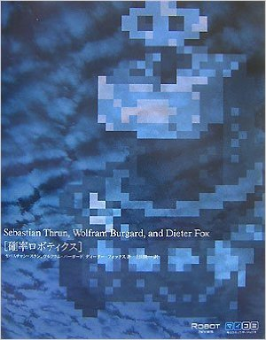
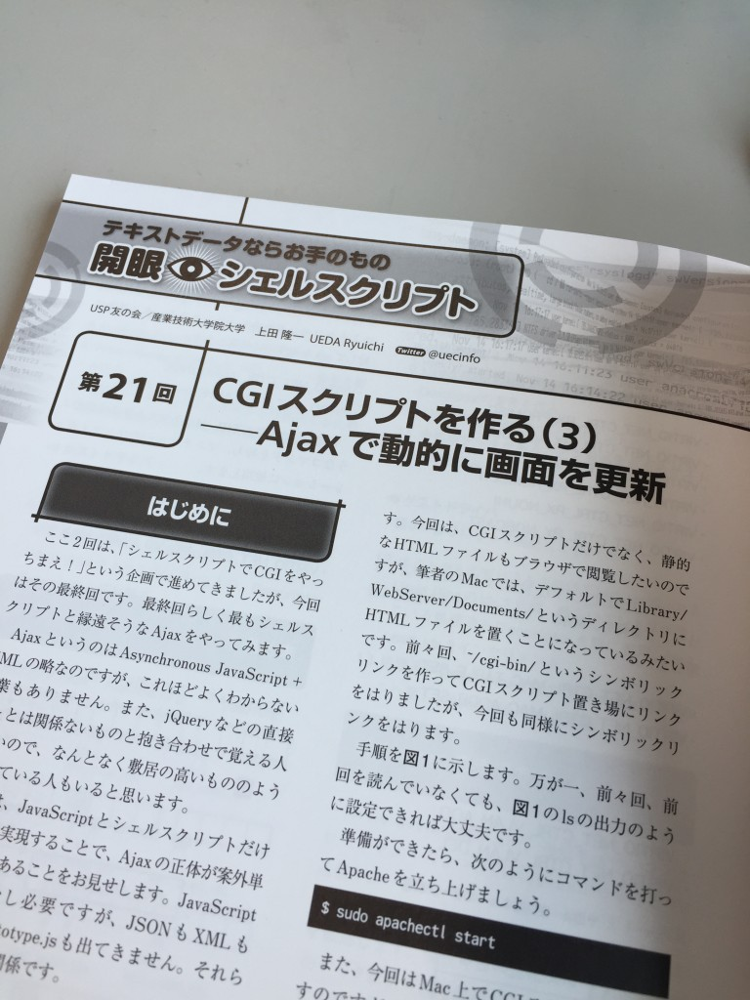

# 自己紹介
<h1 style="font-size:180%">自己紹介</h1> 
　　 
<strong>上田 隆一</strong> 
 
<!--nextpage--> 
 
<h2>上田隆一</h2> 
　　 

 
<ul> 
	<li><a href="https://twitter.com/ryuichiueda" target="_blank">\@ryuichiueda</a></li> 
	<li>1978年2月、富山県小矢部市生まれ</li> 
	<li>仕事</li> 
 <ul> 
	<li>研究と教育: 大学に勤務</li> 
	<li>執筆: 雑誌記事、本</li> 
	<li>興行師: 学会・勉強会の開催</li> 
 </ul> 
</ul> 

 

 
　　 

 
 
<!--nextpage--> 
 
<h2>職歴</h2> 
　　 
<ul> 
	<li>2004年-2009年: 東大の助手・助教</li> 
	<li>主な仕事</li> 
 <ul> 
	<li>ロボットの研究</li> 
	<li>ロボカップで世界を転戦（左下の動画）</li> 
	<li>教科書の翻訳</li> 
 </ul> 
</ul> 
 

 
<iframe width="420" height="315" src="https://www.youtube.com/embed/z6Yw1qhCZjk" frameborder="0" allowfullscreen></iframe> 

 
 
 

 
 
<!--nextpage--> 
 
<ul> 
	<li>2009年-2013年: 新橋のサラリーマン</li> 
	<li>主な仕事</li> 
 <ul> 
	<li>営業以外の会社のこと全般</li> 
	<li>コミュニティーの形成（<a href="https://www.usptomo.com/" target="_blank">USP友の会</a>）</li> 
	<li>社外教育用のテキストや雑誌記事 （技術評論社Software Design）、書籍の執筆</li> 
	<li>「シェル芸」という言葉を作る</li> 
 </ul> 
</ul> 
 
&nbsp;&nbsp; 
 
<!--nextpage--> 
 
<ul> 
	<li>2013年-2015年: 産業技術大学院大学の助教</li> 
	<li>主な仕事</li> 
 <ul> 
	<li>研究・教育（社会人の専門職大学院）</li> 
	<li>雑誌記事（日経Linux）、書籍の執筆</li> 
 </ul> 
</ul> 
 
　 
 
<!--nextpage--> 
 
<ul> 
	<li>2015年-: 千葉工業大学未来ロボティクス学科の准教授</li> 
	<li>主な仕事</li> 
 <ul> 
	<li>研究・教育</li> 
	<li>ロボカップ\@Homeリーグに参加</li> 
 	<ul> 
		<li>プレイヤーというよりも監督</li> 
			<li><a href="http://at-home.cit-brains.net/" target="_blank">CIT Brains \@Homeのサイト</a> 
 	</ul> 
	<li>執筆</li> 
 </ul> 
</ul> 
 
<iframe width="560" height="315" src="https://www.youtube.com/embed/eR5cCLBpbFg" frameborder="0" allowfullscreen></iframe> 
 
<!--nextpage--> 
 
<h2>最近気になっていること</h2> 
　 
<ul> 
 <li>ロボットの体と知能の関係</li> 
 <ul> 
 <li>センサやモータの配置を情報量で評価できないか。</li> 
 </ul> 
　　 
 <li>コンピュータに対する教育</li> 
 <ul> 
 <li>プログラミング以前にコンピュータや情報を 使いこなせる指導者を増産することが必要。</li> 
 <li>マニアで終わらせない。</li> 
 <li>「シェル芸」はそういう立場に立てる人の才能を 見抜き、育てるツールの一つだろう。</li> 
 </ul> 
</ul> 
　 
一緒に考えてくれる方募集中。 
 

 
 <footer><a href="/">ブログに戻る</a></footer> 

