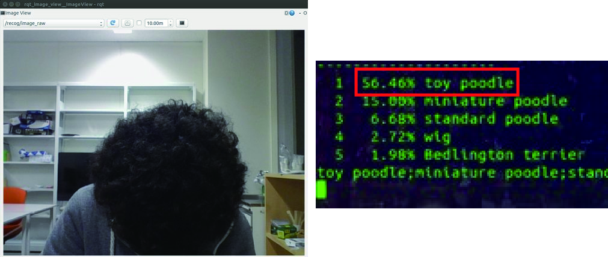
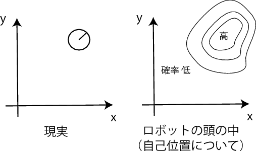
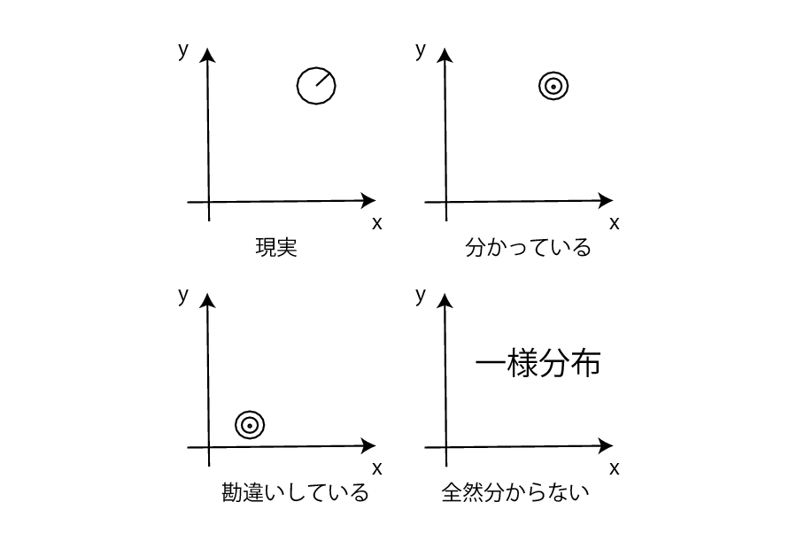
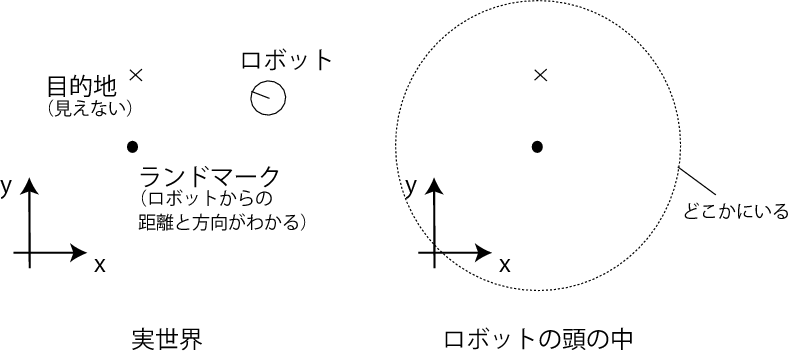

# 第32回CATTOMフォーラム
<h1 style="font-size:200%">移動ロボットの 
ナビゲーション技術</h1> 
　 
<h2 style="font-size:150%">千葉工業大学 上田隆一</h2> 
 
<!--nextpage--> 
 
<h2>本日の内容</h2> 
　 
<ul> 
	<li>自身の背景</li> 
	<li>研究室</li> 
	<li>移動ロボットのアルゴリズム</li> 
	<li>自身の研究</li> 
</ul> 
 
 
<!--nextpage--> 
 
<h2>自身の背景</h2> 
　 

ソフトウェアでロボットを動かす人
 
　 
<ul> 
	<li><a href="https://blog.ueda.asia/?presenpress=%e8%87%aa%e5%b7%b1%e7%b4%b9%e4%bb%8b" target="_blank">自己紹介</a></li> 
</ul> 
 
 
<!--nextpage--> 
 
<h2>上田研究室</h2> 
　 
<ul> 
	<li>15名</li> 
	<ul> 
		<li>B3: 13名、B4: 2名</li> 
	</ul> 
　 
	<li>「自律ロボット研究室」</li> 
	<ul> 
		<li>ロボットの状態認識・行動決定を研究</li> 
		<li>機械学習も道具として少し扱う</li> 
		<li><a target="_blank" href="http://at-home.cit-brains.net/">RoboCup\@Home</a></li> 
		<ul> 
			<li>学科で連携。上田研の貢献はまだまだ</li> 
		</ul> 
	</ul> 
 
</ul> 
 
<!--nextpage--> 
 
<h2>最近の活動</h2> 
　 

3年の皆さんは使う道具（ハード/ソフト）の評価中
 
 
 
 

「トイプードル」だそうです。
 
 
<!--nextpage--> 
 
<h2>移動ロボットの 
ナビゲーション</h2> 
　 

 
<ul> 
	<li>ナビゲーション: 航海術</li> 
　 
	<li>その昔、課題となったこと</li> 
	<ul style="font-size:85%"> 
		<li>どこにいるか知りたい</li> 
		<li>正確な地図を知りたい</li> 
		<li>安全で短い経路が知りたい</li> 
	</ul> 
</ul> 

 
 

 
 
遭難したらおしまい

By <a href="//en.wikipedia.org/wiki/George_Grie" class="extiw" title="en:George Grie">George Grie</a> - 投稿者自身による作品, <a rel="nofollow" class="external autonumber" href="http://www.neosurrealismart.com">[1]</a>, <a href="http://creativecommons.org/licenses/by-sa/3.0/" title="Creative Commons Attribution-Share Alike 3.0">CC 表示-継承 3.0</a>, https://commons.wikimedia.org/w/index.php?curid=3298445
 

 
 
<!--nextpage--> 
 
<h2>ナビゲーション技術</h2> 
<ul> 
	<li>自己位置推定</li> 
	<li>SLAM（simultaneous localization and mapping）</li> 
	<li>目的地までの経路探索</li> 
</ul> 
　 
<iframe width="420" height="315" src="https://www.youtube.com/embed/A3FqZraWqX4" frameborder="0" allowfullscreen></iframe> 
 
 
<!--nextpage--> 
 
<h2>最近（ここ20年）の考え方</h2> 
　 
<ul> 
	<li>確率論（ベイズ推論）の導入</li> 
	<ul> 
		<li>自身の分かっていること/分かっていないことを 
確率分布で表現 

</li> 
		<li>センサが良くなるまでのつなぎ扱いになることも</li> 
	</ul> 
</ul> 
 
<!--nextpage--> 
 

 
 
 
<!--nextpage--> 
 
<h2>確率分布の記述</h2> 
　 
<ul> 
	<li>ガウス分布</li> 
	<ul> 
			<li>カルマンフィルタ（1960年〜）</li> 
	</ul> 
　 
	<li>格子地図</li> 
	<ul> 
			<li>状態空間を切って格子一つ一つに確率を記述</li> 
	</ul> 
　 
	<li>パーティクルフィルタ</li> 
	<ul> 
			<li>確率分布から標本抽出した標本の分布で記述</li> 
	</ul> 
</ul> 
　 
 
 
<!--nextpage--> 
 
<h2>よく使われるアルゴリズム</h2> 
　 
<ul> 
	<li>こちらが詳しいです</li> 
	<ul> 
		<li><a href="http://myenigma.hatenablog.com" target="_blank">MyEnigma | <a href="https://twitter.com/atsushi_twi" target="_blank">\@Atsushi_twi</a></a></li> 
	</ul> 
	<li><a href="http://myenigma.hatenablog.com/entry/20140628/1403956852" target="_blank">Monte Carlo Locaization</a>（MCL）</li> 
	<li>FastSLAM</li> 
	<ul> 
		<li>MCLのパーティクルに地図を持たせたもの</li> 
		<li><iframe width="560" height="315" src="https://www.youtube.com/embed/EeW9OL1J9sM" frameborder="0" allowfullscreen></iframe></li> 
	</ul> 
</ul> 
 
<!--nextpage-->　 
 
<ul> 
	<li>graph-based SLAM</li> 
	<ul> 
		<li>精度行列（情報行列）に移動履歴やセンサでの 
観測履歴を登録し、後で最も精度行列を操作して 
ロボットの経路と地図を得る</li> 
　 
		<li><iframe width="560" height="315" src="https://www.youtube.com/embed/nLEbJZFm5-E" frameborder="0" allowfullscreen></iframe></li> 
	</ul> 
</ul> 
 
<!--nextpage--> 
 
<ul> 
	<li>visual SLAM</li> 
	<ul> 
		<li>画像の重ね合わせ</li> 
		<li>画像どうしの相対姿勢からカメラの経路を推定 
（visual odometry）</li> 
　 
		<li><iframe width="560" height="315" src="https://www.youtube.com/embed/XySrhZpODYs" frameborder="0" allowfullscreen></iframe></li> 
	</ul> 
</ul> 
 
<!--nextpage--> 
 
<h2>ROS</h2> 
　 
<ul> 
	<li>ロボットのためのプロセス間通信の仕組み</li> 
	<ul style="font-size:80%"> 
		<li>仕組みも重要だが使いこなすにはオープンソース活動の理解が必須</li> 
		<ul> 
			<li>GitHubやLinuxのパッケージの利用</li> 
			<li>コミュニティーへの貢献</li> 
		</ul> 
	</ul> 
</ul> 
 
<iframe width="560" height="315" src="https://www.youtube.com/embed/wFUvBKz9nEY" frameborder="0" allowfullscreen></iframe> 

RoboCup\@Homeでの利用<a href="https://github.com/citbrains/citbrains_home/tree/master/installer" target="_blank">（参考: インストーラのコード）</a>
 
 
<!--nextpage--> 
 
<h2>自身の研究</h2> 
　 
<ul> 
	<li>海馬とナビゲーション</li> 
	<li>情報不足な中での行動決定</li> 
</ul> 
 
 
<!--nextpage--> 
 
<h2>海馬とナビゲーション</h2> 
　 
<ul> 
	<li>哺乳類の海馬</li> 
	<ul> 
		<li>記憶や空間情報を扱う</li> 
		<li>移動ロボットのアルゴリズムとの関連性を調査中</li> 
		<li>海馬モデル検討会\@ドワンゴ</li> 
	</ul> 
</ul> 
 

 By original: <a href="//en.wikipedia.org/wiki/Santiago_Ram%C3%B3n_y_Cajal" class="extiw" title="w:Santiago Ramón y Cajal">Santiago Ramón y Cajal</a> (1852–1934) 
derivative = <a href="//commons.wikimedia.org/wiki/User:Looie496" title="User:Looie496">Looie496</a> - <a href="//commons.wikimedia.org/wiki/File:CajalHippocampus.jpeg" title="File:CajalHippocampus.jpeg">File:CajalHippocampus.jpeg</a> from: Santiago Ramón y Cajal (1911) [1909] Histologie du Système nerveux de l'Homme et des Vertébrés, <a href="//en.wikipedia.org/wiki/Paris" class="extiw" title="en:Paris">Paris</a>: A. Maloine, Public Domain, https://commons.wikimedia.org/w/index.php?curid=3908039
 
 
 
<!--nextpage--> 
 
<h2>自身の成果</h2> 

「Particle Filter on Episode」
 
　 
<ul> 
	<li>Monte Carlo Localizationを記憶（時間軸）の上で実行 
→学習アルゴリズムになる</li> 
	<ul> 
		<li>記憶を無限に蓄えられたら生物はどんな学習をする？ 
という思考実験から</li> 
		<li>7月に上海で発表</li> 
	</ul> 
</ul> 
 
<iframe width="560" height="315" src="https://www.youtube.com/embed/eBMIjjwNElM" frameborder="0" allowfullscreen></iframe> 
 
 
<!--nextpage--> 
 
<h2>情報不足な中での行動決定</h2> 

<a href="https://www.researchgate.net/publication/270905527_Generation_of_Compensation_Behavior_of_Autonomous_Robot_for_Uncertainty_of_Information_with_Probabilistic_Flow_Control" target="_blank">PFC（probabilistic flow control）法</a>
 
　 

問題
 
 
 
 
 
<!--nextpage--> 
 
<h2>PFCで得られる行動</h2> 
  
 
 
<!--nextpage--> 
 
<h2>実機実験（改良中）</h2> 
　 

対称・ほぼ自己位置推定できない環境でのナビゲーション
 
　 
<iframe width="560" height="315" src="https://www.youtube.com/embed/qs7JUygUzyI" frameborder="0" allowfullscreen></iframe> 
 
 
<!--nextpage--> 
 
<h2>本日のまとめ</h2> 
　 
<ul> 
	<li>移動ロボットの分野には確率論が流入し続けている</li> 
	<ul> 
		<li>機械学習の導入でさらに確率・統計の扱いが重要に</li> 
	</ul> 
　 
	<li>移動ロボットを始めるならROS</li> 
	<ul> 
		<li>文化的な背景を知るとなじみやすい</li> 
	</ul> 
　 
	<li>上田個人の研究</li> 
	<ul> 
		<li>応用例を増やしたい</li> 
	</ul> 
</ul>
