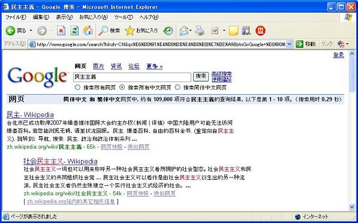
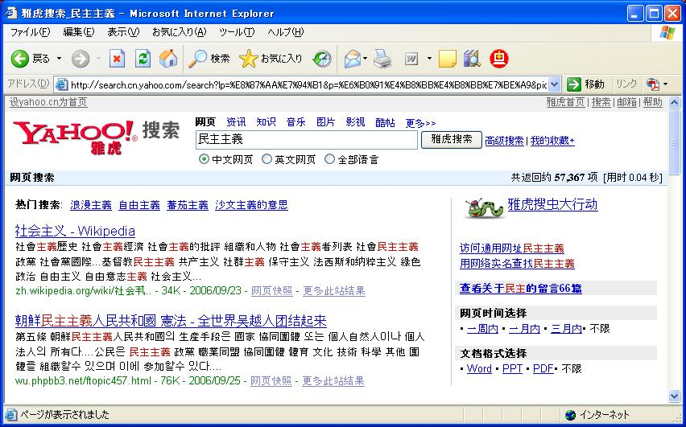

# 上海から（帰国するまで随時更新）
生きてます。Googleのサービスが軒並みダメです。他の会社の同等なシステムがGoogleだと目の敵にされて使えません。Gmailも使えませんので返事をしなければならないメールにも返事ができません。VPN用意すればよかったけどそれはそれで面倒です。

Twitterがたまにつながります。

<blockquote class="twitter-tweet" data-lang="ja">
Tweetdeckが普通に使える <a href="https://twitter.com/hashtag/%E4%B8%8A%E6%B5%B7?src=hash">#上海</a>
&mdash; Ryuichi Ueda (@ryuichiueda) <a href="https://twitter.com/ryuichiueda/status/750518402792382465">2016年7月6日</a></blockquote>

<blockquote class="twitter-tweet" data-lang="ja">
上海で見たもの: 1) 地下鉄の中でビラを撒いている子供がいて、もらった客が床に落とす。2) 地下鉄でアクティブな乞食。3) 美人
&mdash; Ryuichi Ueda (@ryuichiueda) <a href="https://twitter.com/ryuichiueda/status/750516626064236545">2016年7月6日</a></blockquote>

発表は無事終わりました。パワポが100MB以上あってアップできません。ビデオを埋め込んでいるから？？？

Dropboxもダメっぽい。

Slackはつながるケースが多いんですが、なぜか重たいです。なんか、Twitterとかたまにつながるものも、謎遅延が発生するようです。

<h2>2006年にやった実験</h2>

そういえば中国本土は2006年以来10年ぶりです。当時はまだGoogleが使えました。この時はこんな実験をしていました。コメントはしません。

