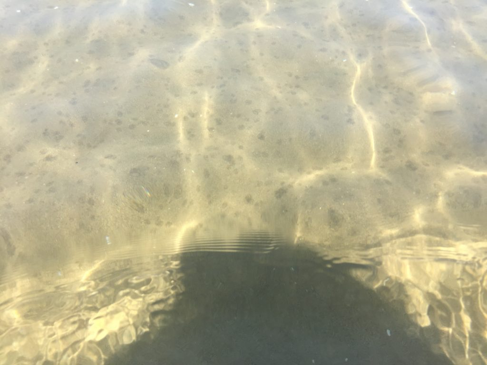
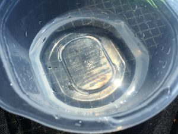
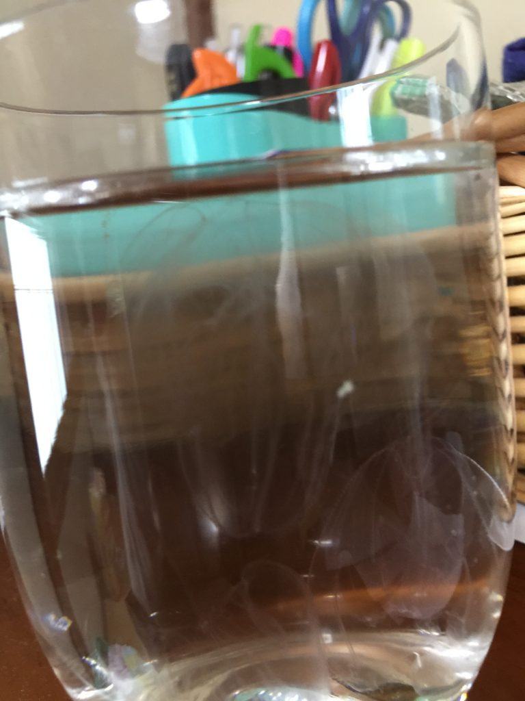
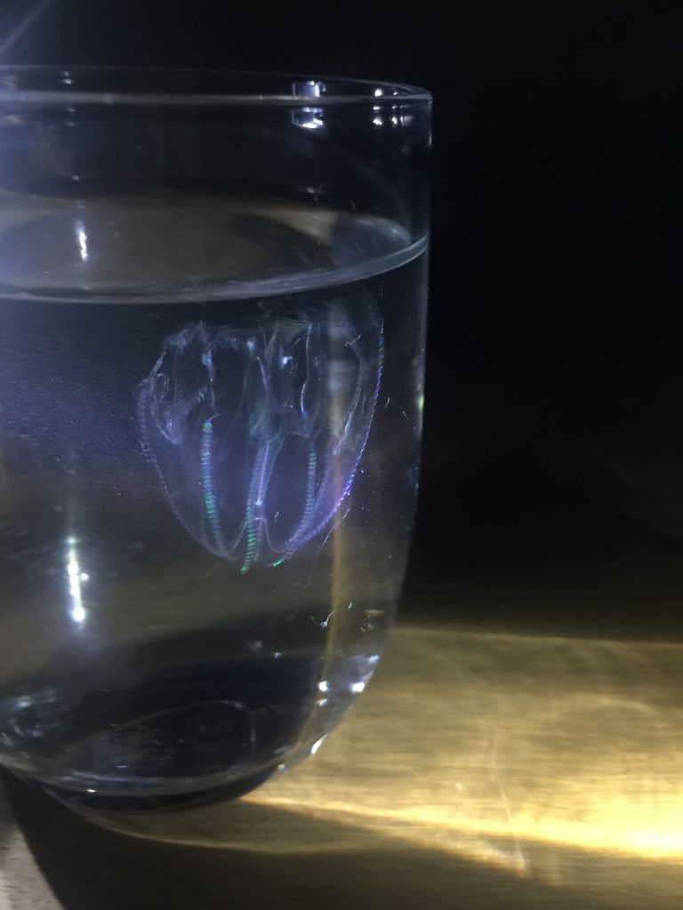

# 千里浜にクシクラゲがたくさんいた
じい様と子供に千里浜に引きずられて行ったらクシクラゲ（たぶんカブトクラゲ）が大量に発生しており珍しかったのでまとめておきます。 
 
下の写真でブツブツは全部クラゲの影です。クラゲと言っても刺すのと種類が違うので平和なものです。泳いでいるとヌルヌルしましたが。 
 
 
 
長女がクラゲ大好きなので採取して現場で写真を撮ったものの、案の定、透明でワケがわからず。 
 
 
 
家に持ち帰って撮影。 
 
 
 
これでも分かりにくいので、夜に撮影。 
 
<iframe width="560" height="315" src="https://www.youtube.com/embed/GcrWdnBjuTI" frameborder="0" allowfullscreen></iframe> 
 
 
 
<iframe width="420" height="315" src="https://www.youtube.com/embed/W-IsVwURoDA" frameborder="0" allowfullscreen></iframe> 
 
もともと深海にいるものだし、帰り際は明らかに数が少なくなっていたので、海流によっていたりいなかったりするみたいです。子供の時から千里浜には通いつめていますが、クシクラゲを見たのは初めてでした。 
 
 
 
千里浜、南に旅行に行く意味が見出せないほど綺麗でした。 
 
 
疲れたので寝る。 
 

