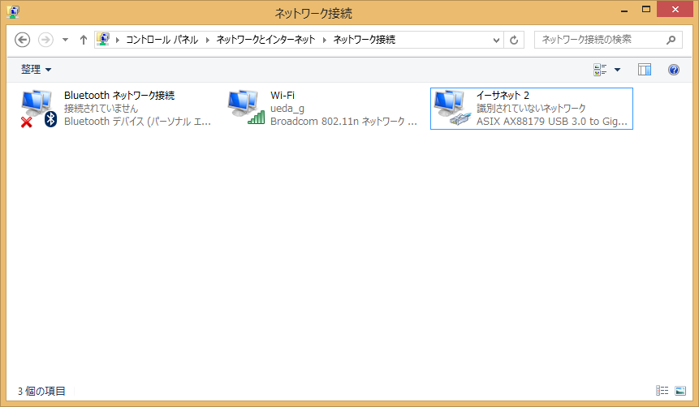
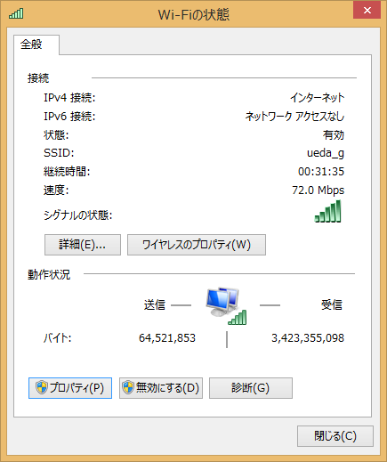
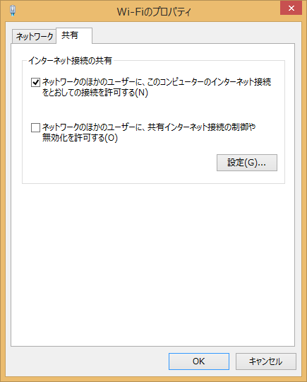
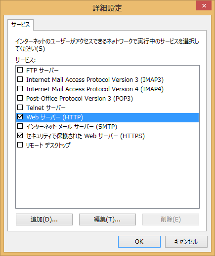
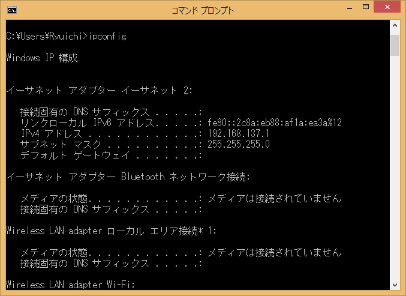
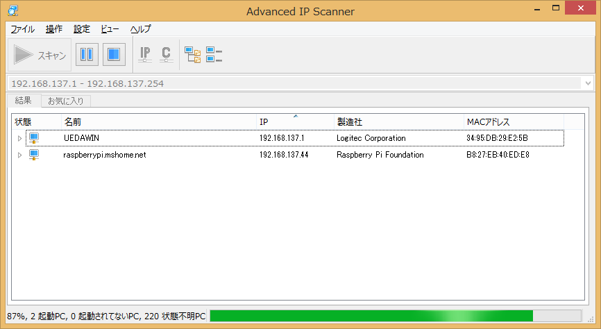
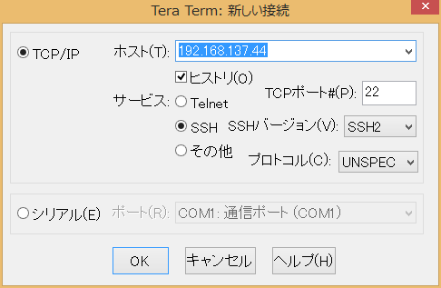
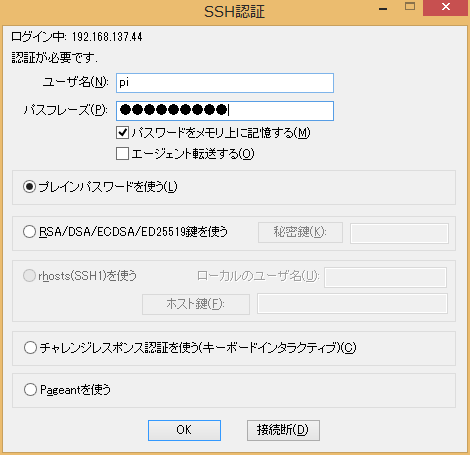
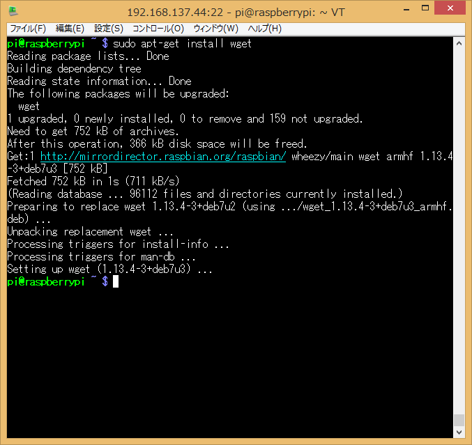

---
Keywords:ブチギレ,ICS,Raspberry,Windows,インターネット接続の共有
Copyright: (C) 2017 Ryuichi Ueda
---
# Raspberry Piを有線LANでWindows8に直結してWindows8経由でapt-getできるようにするまでの手順
講義のために慣れぬWindowsを触り、イライラで血圧が1000くらいになりながら分かった手順をまとめます。Windows8以降ならおそらく手順は同じです。タイトルにあるように、下の写真のようにラズパイとノートPCを接続して、ラズパイからインターネットに出られるようにします。（この写真のノートPCはWindowsではありませんが。） 
 
 
 
<h2>Raspberry Pi側の準備</h2> 
 
有線LANがDHCPで使えるようにします。つまりデフォルトの状態にしておきます。 
 
<h2>Windows側の準備</h2> 
 
Windowsマシンには無線LANと有線LANが必要です。上の写真のように有線側をラズパイに接続し、無線側でインターネットとやりとりします。 
 
<h2>接続の共有設定</h2> 
 
Internet Connection Sharing（ICS）という機能らしいので、分からないことがあったらこのキーワードで調べるとよいかと。 
 
まず、下のようにお馴染みのネットワーク接続の一覧画面を出します。お馴染みと言っても、私はここにたどり着くまでにかなり時間を要しました。分からん。ここで一覧にブリッジ接続があったら次に進めないかもしれません。差し支えなければ削除します。 
 
 
 
次に、Wi-Fiの方を右クリックし、「プロパティ」を選択します。で、タブに「共有」があることを確認し、選択します。 
 
 
 
で、次のように「ネットワークのほかのユーザーに、このコンピューターのインターネット接続をとおしての接続を許可する」をチェックします。 
 
 
 
で、右にある「設定」ボタンを押します。すると次のようにいくつかチェックボックスが出てきますので、HTTPとHTTPSをチェックしておきます。チェックの際、何かボックスが出てきますが、OKを押しておきます。 
 
 
 
そして有線LAN同士でラズパイを接続し、ラズパイを再起動します。ちゃんとラズパイが立ち上がれば、Windows側のDHCPでIPアドレスが割り振られます。 
 
 
<h2>IPアドレスの確認</h2> 
 
で、次にIPアドレスを調べます。まず、Windowsの有線LANのIPをipconfigで調べます。 
 
 
192.168.137.1のようです。 
 
 
で、次にラズパイのIPアドレスを調べますが、これがなぜかひねくれたIPアドレスになってしまい、192.168.137.2,3,...と調べても見つかりませんでした・・・。ということで192.168.137.0をスキャンして調べる必要がありました。私は「<a href="http://forest.watch.impress.co.jp/library/software/advipscanner/" target="_blank">Advanced IP Scanner</a>」を使いました。 
 
このツールの画面にはIPアドレスの範囲を指定するテキストボックスがあるので、その中に範囲を指定してスキャンします。 
 
 
 
なんで44なんでしょう・・・。 
 
 
ということで、<a href="https://osdn.jp/projects/ttssh2/" target="_blank">TeraTerm</a>で次のように192.168.137.44に接続し、ラズパイにログインできました。 
 
 
 
 
 
で、（ちゃんと/etc/resolv.confの設定が正しければ）apt-getできるようです。 
 
 
 
おしまい。 
 
ってか、これだけのことを説明するためにこんなにスクリーンショットが必要なのはおかしい。 
 
 
おかしい。 
 
 
 
 

