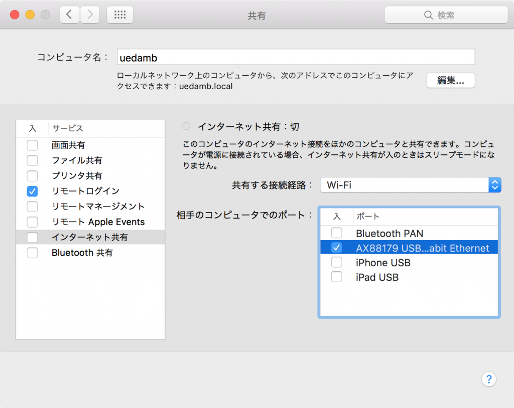

# Raspberry Piを有線LANでMacに直結してMac経由でapt-getできるようにするまでの手順
<a href="https://blog.ueda.asia/?p=8694">さっきの記事</a>のMac版。OS Xです。画面数は減ります。こちらもMacで有線LANと無線LANが両方使える必要があります。

まず、「システム環境設定」->「共有」に行き、「インターネット共有」の文字を押して、下のように「共通する通信経路」をWi-Fi、相手のコンピュータでのポートを有線LANのものにします。

<a href="b4a50e93b43b3f8ceac1b3318a9cfd9a.png"></a>

その後、チェックボックスをクリックして共有をスタートします。

で、次にTerminalを立ち上げ、ifconfigで有線側のIPアドレスを調べます。下の例の場合は192.168.3.1です。

```bash
uedamb:~ ueda$ ifconfig
...
bridge100: flags=8863<UP,BROADCAST,SMART,RUNNING,SIMPLEX,MULTICAST&gt; mtu 1500
	options=23<RXCSUM,TXCSUM,TSO4&gt;
	ether aa:66:7f:f0:af:64 
	inet 192.168.3.1 netmask 0xffffff00 broadcast 192.168.3.255
...
```

で、192.168.3.2,3,4,...と調べていけばすぐにRaspberry Piにぶつかります。

```bash
uedamb:~ ueda$ ping 192.168.3.2
PING 192.168.3.2 (192.168.3.2): 56 data bytes
64 bytes from 192.168.3.2: icmp_seq=0 ttl=64 time=0.456 ms
64 bytes from 192.168.3.2: icmp_seq=1 ttl=64 time=0.376 ms
...
```

で、sshで接続し、外と通信できることを確認します。

```bash
uedamb:~ ueda$ ssh pi\@192.168.3.2
Linux raspberrypi 4.1.10-v7+ #2 SMP PREEMPT Sat Oct 10 09:49:41 UTC 2015 armv7l
...
pi\@raspberrypi ~ $ ping google.com
PING google.com (216.58.197.206) 56(84) bytes of data.
64 bytes from nrt13s48-in-f14.1e100.net (216.58.197.206): icmp_req=1 ttl=50 time=4.54 ms
64 bytes from nrt13s48-in-f14.1e100.net (216.58.197.206): icmp_req=2 ttl=50 time=5.28 ms
...
```

・・・端末って楽ですね。慣れれば。
