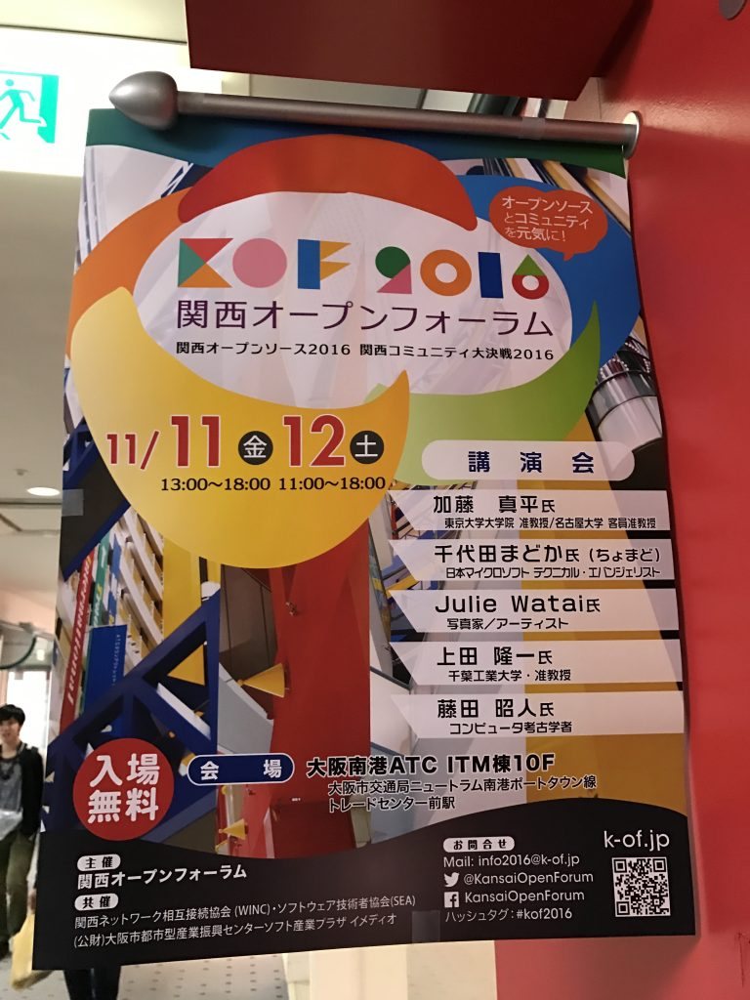
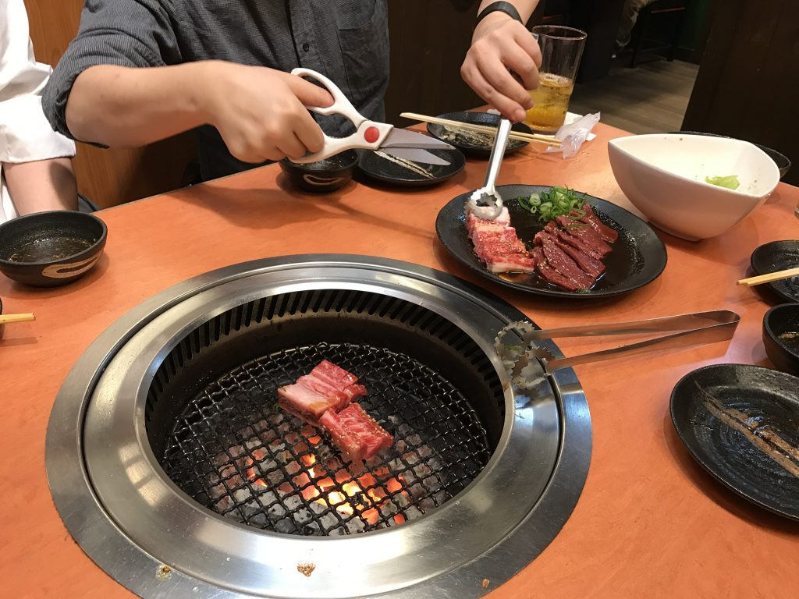

# 関西オープンフォーラム2016（KOF2016）で話をしました
11/12に大阪南港ATCで、いつものシェル芸ネタでなくロボットの話をしてきました。 
 
内容は「ROSに興味持って」というシンプルなメッセージを包み隠さず話をしたものです。私も「ハードウェアやらない」とつい言ってしまうことがあるので少々一方的ですが、電子回路に手を出しているので少しずつそっち方向に近づいているような気がします。 
 
表紙は冗談です。あと、学会での発表では使わない表現を多用しています。 
 
<iframe src="//www.slideshare.net/slideshow/embed_code/key/9NzhuEx6N6roVb" width="595" height="485" frameborder="0" marginwidth="0" marginheight="0" scrolling="no" style="border:1px solid #CCC; border-width:1px; margin-bottom:5px; max-width: 100%;" allowfullscreen> </iframe> 
 <strong> <a href="//www.slideshare.net/ryuichiueda/ss-68758265" title="オープンソースとロボット" target="_blank">オープンソースとロボット</a> </strong> from <strong><a target="_blank" href="//www.slideshare.net/ryuichiueda">隆一 上田</a></strong> 
 
 
 
講演の機会と、リラックスした週末を与えてくださったKOFのスタッフの皆様、講演を聞いてくださったシェル芸勉強会大阪サテライトの皆様、鶴橋に乗り込んだ焼肉メンバーに感謝申し上げます。 
 
来年はシェル芸で勝手に乗り込むかもしれません。 
 
<h2>写真とか</h2> 
 
 
 
 
 
 
 
<blockquote class="twitter-tweet" data-lang="ja">
やったー！鶴橋だー！ <a href="https://t.co/Wz89WyaWpJ">pic.twitter.com/Wz89WyaWpJ</a>
&mdash; Ryuichi Ueda (\@ryuichiueda) <a href="https://twitter.com/ryuichiueda/status/797380009727967232">2016年11月12日</a></blockquote>  
 
<blockquote class="twitter-tweet" data-lang="ja">
サンタさんありがとう！！！ <a href="https://twitter.com/hashtag/%E3%82%A2%E3%83%91%E6%B0%B4?src=hash">#アパ水</a> <a href="https://t.co/WSKAqhRm15">pic.twitter.com/WSKAqhRm15</a>
&mdash; Ryuichi Ueda (\@ryuichiueda) <a href="https://twitter.com/ryuichiueda/status/797424428040658944">2016年11月12日</a></blockquote>  
 
<blockquote class="twitter-tweet" data-lang="ja">
いつも仕事してるしあんまり珍しさを感じないのでやったことなかったけど、新幹線はかなり中毒性の高い動画が撮れる。 <a href="https://t.co/stv3HMOB9c">pic.twitter.com/stv3HMOB9c</a>
&mdash; Ryuichi Ueda (\@ryuichiueda) <a href="https://twitter.com/ryuichiueda/status/797635951182770176">2016年11月13日</a></blockquote>  
 
<blockquote class="twitter-tweet" data-lang="ja">
喋る前にVimをインストールして心を落ち着かせる。 <a href="https://twitter.com/hashtag/KOF2016?src=hash">#KOF2016</a> <a href="https://t.co/S8zp7AG6XZ">pic.twitter.com/S8zp7AG6XZ</a>
&mdash; Ryuichi Ueda (\@ryuichiueda) <a href="https://twitter.com/ryuichiueda/status/797286936457060352">2016年11月12日</a></blockquote>  
 
<blockquote class="twitter-tweet" data-lang="ja">
「隣いいですか？」って聞いたらこっち来んな言われて激おこ晒し上げ <a href="https://twitter.com/hashtag/kof2016?src=hash">#kof2016</a> <a href="https://t.co/xr4UolF42h">pic.twitter.com/xr4UolF42h</a>
&mdash; Ryuichi Ueda (\@ryuichiueda) <a href="https://twitter.com/ryuichiueda/status/797003741522055168">2016年11月11日</a></blockquote> 
